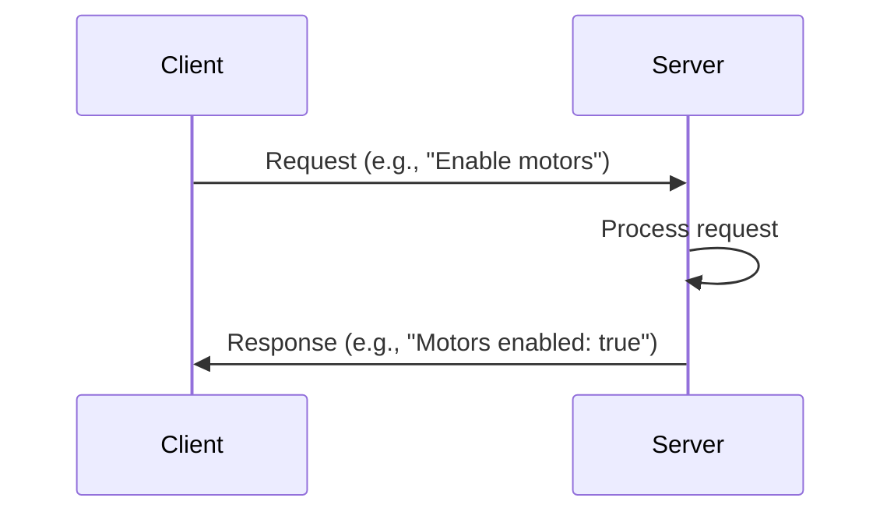
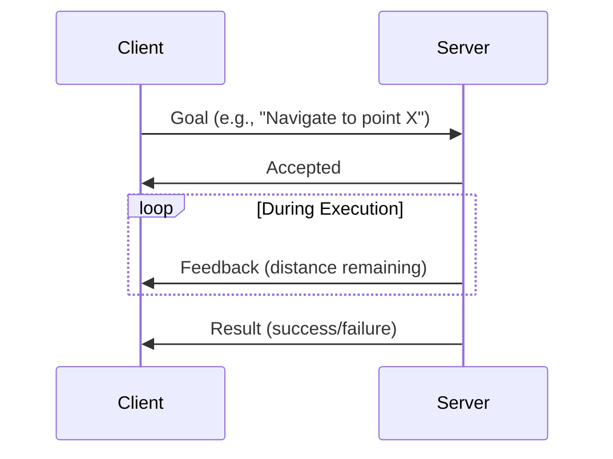
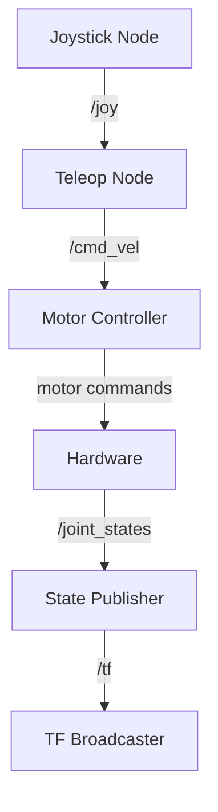

# Physical AI & Humanoid Robotics - Docusaurus Documentation Structure

## Directory Structure

```
docs/
├── intro.md
├── module-1-ros2/
│   ├── index.md
│   ├── chapter-1-1-ros2-architecture.md
│   ├── chapter-1-2-first-ros2-node.md
│   ├── chapter-1-3-services-actions.md
│   ├── chapter-1-4-python-rclpy.md
│   ├── chapter-1-5-urdf-robot-description.md
│   └── chapter-1-6-launch-files.md
├── module-2-digital-twin/
│   ├── index.md
│   ├── chapter-2-1-physics-simulation.md
│   ├── chapter-2-2-gazebo-basics.md
│   ├── chapter-2-3-physics-tuning.md
│   ├── chapter-2-4-sensor-simulation.md
│   ├── chapter-2-5-unity-visualization.md
│   └── chapter-2-6-complex-environments.md
├── module-3-isaac/
│   ├── index.md
│   ├── chapter-3-1-isaac-ecosystem.md
│   ├── chapter-3-2-isaac-sim-basics.md
│   ├── chapter-3-3-photorealistic-rendering.md
│   ├── chapter-3-4-robot-training.md
│   ├── chapter-3-5-isaac-ros.md
│   ├── chapter-3-6-nav2-navigation.md
│   └── chapter-3-7-sim-to-real.md
├── module-4-vla/
│   ├── index.md
│   ├── chapter-4-1-vla-intro.md
│   ├── chapter-4-2-whisper-speech.md
│   ├── chapter-4-3-llm-planning.md
│   ├── chapter-4-4-vision-language.md
│   ├── chapter-4-5-action-primitives.md
│   ├── chapter-4-6-conversational-robots.md
│   └── chapter-4-7-capstone-project.md
└── appendix/
    ├── hardware-requirements.md
    └── software-requirements.md
```

---

## File: docs/intro.md

```markdown
---
sidebar_position: 1
---

# Physical AI & Humanoid Robotics

## Bridging the Gap Between Digital Intelligence and Physical Reality

Welcome to the comprehensive guide on Physical AI and Humanoid Robotics. This documentation will take you from foundational concepts to building fully autonomous humanoid robots capable of understanding voice commands and interacting naturally with the physical world.

## Course Overview

**Focus:** AI Systems in the Physical World • Embodied Intelligence

**Goal:** Bridge the gap between the digital brain and the physical body by applying AI knowledge to control Humanoid Robots in simulated and real-world environments.

### Course Philosophy

The future of AI extends beyond digital spaces into the physical world. This course introduces **Physical AI**—AI systems that function in reality and comprehend physical laws. You'll learn to design, simulate, and deploy humanoid robots capable of natural human interactions using:

- **ROS 2** (Robot Operating System)
- **Gazebo & Unity** (Simulation platforms)
- **NVIDIA Isaac** (AI robotics platform)
- **Vision-Language-Action Models** (VLA)

### Why Physical AI Matters

Humanoid robots are poised to excel in our human-centered world because they share our physical form and can be trained with abundant data from interacting in human environments. This represents a significant transition from AI models confined to digital environments to **embodied intelligence** that operates in physical space.

## What You'll Learn

This course is divided into four comprehensive modules:

### [Module 1: The Robotic Nervous System (ROS 2)](/module-1-ros2)

Learn the middleware that enables robot components to communicate seamlessly. Master nodes, topics, services, and the URDF format for defining robot structures.

### [Module 2: The Digital Twin (Gazebo & Unity)](/module-2-digital-twin)

Create virtual replicas of robots that behave identically to their real-world counterparts. Simulate physics, sensors, and environments safely before deploying to hardware.

### [Module 3: The AI-Robot Brain (NVIDIA Isaac™)](/module-3-isaac)

Explore cutting-edge AI-powered robotics with photorealistic simulation, synthetic data generation, and hardware-accelerated perception pipelines.

### [Module 4: Vision-Language-Action (VLA)](/module-4-vla)

Build robots that understand voice commands and translate natural language into physical actions. Combine LLMs with robotics for intuitive human-robot interaction.

## Learning Outcomes

By the end of this course, you will be able to:

1. ✅ Understand Physical AI principles and embodied intelligence
2. ✅ Master ROS 2 for distributed robotic control
3. ✅ Simulate robots with Gazebo and Unity
4. ✅ Develop with NVIDIA Isaac AI platform
5. ✅ Design humanoid robots for natural interactions
6. ✅ Integrate GPT models for conversational robotics
7. ✅ Deploy AI systems from simulation to physical hardware

## Prerequisites

- Strong Python programming skills
- Basic understanding of linear algebra and calculus
- Familiarity with machine learning concepts
- Linux command-line experience (Ubuntu recommended)

## Hardware Requirements

:::warning
This is a computationally demanding course. See [Hardware Requirements](/appendix/hardware-requirements) for detailed specifications.
:::

**Minimum Setup:**

- NVIDIA RTX 4070 Ti GPU (12GB VRAM)
- 64GB RAM
- Ubuntu 22.04 LTS

## Get Started

Ready to begin? Start with [Module 1: The Robotic Nervous System →](/module-1-ros2)
```

---

## File: docs/module-1-ros2/index.md

````markdown
---
sidebar_position: 2
---

# Module 1: The Robotic Nervous System (ROS 2)

## Introduction

Just as the human nervous system coordinates communication between the brain and body, **ROS 2 (Robot Operating System 2)** serves as the middleware that enables seamless communication between different components of a robotic system.

This module introduces you to the architectural foundation that powers modern robotics, teaching you how to build **distributed systems** where perception, planning, and control work in harmony.

## The Paradigm Shift

ROS 2 represents a fundamental shift from traditional monolithic robot control systems to a **modular, message-passing architecture**. Instead of a single program controlling everything, you'll learn to decompose complex robotic behaviors into manageable nodes that communicate through well-defined interfaces.

### Why ROS 2?

- **Industry Standard:** Used by Boston Dynamics, NASA, and leading robotics companies
- **Distributed Architecture:** Run nodes on multiple machines seamlessly
- **Real-Time Capable:** Built on DDS middleware for deterministic communication
- **Language Agnostic:** Write nodes in Python, C++, or other supported languages
- **Hardware Abstraction:** Same code works across different robot platforms

## Module Focus

This module covers the essential middleware for robot control and inter-process communication:

### Core Topics

1. **ROS 2 Nodes, Topics, and Services**
   - Understanding the publish-subscribe pattern
   - Service-based request-response communication
   - Building reactive and proactive behaviors

2. **Bridging Python Agents to ROS Controllers**
   - Using `rclpy` to integrate AI models with robotic control
   - Real-time inference in ROS 2 nodes
   - Managing computational resources

3. **Understanding URDF**
   - Unified Robot Description Format for defining robot structure
   - Kinematic chains and joint configurations
   - Preparing humanoid models for simulation

## Learning Path

This module is structured to take you from zero to building complete ROS 2 systems:


````

## Chapters

### [Chapter 1.1: Introduction to ROS 2 Architecture](chapter-1-1-ros2-architecture)

Understand the evolution from ROS 1, core concepts (nodes, topics, services, actions), DDS middleware, and the computation graph.

### [Chapter 1.2: Building Your First ROS 2 Node](chapter-1-2-first-ros2-node)

Set up your development environment, create publisher and subscriber nodes, work with message types, and debug with ROS 2 tools.

### [Chapter 1.3: Services and Actions in ROS 2](chapter-1-3-services-actions)

Learn request-response patterns, handle long-running tasks with actions, implement servers and clients, and manage feedback mechanisms.

### [Chapter 1.4: Python Integration with rclpy](chapter-1-4-python-rclpy)

Master the rclpy API, node lifecycle, timers and callbacks, parameter management, and best practices for Python-based control.

### [Chapter 1.5: URDF and Robot Description](chapter-1-5-urdf-robot-description)

Define robot structures in XML, understand links and joints, create visual and collision geometries, and use Xacro for modular descriptions.

### [Chapter 1.6: Launch Files and System Composition](chapter-1-6-launch-files)

Write launch files in Python, manage configurations, orchestrate multi-node systems, and handle multiple robots with namespaces.

## Prerequisites for This Module

- Python 3.8+ installed
- Basic understanding of object-oriented programming
- Familiarity with Linux terminal commands
- Ubuntu 22.04 LTS recommended

## Tools You'll Use

- **ROS 2 Humble Hawksbill** (or Iron Irwini)
- **Visual Studio Code** with ROS extensions
- **rqt** and **rviz2** for visualization
- **colcon** build system

## Module Assessment

By the end of this module, you'll complete a **ROS 2 Package Development Project** where you:

- Build a multi-node system with publishers and subscribers
- Implement service calls for robot control
- Create action servers for long-running tasks
- Define a robot in URDF format
- Launch the complete system with a single command

## Estimated Time

⏱️ **3 weeks** (Weeks 3-5 of the course)

- 15-20 hours of content
- 10-15 hours of hands-on practice
- 5-8 hours for the assessment project

---

## Get Started

Ready to dive into ROS 2? Begin with [Chapter 1.1: Introduction to ROS 2 Architecture →](chapter-1-1-ros2-architecture)

````

---

## File: docs/module-1-ros2/chapter-1-1-ros2-architecture.md

```markdown
---
sidebar_position: 1
---

# Chapter 1.1: Introduction to ROS 2 Architecture

## Overview

ROS 2 (Robot Operating System 2) is not an operating system in the traditional sense—it's a **middleware framework** that provides the communication infrastructure, development tools, and software libraries necessary to build robot applications.

In this chapter, you'll learn the fundamental architecture of ROS 2, understand why it was redesigned from ROS 1, and grasp the core concepts that will form the foundation of everything you build in this course.

## The Evolution from ROS 1 to ROS 2

### Why ROS 2 Exists

ROS 1 (released in 2007) revolutionized robotics research but had fundamental limitations:

| Limitation | ROS 1 | ROS 2 Solution |
|------------|-------|----------------|
| **Single Point of Failure** | roscore required | Fully distributed |
| **No Real-Time Support** | Best-effort delivery | DDS with QoS policies |
| **Network Security** | None | DDS Security (SROS2) |
| **Multi-Robot Systems** | Complex workarounds | Native support |
| **Production Use** | Research-focused | Industry-grade reliability |

### Key Improvements in ROS 2

```mermaid
graph TD
    A[ROS 2 Architecture] --> B[DDS Middleware]
    A --> C[Distributed System]
    A --> D[Real-Time Capable]
    A --> E[Secure by Default]
    B --> F[Quality of Service]
    C --> G[No Master Node]
    D --> H[Executor Model]
    E --> I[SROS2]
````

## Core Concepts

### 1. Nodes

**Nodes** are the fundamental building blocks of ROS 2 applications. Each node is a **process** that performs a specific computation.

#### Node Characteristics

- **Single Purpose:** Each node should do one thing well
- **Modular:** Nodes can be developed, tested, and deployed independently
- **Composable:** Multiple nodes work together to create complex behaviors
- **Language Agnostic:** Write in Python, C++, or other supported languages

#### Example Node Purposes

```
├── /camera_driver          → Publishes raw images
├── /image_processor        → Detects objects in images
├── /robot_controller       → Commands robot motors
└── /path_planner           → Computes navigation paths
```

### 2. Topics (Publish-Subscribe Pattern)

**Topics** enable **asynchronous, many-to-many communication** between nodes using a publish-subscribe model.

#### How Topics Work

```mermaid
graph LR
    A[Publisher Node] -->|publishes| B[/camera/image Topic]
    B --> C[Subscriber Node 1]
    B --> D[Subscriber Node 2]
    B --> E[Subscriber Node N]
```

#### Key Characteristics

- **Asynchronous:** Publishers don't wait for subscribers
- **Decoupled:** Publishers don't know who's subscribing
- **Typed:** Each topic has a specific message type
- **Many-to-Many:** Multiple publishers and subscribers per topic

#### Common Topic Examples

```bash
/camera/image_raw           # sensor_msgs/Image
/cmd_vel                    # geometry_msgs/Twist
/joint_states               # sensor_msgs/JointState
/odom                       # nav_msgs/Odometry
```

### 3. Services (Request-Response Pattern)

**Services** provide **synchronous, one-to-one communication** for request-response interactions.

#### How Services Work



#### When to Use Services

✅ **Use Services When:**

- You need a response immediately
- The operation is quick (< 1 second)
- It's a configuration or query operation

❌ **Don't Use Services When:**

- The operation takes a long time
- You need progress updates
- Multiple clients might call simultaneously

#### Common Service Examples

```bash
/get_robot_state            # Check current robot status
/reset_odometry             # Reset position tracking
/set_parameters             # Configure node settings
```

### 4. Actions (Long-Running Tasks)

**Actions** are designed for **long-running, preemptable tasks** that provide feedback.

#### How Actions Work



#### Action Components

1. **Goal:** What you want to accomplish
2. **Feedback:** Progress updates during execution
3. **Result:** Final outcome when complete

#### When to Use Actions

✅ **Use Actions When:**

- Task takes more than 1 second
- You need progress updates
- Task should be cancellable mid-execution

#### Common Action Examples

```bash
/navigate_to_pose           # Move robot to target location
/follow_path                # Execute a planned trajectory
/gripper_grasp              # Close gripper on object
```

## The DDS Middleware Layer

### What is DDS?

**DDS (Data Distribution Service)** is the communication layer underneath ROS 2. It provides:

- **Discovery:** Nodes automatically find each other
- **Quality of Service (QoS):** Configure reliability, durability, and latency
- **Security:** Encrypted communication (SROS2)
- **Real-Time:** Deterministic message delivery

### DDS Implementations

ROS 2 supports multiple DDS vendors:

| Implementation  | Characteristics             | Use Case                     |
| --------------- | --------------------------- | ---------------------------- |
| **Fast DDS**    | Default, well-optimized     | General purpose              |
| **Cyclone DDS** | Lightweight, fast discovery | Resource-constrained systems |
| **RTI Connext** | Professional, certified     | Industrial applications      |

You can switch DDS implementations without changing code:

```bash
export RMW_IMPLEMENTATION=rmw_cyclonedds_cpp
```

## Understanding the Computation Graph

The **computation graph** is the network of nodes and their connections.

### Visualizing the Graph

Use `rqt_graph` to visualize running nodes and topics:

```bash
ros2 run rqt_graph rqt_graph
```

### Example Graph

```
┌─────────────────┐
│  /camera_driver │
└────────┬────────┘
         │ /camera/image_raw
         ├───────────────┐
         ▼               ▼
┌────────────────┐  ┌─────────────────┐
│ /object_detect │  │  /image_viewer  │
└────────┬───────┘  └─────────────────┘
         │ /detected_objects
         ▼
┌────────────────┐
│ /robot_control │
└────────────────┘
```

## ROS 2 Communication Patterns

### 1. One-Way Data Flow (Topics)

```python
# Publisher
publisher.publish(msg)  # Fire and forget

# Subscriber
def callback(msg):
    process(msg)  # Called when message arrives
```

### 2. Request-Response (Services)

```python
# Client
response = client.call(request)  # Blocks until response

# Server
def handle_request(request, response):
    response.result = process(request)
    return response
```

### 3. Goal-Oriented (Actions)

```python
# Client
goal = NavigateToPose.Goal()
future = action_client.send_goal_async(goal, feedback_callback)

# Server
def execute_callback(goal_handle):
    while not done:
        goal_handle.publish_feedback(progress)
    return result
```

## Quality of Service (QoS) Policies

QoS policies allow you to tune communication characteristics.

### Key QoS Parameters

#### Reliability

- **RELIABLE:** Guarantee delivery (TCP-like)
- **BEST_EFFORT:** Send and forget (UDP-like)

```python
from rclpy.qos import QoSProfile, ReliabilityPolicy

qos = QoSProfile(
    reliability=ReliabilityPolicy.RELIABLE,
    depth=10  # Message queue size
)
```

#### Durability

- **VOLATILE:** Only send to current subscribers
- **TRANSIENT_LOCAL:** Send last message to new subscribers

```python
from rclpy.qos import DurabilityPolicy

qos = QoSProfile(
    durability=DurabilityPolicy.TRANSIENT_LOCAL
)
```

### Common QoS Presets

```python
from rclpy.qos import qos_profile_sensor_data
from rclpy.qos import qos_profile_services_default
from rclpy.qos import qos_profile_system_default
```

## ROS 2 Workspace Structure

### Standard Workspace Layout

```
ros2_ws/
├── src/                    # Source code
│   ├── my_robot_pkg/
│   │   ├── my_robot_pkg/  # Python package
│   │   ├── package.xml    # Package manifest
│   │   └── setup.py       # Python setup
│   └── another_pkg/
├── build/                  # Build artifacts (auto-generated)
├── install/                # Installed files (auto-generated)
└── log/                    # Build logs (auto-generated)
```

### Package Structure

```
my_robot_pkg/
├── my_robot_pkg/
│   ├── __init__.py
│   ├── my_node.py
│   └── utils.py
├── resource/
│   └── my_robot_pkg       # Package marker
├── test/
│   └── test_my_node.py
├── package.xml            # Package dependencies
└── setup.py               # Python setup
```

## ROS 2 Command-Line Tools

### Essential Commands

```bash
# Node management
ros2 node list              # List running nodes
ros2 node info /my_node     # Show node details

# Topic management
ros2 topic list             # List all topics
ros2 topic echo /cmd_vel    # Print topic messages
ros2 topic hz /camera/image # Show message rate
ros2 topic pub /cmd_vel ... # Publish from terminal

# Service management
ros2 service list           # List all services
ros2 service call /reset    # Call a service

# Action management
ros2 action list            # List all actions
ros2 action send_goal ...   # Send action goal

# Package management
ros2 pkg list               # List installed packages
ros2 pkg create my_pkg      # Create new package
```

## Namespaces and Remapping

### Namespaces

Organize nodes hierarchically to avoid naming conflicts:

```bash
/robot1/camera/image_raw
/robot2/camera/image_raw
```

Launch with namespace:

```bash
ros2 run pkg_name node_name --ros-args -r __ns:=/robot1
```

### Remapping

Change topic names at runtime:

```bash
ros2 run pkg_name node_name --ros-args -r /cmd_vel:=/robot1/cmd_vel
```

## Best Practices

### 1. Node Design

✅ **DO:**

- Keep nodes focused on single responsibilities
- Use descriptive node names: `/camera_driver` not `/node1`
- Handle initialization errors gracefully

❌ **DON'T:**

- Create monolithic nodes that do everything
- Use hard-coded topic names
- Ignore error conditions

### 2. Topic Naming

✅ **DO:**

```
/camera/image_raw           # Clear hierarchy
/robot/joint_states         # Descriptive names
/navigation/cmd_vel         # Grouped by function
```

❌ **DON'T:**

```
/data                       # Too vague
/t1                         # Not descriptive
/MySpecialTopic            # Use lowercase with underscores
```

### 3. Message Types

✅ **DO:**

- Use standard message types when possible
- Create custom messages for domain-specific data
- Document message field meanings

❌ **DON'T:**

- Abuse generic types (e.g., `String` for structured data)
- Create duplicate message types
- Use nested messages excessively

## Practical Example: Simple Robot System

Let's visualize a minimal robot system:



### Node Responsibilities

1. **Joystick Node:** Reads gamepad input
2. **Teleop Node:** Converts joy to velocity commands
3. **Motor Controller:** Sends commands to hardware
4. **State Publisher:** Reports robot state
5. **TF Broadcaster:** Publishes coordinate transforms

## Summary

In this chapter, you learned:

- ✅ The evolution from ROS 1 to ROS 2 and key improvements
- ✅ Core concepts: Nodes, Topics, Services, and Actions
- ✅ The DDS middleware layer and QoS policies
- ✅ ROS 2 workspace and package structure
- ✅ Essential command-line tools for development
- ✅ Best practices for node and topic naming

## Next Steps

Now that you understand the architecture, you're ready to write your first ROS 2 node!

**Continue to:** [Chapter 1.2: Building Your First ROS 2 Node →](chapter-1-2-first-ros2-node)

## Additional Resources

- [ROS 2 Documentation](https://docs.ros.org/en/humble/)
- [DDS Specification](https://www.omg.org/spec/DDS/)
- [ROS 2 Design](https://design.ros2.org/)
- [QoS Policy Guide](https://docs.ros.org/en/humble/Concepts/About-Quality-of-Service-Settings.html)

```

---

This structure provides a template for the remaining chapters. Each chapter should follow this format with:
- Clear learning objectives
- Detailed explanations with diagrams
- Code examples
- Best practices
- Summary and next steps

Would you like me to continue with the remaining chapters for Module 1, or would you prefer I create the complete structure for all four modules?
```
