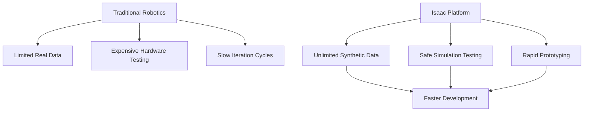
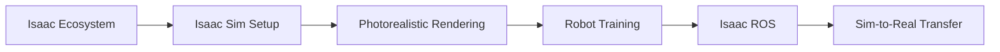
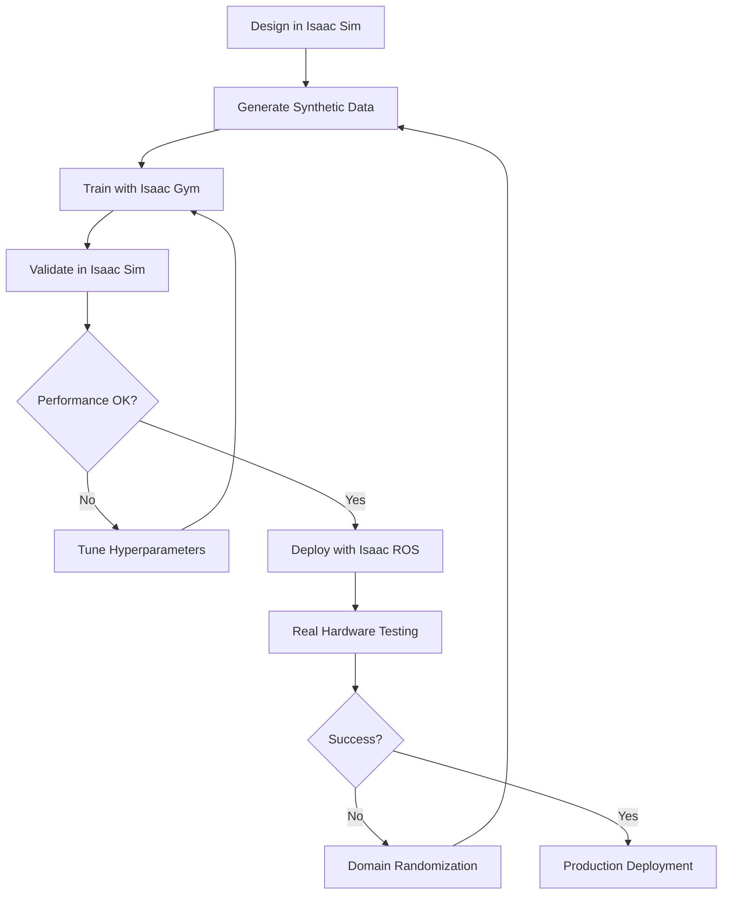
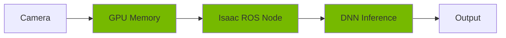
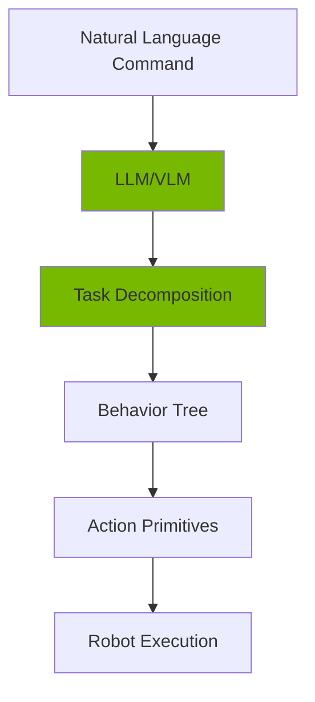
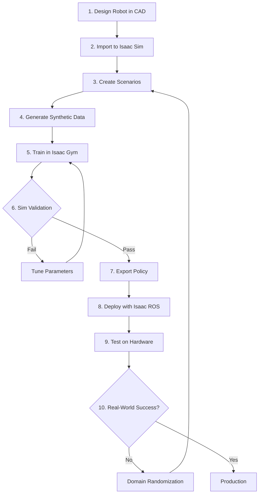
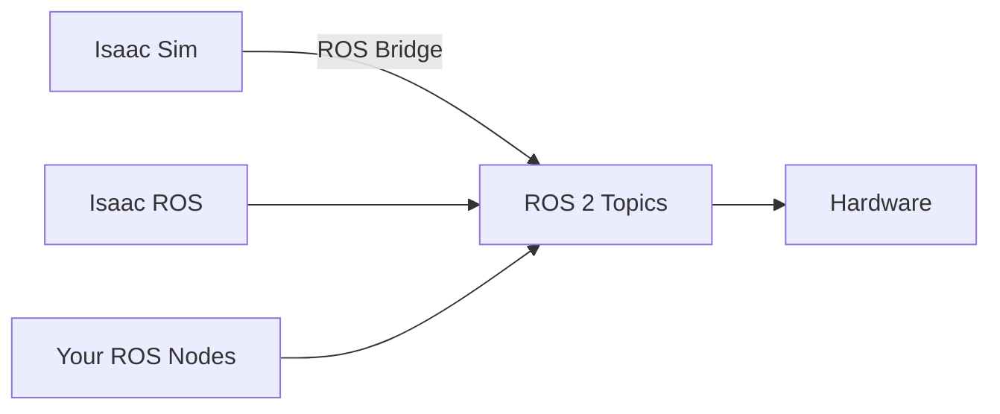

# Module 3: The AI-Robot Brain (NVIDIA Isaac™)

## File: docs/module-3-isaac/index.md

````markdown
---
sidebar_position: 4
---

# Module 3: The AI-Robot Brain (NVIDIA Isaac™)

## Introduction

Welcome to the cutting edge of AI-powered robotics. **NVIDIA Isaac™** represents the convergence of GPU-accelerated computing, photorealistic simulation, and production-grade AI frameworks—creating an ecosystem where robots can be trained at scale using synthetic data and deployed with real-time performance.

This module takes you beyond basic simulation into the realm of **industrial-grade robotics development**, where you'll learn to leverage NVIDIA's complete robotics platform for perception, manipulation, and navigation.

## The Isaac Advantage

Traditional robotics development faces a critical bottleneck: **data scarcity**. Real-world data collection is expensive, time-consuming, and dangerous. NVIDIA Isaac solves this through:

- **Synthetic Data Generation:** Create infinite labeled datasets in simulation
- **Photorealistic Rendering:** Physics-accurate RTX ray tracing for domain randomization
- **Hardware Acceleration:** GPU-accelerated inference pipelines (TensorRT, Triton)
- **Sim-to-Real Transfer:** Proven techniques for deploying trained models on real robots

### Why Isaac Matters


````

## The Isaac Ecosystem

NVIDIA Isaac isn't just a simulator—it's a complete robotics development platform:

### Core Components

1. **Isaac Sim**
   - Photorealistic physics simulation built on NVIDIA Omniverse
   - RTX ray-traced rendering for computer vision
   - USD-based scene composition

2. **Isaac ROS**
   - Hardware-accelerated ROS 2 packages
   - GPU-optimized perception pipelines
   - Pre-built GEMs for common tasks

3. **Isaac Gym**
   - Reinforcement learning environment
   - Parallel physics simulation (10,000+ environments)
   - Direct-to-GPU tensors for training

4. **Isaac Cortex**
   - AI-powered behavior coordination
   - Mission planning and task execution
   - Integration with foundation models

## Module Focus

This module covers the essential NVIDIA Isaac platform for humanoid robot development:

### Core Topics

1. **Isaac Sim Environment**
   - Setting up Omniverse-based simulation
   - Understanding USD workflows
   - Importing and configuring humanoid models

2. **Photorealistic Rendering & Synthetic Data**
   - RTX ray tracing for visual fidelity
   - Domain randomization techniques
   - Automated data labeling and annotation

3. **Robot Training with Isaac Gym**
   - Massively parallel RL training
   - Reward shaping for humanoid locomotion
   - Sim-to-real transfer strategies

4. **Isaac ROS Integration**
   - Hardware-accelerated perception
   - Real-time object detection and tracking
   - Navigation stack integration (Nav2)

## Learning Path

This module builds progressively from setup to deployment:



## Chapters

### [Chapter 3.1: Understanding the Isaac Ecosystem](chapter-3-1-isaac-ecosystem)

Overview of NVIDIA's robotics platform, Omniverse foundation, Isaac Sim architecture, and when to use each Isaac tool.

### [Chapter 3.2: Getting Started with Isaac Sim](chapter-3-2-isaac-sim-basics)

Installation and setup, navigating the Isaac Sim interface, importing URDF/USD assets, basic scene creation, and running your first simulation.

### [Chapter 3.3: Photorealistic Rendering & Synthetic Data](chapter-3-3-photorealistic-rendering)

RTX ray tracing fundamentals, material and lighting setup, domain randomization strategies, semantic segmentation and bounding boxes, building training datasets.

### [Chapter 3.4: Robot Training with Isaac Gym](chapter-3-4-robot-training)

Reinforcement learning in Isaac Gym, humanoid locomotion training, parallel environment scaling, reward function design, and exporting trained policies.

### [Chapter 3.5: Isaac ROS for Production Robotics](chapter-3-5-isaac-ros)

Hardware-accelerated perception pipelines, NITROS framework, integrating Isaac ROS GEMs, real-time object detection, and SLAM with NVIDIA hardware.

## Prerequisites for This Module

- Completed Module 1 (ROS 2) and Module 2 (Gazebo/Unity)
- Strong Python programming skills
- Basic understanding of deep learning (PyTorch/TensorFlow)
- Familiarity with computer vision concepts

## Hardware Requirements

:::warning CRITICAL
Isaac Sim requires **significant GPU resources**. This is the most demanding module.
:::

**Minimum Setup:**

- **GPU:** NVIDIA RTX 4070 Ti (12GB VRAM) or better
- **CPU:** 8-core processor
- **RAM:** 64GB minimum
- **Storage:** 500GB SSD (Omniverse cache)
- **OS:** Ubuntu 22.04 LTS

**Recommended Setup:**

- **GPU:** NVIDIA RTX 4090 (24GB VRAM) or A6000
- **CPU:** 16-core processor (AMD Ryzen 9 / Intel i9)
- **RAM:** 128GB
- **Storage:** 1TB NVMe SSD

## Software You'll Use

- **NVIDIA Omniverse Launcher**
- **Isaac Sim 4.0+** (built on Omniverse)
- **Isaac Gym** (standalone RL environment)
- **Isaac ROS 2** (Humble Hawksbill)
- **PyTorch 2.0+** with CUDA support
- **ROS 2 Humble** integration

## The Isaac Development Workflow



## Real-World Applications

By mastering Isaac, you'll be equipped to work on:

### Industrial Robotics

- **Warehouse Automation:** Pick-and-place with humanoid robots
- **Manufacturing:** Assembly line assistance
- **Logistics:** Autonomous material handling

### Service Robotics

- **Healthcare:** Patient assistance and monitoring
- **Hospitality:** Reception and concierge robots
- **Retail:** Inventory management and customer service

### Research & Development

- **Humanoid Locomotion:** Bipedal walking research
- **Manipulation:** Dexterous grasping
- **Human-Robot Interaction:** Natural collaboration

## Module Assessment

By the end of this module, you'll complete the **Isaac Humanoid Navigation Project**:

- Set up a photorealistic environment in Isaac Sim
- Generate synthetic training data with domain randomization
- Train a humanoid robot to navigate obstacles using Isaac Gym
- Deploy the trained policy through Isaac ROS
- Validate performance in simulation before hardware deployment

## Estimated Time

⏱️ **4 weeks** (Weeks 9-12 of the course)

- 20-25 hours of content
- 15-20 hours of hands-on practice
- 10-15 hours for the assessment project

## Industry Context

### Companies Using Isaac

- **Agility Robotics (Digit):** Humanoid warehouse robots
- **Figure AI:** General-purpose humanoid development
- **1X Technologies (NEO):** Consumer humanoid robots
- **Boston Dynamics:** AI-powered navigation research
- **BMW, Mercedes-Benz:** Factory automation testing

### Career Opportunities

Mastering Isaac opens roles in:

- Robotics Simulation Engineer
- AI/ML Robotics Developer
- Perception Systems Engineer
- Humanoid Robotics Researcher
- Sim-to-Real Transfer Specialist

## Key Takeaways from This Module

By completing Module 3, you will:

1. ✅ Master NVIDIA's complete robotics platform
2. ✅ Generate infinite synthetic training data
3. ✅ Train humanoid robots with reinforcement learning
4. ✅ Deploy GPU-accelerated perception pipelines
5. ✅ Understand sim-to-real transfer techniques
6. ✅ Use photorealistic simulation for robot validation
7. ✅ Integrate Isaac with ROS 2 for production systems

## What Makes Isaac Different?

| Feature             | Traditional Sim      | Isaac Platform                 |
| ------------------- | -------------------- | ------------------------------ |
| **Rendering**       | OpenGL/rasterization | RTX ray tracing                |
| **Physics**         | CPU-based            | GPU-accelerated (PhysX)        |
| **Training**        | Sequential           | Massively parallel (10K+ envs) |
| **Perception**      | CPU processing       | GPU-native (NITROS)            |
| **Data Generation** | Manual labeling      | Automatic synthetic labels     |
| **Deployment**      | Custom integration   | Isaac ROS packages             |

---

## Get Started

Ready to harness the power of NVIDIA's robotics platform?

**Begin with:** [Chapter 3.1: Understanding the Isaac Ecosystem →](chapter-3-1-isaac-ecosystem)

## Additional Resources

- [NVIDIA Isaac Sim Documentation](https://docs.omniverse.nvidia.com/isaacsim/latest/index.html)
- [Isaac ROS Documentation](https://nvidia-isaac-ros.github.io/index.html)
- [Isaac Gym Paper](https://arxiv.org/abs/2108.10470)
- [Omniverse Platform Overview](https://www.nvidia.com/en-us/omniverse/)
- [NVIDIA Developer Forums](https://forums.developer.nvidia.com/c/omniverse/isaac-sim/69)

````

---

## File: docs/module-3-isaac/chapter-3-1-isaac-ecosystem.md

```markdown
---
sidebar_position: 1
---

# Chapter 3.1: Understanding the Isaac Ecosystem

## Overview

The NVIDIA Isaac platform represents a paradigm shift in robotics development—moving from sequential, CPU-bound workflows to massively parallel, GPU-accelerated pipelines. This chapter provides a comprehensive overview of the Isaac ecosystem, helping you understand which tools to use for different stages of robot development.

## The Genesis: Why Isaac Was Created

### The Robotics Data Problem

Traditional robotics development faces critical challenges:

| Challenge | Impact | Isaac Solution |
|-----------|--------|----------------|
| **Data Scarcity** | Expensive real-world collection | Infinite synthetic data |
| **Safety Risks** | Hardware damage during testing | Safe simulation environment |
| **Iteration Speed** | Slow physical prototyping | Instant virtual testing |
| **Scalability** | Single robot at a time | Thousands of parallel instances |
| **Perception Labeling** | Manual annotation (hours) | Automatic labels (seconds) |

### The GPU Advantage

NVIDIA's core insight: **Robotics is a GPU problem**.

```mermaid
graph LR
    A[Traditional CPU Pipeline] --> B[Sequential Processing]
    B --> C[Slow Training]

    D[Isaac GPU Pipeline] --> E[Parallel Processing]
    E --> F[Fast Training]

    C --> G[Days/Weeks]
    F --> H[Hours/Minutes]
````

## The Isaac Platform Architecture

### Complete Ecosystem Overview

```mermaid
graph TB
    subgraph Development
        A[Isaac Sim] --> B[Scene Creation]
        A --> C[Sensor Simulation]
        A --> D[Physics Testing]
    end

    subgraph Training
        E[Isaac Gym] --> F[RL Training]
        E --> G[Parallel Envs]
        E --> H[Policy Export]
    end

    subgraph Deployment
        I[Isaac ROS] --> J[Perception]
        I --> K[Navigation]
        I --> L[Manipulation]
    end

    subgraph Coordination
        M[Isaac Cortex] --> N[Task Planning]
        M --> O[Behavior Trees]
        M --> P[LLM Integration]
    end

    B --> F
    C --> J
    H --> I
    P --> I
```

## Core Components Deep Dive

### 1. Isaac Sim: The Photorealistic Simulator

**Purpose:** High-fidelity robot simulation with RTX ray tracing

#### Built on NVIDIA Omniverse

- **USD (Universal Scene Description):** Pixar's format for 3D scenes
- **RTX Rendering:** Real-time ray tracing for computer vision
- **PhysX 5:** GPU-accelerated physics engine
- **Material Definition Language (MDL):** Physically accurate materials

#### Key Features

```python
# Isaac Sim capabilities
capabilities = {
    "rendering": "RTX ray tracing (path tracing, photon mapping)",
    "physics": "GPU-accelerated rigid body, soft body, fluids",
    "sensors": "RGB, depth, lidar, IMU, contact sensors",
    "robots": "URDF, USD import with automatic articulation",
    "extensibility": "Python API for custom behaviors"
}
```

#### When to Use Isaac Sim

✅ **Use Isaac Sim For:**

- Photorealistic sensor data generation
- Computer vision model training (object detection, segmentation)
- Testing navigation algorithms in complex environments
- Validating robot designs before hardware build
- Creating marketing/demo videos

❌ **Don't Use Isaac Sim For:**

- Large-scale RL training (use Isaac Gym instead)
- Simple physics testing (Gazebo is sufficient)
- Real-time embedded deployment (too heavy)

### 2. Isaac Gym: The RL Powerhouse

**Purpose:** Massively parallel reinforcement learning training

#### Architecture


#### Key Innovations

1. **GPU-Centric Design:** Entire simulation runs on GPU (no CPU bottleneck)
2. **Vectorized Environments:** Thousands of simultaneous rollouts
3. **Direct-to-Tensor:** Observations go straight to neural network (no copying)

#### Performance Comparison

| Metric             | Traditional CPU RL | Isaac Gym  |
| ------------------ | ------------------ | ---------- |
| **Parallel Envs**  | 10-100             | 10,000+    |
| **Samples/Second** | 1K-10K             | 1M+        |
| **Training Time**  | Days/Weeks         | Hours      |
| **Hardware**       | CPU cluster        | Single GPU |

#### When to Use Isaac Gym

✅ **Use Isaac Gym For:**

- Training humanoid locomotion policies
- Manipulation task learning (grasping, assembly)
- Large-scale hyperparameter sweeps
- Curriculum learning scenarios

❌ **Don't Use Isaac Gym For:**

- Photorealistic rendering (no ray tracing)
- Complex sensor simulation (limited sensor types)
- Deployment (training only)

### 3. Isaac ROS: Production-Grade Deployment

**Purpose:** Hardware-accelerated ROS 2 packages for real robots

#### The NITROS Framework

**NITROS (NVIDIA Isaac Transport for ROS)** eliminates CPU-GPU data copying:



Traditional ROS 2 would copy data to CPU, then back to GPU (2x overhead).

#### Available GEMs (Graph-Enabled Modules)

| GEM Category     | Examples                          | Purpose                 |
| ---------------- | --------------------------------- | ----------------------- |
| **Perception**   | DNN Inference, Pose Estimation    | Object/person detection |
| **SLAM**         | Visual SLAM, Nvblox               | Real-time mapping       |
| **Navigation**   | Path Planning, Obstacle Avoidance | Nav2 integration        |
| **Manipulation** | AprilTag, Pose Refinement         | Precise grasping        |
| **Sensors**      | Realsense, Hawk Camera            | Hardware interfaces     |

#### When to Use Isaac ROS

✅ **Use Isaac ROS For:**

- Deploying trained models on NVIDIA hardware (Jetson, x86 + RTX)
- Real-time perception (object detection, tracking)
- Hardware-accelerated SLAM and navigation
- Production robot systems

❌ **Don't Use Isaac ROS For:**

- Non-NVIDIA hardware (no GPU acceleration)
- Simple tasks not requiring GPU (overkill)
- Simulation (use Isaac Sim instead)

### 4. Isaac Cortex: AI Coordination Layer

**Purpose:** High-level task planning and behavior coordination

#### What Isaac Cortex Adds



#### Key Features

1. **Mission Planning:** Break complex tasks into subtasks
2. **Behavior Trees:** Reactive, hierarchical control
3. **Foundation Model Integration:** GPT-4, Gemini for reasoning
4. **Action Libraries:** Pre-built primitives (navigate, grasp, place)

#### When to Use Isaac Cortex

✅ **Use Isaac Cortex For:**

- Long-horizon task planning
- Human-robot interaction scenarios
- Multi-step manipulation tasks
- Adaptive behavior based on environment

❌ **Don't Use Isaac Cortex For:**

- Low-level motor control (too high-level)
- Simple reactive behaviors (overkill)
- Real-time control loops (planning overhead)

## The Isaac Development Workflow

### End-to-End Pipeline



### Workflow Example: Humanoid Walking

Let's walk through training a humanoid robot to walk:

#### Step 1: Design & Import (Isaac Sim)

```python
# Import humanoid URDF into Isaac Sim
from omni.isaac.core.utils.stage import add_reference_to_stage

robot_usd = add_reference_to_stage(
    usd_path="path/to/humanoid.urdf",
    prim_path="/World/Humanoid"
)
```

#### Step 2: Generate Training Data (Isaac Sim)

```python
# Create diverse terrains for training
terrains = [
    "flat_ground",
    "stairs",
    "uneven_terrain",
    "slopes"
]

for terrain in terrains:
    create_environment(terrain)
    record_sensor_data()
```

#### Step 3: Train Policy (Isaac Gym)

```python
# Train locomotion with PPO
from isaacgymenvs.tasks.humanoid import Humanoid

env = Humanoid(num_envs=4096)  # 4096 parallel robots
policy = train_ppo(env, num_iterations=10000)
```

#### Step 4: Deploy (Isaac ROS)

```python
# Load policy on real robot
policy_node = IsaacROSPolicyNode(
    model_path="trained_policy.onnx",
    input_topic="/joint_states",
    output_topic="/joint_commands"
)
```

## Omniverse Foundation

### What is Omniverse?

NVIDIA Omniverse is a platform for 3D collaboration and simulation. Isaac Sim is built on top of it.

#### Omniverse Architecture

```
┌─────────────────────────────────────┐
│        Isaac Sim Application         │
├─────────────────────────────────────┤
│       Omniverse Kit Framework        │
├─────────────────────────────────────┤
│  RTX Renderer │ PhysX │ USD Core    │
├─────────────────────────────────────┤
│         Omniverse Nucleus            │
│      (Collaboration Server)          │
└─────────────────────────────────────┘
```

#### Key Omniverse Concepts

1. **USD (Universal Scene Description)**
   - Open-source format by Pixar
   - Hierarchical scene composition
   - Non-destructive editing (layering)

2. **Nucleus Server**
   - Central asset repository
   - Real-time collaboration
   - Version control for 3D scenes

3. **Extensions**
   - Modular functionality
   - Python/C++ APIs
   - Community marketplace

### Why USD Matters for Robotics

```python
# USD allows non-destructive composition
from pxr import Usd, UsdGeom

# Base robot definition
stage = Usd.Stage.Open("base_humanoid.usd")

# Add sensors without modifying original
layer = stage.GetRootLayer().subLayerPaths.append("sensors.usd")

# Result: Base robot + sensors, both independently editable
```

## Integration with Other Tools

### Isaac + ROS 2



### Isaac + PyTorch

```python
# Direct tensor interface (no copying)
observations = env.get_observations()  # Already on GPU
actions = policy(observations)  # Inference on GPU
env.step(actions)  # Back to simulation, still on GPU
```

### Isaac + Computer Vision Pipelines

```python
# Synthetic data → Training pipeline
isaac_sim.export_annotations(format="COCO")
train_yolov8(dataset="isaac_synthetic")
deploy_to_isaac_ros()
```

## Hardware Acceleration Details

### GPU Requirements by Task

| Task                        | Minimum GPU | Recommended GPU | VRAM |
| --------------------------- | ----------- | --------------- | ---- |
| **Isaac Sim (Basic)**       | RTX 3060    | RTX 4070 Ti     | 8GB  |
| **Isaac Sim (Raytracing)**  | RTX 4070    | RTX 4090        | 12GB |
| **Isaac Gym (Small Scale)** | RTX 3070    | RTX 4080        | 10GB |
| **Isaac Gym (Large Scale)** | RTX 4090    | A6000           | 24GB |
| **Isaac ROS (Jetson)**      | Jetson Orin | Jetson AGX Orin | 32GB |
| **Isaac ROS (x86)**         | RTX 4060    | RTX 4070        | 8GB  |

### PhysX GPU Acceleration

```python
# Enable GPU physics (massive speedup)
sim_params = gymapi.SimParams()
sim_params.use_gpu_pipeline = True
sim_params.physx.use_gpu = True

# Result: 100x speedup for rigid body simulation
```

## Licensing and Access

### Isaac Sim

- **Free** for individual developers
- Commercial use requires NVIDIA Omniverse Enterprise license
- Runs locally (no cloud requirement)

### Isaac Gym

- **Free** for research and commercial use
- Open-source examples and documentation
- Requires RTX GPU (no cloud option)

### Isaac ROS

- **Free** and open-source (Apache 2.0)
- Runs on Jetson and x86 + RTX
- Production deployment allowed

## Comparison with Alternatives

### Isaac Sim vs. Gazebo

| Feature            | Isaac Sim                    | Gazebo               |
| ------------------ | ---------------------------- | -------------------- |
| **Rendering**      | RTX ray tracing              | OpenGL rasterization |
| **Physics**        | GPU PhysX                    | CPU ODE/Bullet       |
| **Sensors**        | Photorealistic               | Simplified           |
| **Performance**    | High (GPU)                   | Medium (CPU)         |
| **Learning Curve** | Steep                        | Moderate             |
| **Best For**       | CV training, visual fidelity | Quick prototyping    |

### Isaac Gym vs. PyBullet

| Feature              | Isaac Gym      | PyBullet  |
| -------------------- | -------------- | --------- |
| **Parallel Envs**    | 10,000+        | 10-100    |
| **GPU Acceleration** | Native         | None      |
| **Training Speed**   | Hours          | Days      |
| **Rendering**        | Basic          | Basic     |
| **Best For**         | Large-scale RL | Simple RL |

### Isaac ROS vs. Standard ROS 2

| Feature        | Isaac ROS            | Standard ROS 2   |
| -------------- | -------------------- | ---------------- |
| **Perception** | GPU-accelerated      | CPU-bound        |
| **Latency**    | <10ms                | 50-100ms         |
| **Throughput** | 30+ FPS              | 5-15 FPS         |
| **Hardware**   | NVIDIA GPU required  | Any              |
| **Best For**   | Real-time perception | General robotics |

## When NOT to Use Isaac

Despite its power, Isaac isn't always the right choice:

❌ **Skip Isaac If:**

1. **No NVIDIA GPU:** Isaac requires NVIDIA hardware (no AMD/Intel support)
2. **Simple Tasks:** Basic simulation (Gazebo is sufficient)
3. **Educational Projects:** Lighter tools (Webots, CoppeliaSim)
4. **Limited Resources:** Small laptop without dedicated GPU
5. **Web Deployment:** Isaac requires local GPU (can't run in browser)

## Getting Started Checklist

Before diving into Isaac, ensure you have:

### Software Prerequisites

- [ ] Ubuntu 22.04 LTS (required)
- [ ] NVIDIA Driver 525+ installed
- [ ] CUDA 12.0+ installed
- [ ] Python 3.10+ with pip
- [ ] ROS 2 Humble installed (for Isaac ROS)

### Hardware Prerequisites

- [ ] NVIDIA RTX GPU (4070 Ti minimum, 4090 recommended)
- [ ] 64GB RAM minimum
- [ ] 500GB+ free SSD space
- [ ] Stable internet (initial download ~50GB)

### Account Setup

- [ ] NVIDIA Developer Account (free)
- [ ] Omniverse Launcher installed
- [ ] Isaac Sim 4.0+ downloaded
- [ ] Isaac Gym cloned from GitHub

## Summary

In this chapter, you learned:

- ✅ The motivation behind NVIDIA Isaac and the robotics data problem
- ✅ Four core components: Isaac Sim, Gym, ROS, and Cortex
- ✅ When to use each tool in the Isaac ecosystem
- ✅ The complete development workflow from design to deployment
- ✅ Integration with Omniverse and USD format
- ✅ Hardware requirements and GPU acceleration details
- ✅ Comparison with alternative simulation platforms
- ✅ Licensing and access information

## Next Steps

Now that you understand the ecosystem, you're ready to install and use Isaac Sim!

**Continue to:** [Chapter 3.2: Getting Started with Isaac Sim →](chapter-3-2-isaac-sim-basics)

## Additional Resources

- [Isaac Sim Official Documentation](https://docs.omniverse.nvidia.com/isaacsim/latest/index.html)
- [Isaac Gym Paper (NVIDIA Research)](https://arxiv.org/abs/2108.10470)
- [Isaac ROS GitHub](https://github.com/NVIDIA-ISAAC-ROS)
- [Omniverse USD Documentation](https://docs.omniverse.nvidia.com/prod_usd/prod_usd/overview.html)
- [PhysX 5 SDK Documentation](https://nvidia-omniverse.github.io/PhysX/physx/5.1.1/index.html)
- [NVIDIA Developer Blog](https://developer.nvidia.com/blog/tag/isaac/)

````

---

## File: docs/module-3-isaac/chapter-3-2-isaac-sim-basics.md

```markdown
---
sidebar_position: 2
---

# Chapter 3.2: Getting Started with Isaac Sim

## Overview

Isaac Sim is NVIDIA's flagship robotics simulator, built on the Omniverse platform. This chapter walks you through installation, understanding the interface, importing robots, and running your first simulation with photorealistic physics and sensors.

By the end of this chapter, you'll have a working Isaac Sim environment and understand how to create scenes, import robots, and configure simulations.

## Installation and Setup

### System Requirements Check

Before installing, verify your system meets requirements:

```bash
# Check NVIDIA driver version (need 525+)
nvidia-smi

# Check CUDA version (need 12.0+)
nvcc --version

# Check disk space (need 500GB+ free)
df -h

# Check RAM
free -h
````

### Step 1: Install NVIDIA Omniverse Launcher

#### Download and Install

```bash
# Download Omniverse Launcher
wget https://install.launcher.omniverse.nvidia.com/installers/omniverse-launcher-linux.AppImage

# Make executable
chmod +x omniverse-launcher-linux.AppImage

# Run installer
./omniverse-launcher-linux.AppImage
```

#### First Launch Setup

1. **Create NVIDIA Account** (if you don't have one)
2. **Sign in** to the launcher
3. **Accept** the license agreements

### Step 2: Install Isaac Sim

#### Through Omniverse Launcher

```
1. Open Omniverse Launcher
2. Go to "Exchange" tab
3. Search for "Isaac Sim"
4. Click "Install" on Isaac Sim 4.0+
5. Wait for download (~30GB)
```

#### Installation Location

Default installation path:

```bash
~/.local/share/ov/pkg/isaac-sim-4.0.0/
```

#### Verify Installation

```bash
# Navigate to Isaac Sim directory
cd ~/.local/share/ov/pkg/isaac-sim-4.0.0/

# Run Isaac Sim
./isaac-sim.sh
```

First launch will take 5-10 minutes (shader compilation).

### Step 3: Install Isaac Sim Python Environment

Isaac Sim includes a Python environment for scripting:

```bash
# Activate Isaac Sim Python
cd ~/.local/share/ov/pkg/isaac-sim-4.0.0/
source setup_python_env.sh

# Verify installation
python -c "from omni.isaac.core import World; print('Isaac Sim Python OK')"
```

### Step 4: Install Isaac Examples (Optional)

```bash
# Clone Isaac Sim examples repository
cd ~/Documents
git clone https://github.com/NVIDIA-Omniverse/IsaacSim-Samples.git

# These provide excellent starting templates
```

## Understanding the Isaac Sim Interface

### Main Window Layout

```
┌─────────────────────────────────────────────────────────┐
│  Menu Bar                                                │
├───────────┬─────────────────────────┬────────────────────┤
│           │                         │                    │
│  Stage    │                         │   Property         │
│  Tree     │     Viewport            │   Panel            │
│           │     (3D View)           │                    │
│           │                         │                    │
├───────────┴─────────────────────
```
