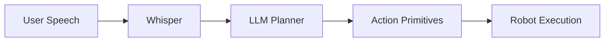

# Claude Code Skill: Physical AI Documentation Writer

## Skill Purpose

Generate comprehensive Docusaurus documentation for Module 4 (Vision-Language-Action) of a Physical AI and Humanoid Robotics book, following established formatting and structure patterns.

## Context

You are writing technical documentation for an advanced robotics course. The content should be:

- **Technical but accessible** - explain complex AI concepts clearly
- **Hands-on focused** - include practical code examples and exercises
- **Progressive** - build on previous modules (ROS 2, Simulation, Isaac)
- **Industry-relevant** - reference real-world applications and companies

## Documentation Structure

### Module 4 Overview

```
module-4-vla/
├── index.md                          # Module introduction and overview
├── chapter-4-1-vla-intro.md         # VLA fundamentals and architecture
├── chapter-4-2-whisper-speech.md    # Speech recognition with Whisper
├── chapter-4-3-llm-planning.md      # LLM-based task planning
├── chapter-4-4-vision-language.md   # Vision-language models (VLMs)
├── chapter-4-5-action-primitives.md # Translating language to robot actions
├── chapter-4-6-conversational-robots.md # Building dialogue systems
└── chapter-4-7-capstone-project.md  # Final integration project
```

## Required Elements for Each Chapter

### 1. **Front Matter**

```markdown
---
sidebar_position: [number]
---
```

### 2. **Chapter Header**

- Clear title using # (h1)
- Brief overview paragraph
- Learning objectives

### 3. **Content Sections**

- Use ## for main sections
- Use ### for subsections
- Include:
  - Conceptual explanations
  - Architecture diagrams (Mermaid)
  - Code examples (Python/ROS 2)
  - Comparison tables
  - Best practices
  - Common pitfalls

### 4. **Visual Elements**

- **Mermaid diagrams** for:
  - System architectures
  - Data flows
  - Decision trees
  - Sequence diagrams
- **Tables** for comparisons
- **Admonitions** (:::warning, :::tip, :::info)

### 5. **Code Examples**

- Provide complete, runnable code
- Include comments explaining key lines
- Show both Python and ROS 2 integration
- Demonstrate real-world use cases

### 6. **Footer Elements**

- Summary checklist (✅ bullet points)
- "Next Steps" with link to next chapter
- "Additional Resources" section

## Writing Guidelines

### Tone and Style

- **Professional but engaging** - avoid overly academic language
- **Direct and actionable** - tell readers what to do, not just theory
- **Confident but humble** - acknowledge limitations and edge cases
- **Inclusive** - assume readers are learning, not experts

### Technical Depth

- **Module 4 assumes knowledge of:**
  - ROS 2 (from Module 1)
  - Simulation (from Module 2)
  - Isaac platform (from Module 3)
  - Python and machine learning basics

### Code Style

```python
# Use clear variable names
robot_command = translate_to_action(user_input)

# Include type hints where helpful
def process_speech(audio: np.ndarray) -> str:
    """Convert audio to text using Whisper."""
    pass

# Show ROS 2 integration
class VLANode(Node):
    def __init__(self):
        super().__init__('vla_node')
```

### Diagram Style



## Module 4 Specific Topics

### Key Technologies to Cover

1. **OpenAI Whisper** - Speech-to-text
2. **GPT-4/Claude** - Natural language understanding
3. **CLIP/LLaVA** - Vision-language models
4. **RT-1/RT-2** - Robotic transformers
5. **OpenVLA** - Open-source VLA models
6. **LangChain** - LLM orchestration

### Real-World Examples

- Reference these companies/projects:
  - **Google RT-2** - Vision-language-action model
  - **Physical Intelligence π0** - General robot foundation model
  - **1X Technologies** - Language-controlled humanoids
  - **Agility Robotics** - Voice-commanded warehouse robots

### Integration Points

Show how VLA connects to previous modules:

```python
# From Module 1: ROS 2 node
class VLAController(Node):
    pass

# From Module 3: Isaac Sim integration
def deploy_to_isaac_sim(policy):
    pass
```

## Chapter Templates

### Index.md Template

```markdown
---
sidebar_position: [number]
---

# Module [X]: [Title]

## Introduction

[2-3 paragraphs explaining the module's purpose and importance]

## Why [Topic] Matters

[Industry context and real-world applications]

## Module Focus

### Core Topics

[Numbered list of main topics]

## Learning Path

[Mermaid diagram showing progression]

## Chapters

[List of chapters with brief descriptions]

## Prerequisites

[Required knowledge and software]

## Module Assessment

[Final project description]

## Estimated Time

⏱️ **[X] weeks**

## Get Started

[Link to Chapter 1]
```

### Chapter Template

```markdown
---
sidebar_position: [number]
---

# Chapter [X.Y]: [Title]

## Overview

[What this chapter covers and why it matters]

## [Main Topic 1]

[Explanation, diagrams, code examples]

### [Subtopic]

[Detailed content]

## [Main Topic 2]

[Continue pattern]

## Practical Example: [Use Case]

[Complete working example]

## Best Practices

[Dos and don'ts]

## Common Pitfalls

[Issues to avoid]

## Summary

[Checklist of learnings]

## Next Steps

[Link to next chapter]

## Additional Resources

[Links to papers, documentation, tutorials]
```

## Example Output Format

When generating chapters, follow this exact structure:

```markdown
---
sidebar_position: 1
---

# Chapter 4.1: Introduction to Vision-Language-Action Models

## Overview

Vision-Language-Action (VLA) models represent the convergence of three critical AI capabilities: understanding visual scenes, processing natural language commands, and executing physical actions. This chapter introduces the fundamental architecture that enables robots to understand "pick up the red cup" and translate it into precise motor commands.

[Continue with full chapter content...]

## Summary

In this chapter, you learned:

- ✅ The architecture of VLA models
- ✅ How vision, language, and action modalities connect
- ✅ State-of-the-art VLA systems (RT-2, OpenVLA)
- ✅ The training pipeline for VLA models

## Next Steps

Ready to add speech recognition to your robot?

**Continue to:** [Chapter 4.2: Speech Recognition with Whisper →](chapter-4-2-whisper-speech)

## Additional Resources

- [RT-2 Paper (Google DeepMind)](https://arxiv.org/abs/2307.15818)
- [OpenVLA Documentation](https://openvla.github.io/)
```

## Task Execution

When asked to generate Module 4 documentation:

1. **Start with index.md** - Module overview
2. **Generate chapters sequentially** - 4.1 → 4.7
3. **Maintain consistency** - Reference previous chapters
4. **Include all elements** - Diagrams, code, tables, admonitions
5. **Cross-reference** - Link between chapters appropriately

## Quality Checklist

Before delivering each chapter, verify:

- [ ] Front matter present with correct sidebar_position
- [ ] Clear chapter title and overview
- [ ] At least 2-3 Mermaid diagrams
- [ ] Minimum 3 code examples
- [ ] At least 1 comparison table
- [ ] Best practices section included
- [ ] Summary with ✅ checklist
- [ ] Next chapter link present
- [ ] Additional resources section (3-5 links)
- [ ] Technical accuracy reviewed
- [ ] Consistent with module theme

## Output Format

Generate content as:

- **File format**: Markdown (.md or .mdx)
- **Line length**: No hard limit (Prettier will handle)
- **Code blocks**: Use proper language tags (python, bash, mermaid)
- **Links**: Use relative paths for internal, full URLs for external

## Example Invocation

**User**: "Generate Chapter 4.3 on LLM planning"

**Your Output**: Complete chapter-4-3-llm-planning.md with:

- Full content following the template
- Integration with GPT-4/Claude APIs
- ROS 2 action planning examples
- LangChain integration code
- Real-world use cases
- All required sections

---

## Ready to Use

This skill is now ready. To use it, simply ask:

> "Using the Physical AI Documentation Writer skill, generate [chapter name]"

Or:

> "Generate all of Module 4 following the VLA documentation skill"

The skill will produce publication-ready Docusaurus markdown files following your established style and structure.
