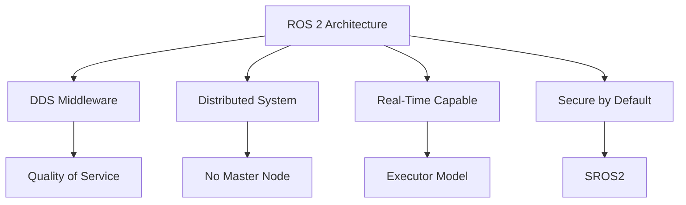
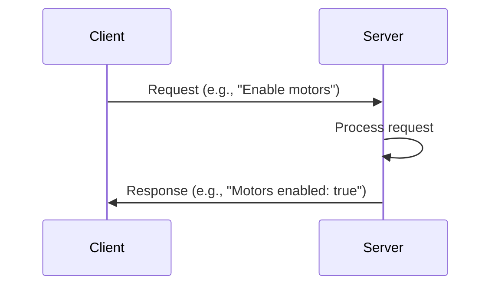
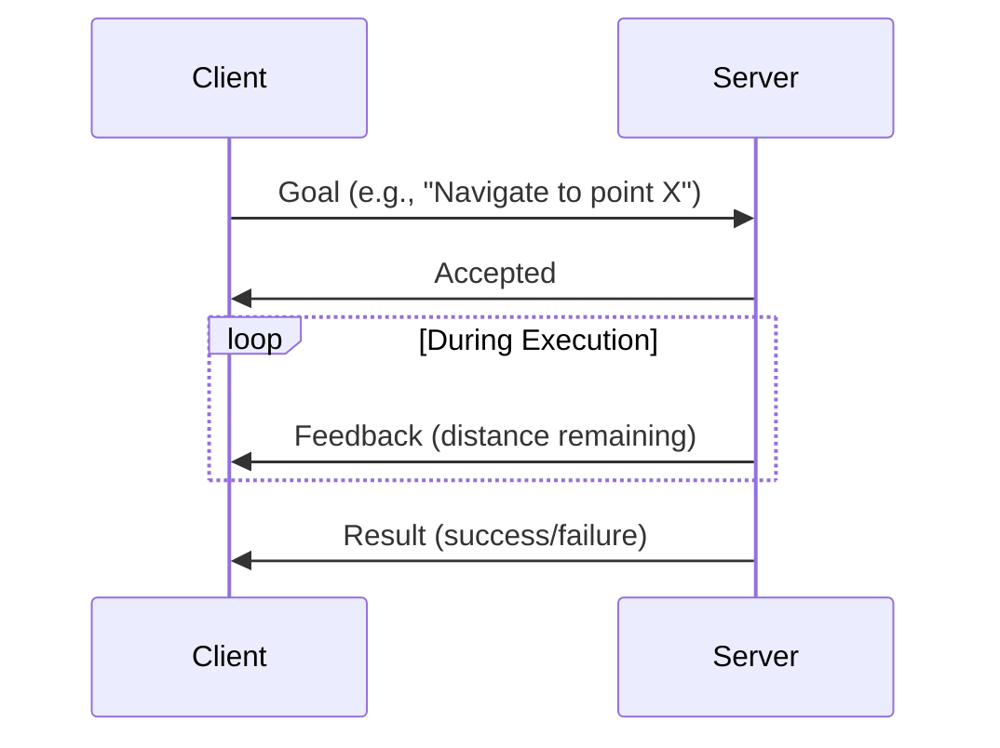
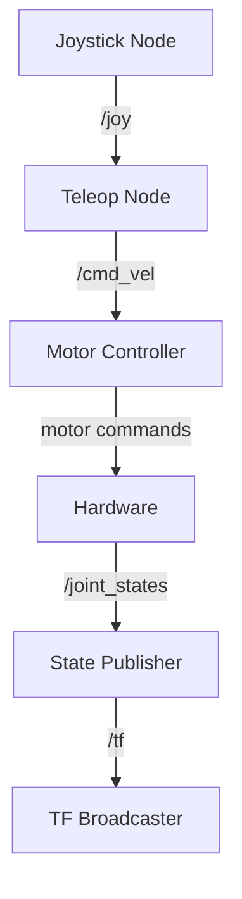

# Chapter 1.1: Introduction to ROS 2 Architecture

## Overview

ROS 2 (Robot Operating System 2) is not an operating system in the traditional sense—it's a **middleware framework** that provides the communication infrastructure, development tools, and software libraries necessary to build robot applications.

In this chapter, you'll learn the fundamental architecture of ROS 2, understand why it was redesigned from ROS 1, and grasp the core concepts that will form the foundation of everything you build in this course.

## The Evolution from ROS 1 to ROS 2

### Why ROS 2 Exists

ROS 1 (released in 2007) revolutionized robotics research but had fundamental limitations:

| Limitation | ROS 1 | ROS 2 Solution |
|------------|-------|----------------|
| **Single Point of Failure** | roscore required | Fully distributed |
| **No Real-Time Support** | Best-effort delivery | DDS with QoS policies |
| **Network Security** | None | DDS Security (SROS2) |
| **Multi-Robot Systems** | Complex workarounds | Native support |
| **Production Use** | Research-focused | Industry-grade reliability |

### Key Improvements in ROS 2



## Core Concepts

### 1. Nodes

**Nodes** are the fundamental building blocks of ROS 2 applications. Each node is a **process** that performs a specific computation.

#### Node Characteristics

- **Single Purpose:** Each node should do one thing well
- **Modular:** Nodes can be developed, tested, and deployed independently
- **Composable:** Multiple nodes work together to create complex behaviors
- **Language Agnostic:** Write in Python, C++, or other supported languages

#### Example Node Purposes

```
├── /camera_driver          → Publishes raw images
├── /image_processor        → Detects objects in images
├── /robot_controller       → Commands robot motors
└── /path_planner           → Computes navigation paths
```

### 2. Topics (Publish-Subscribe Pattern)

**Topics** enable **asynchronous, many-to-many communication** between nodes using a publish-subscribe model.

#### How Topics Work

```mermaid
graph LR
    A[Publisher Node] -->|publishes| B[/camera/image Topic]
    B --> C[Subscriber Node 1]
    B --> D[Subscriber Node 2]
    B --> E[Subscriber Node N]
```

#### Key Characteristics

- **Asynchronous:** Publishers don't wait for subscribers
- **Decoupled:** Publishers don't know who's subscribing
- **Typed:** Each topic has a specific message type
- **Many-to-Many:** Multiple publishers and subscribers per topic

#### Common Topic Examples

```bash
/camera/image_raw           # sensor_msgs/Image
/cmd_vel                    # geometry_msgs/Twist
/joint_states               # sensor_msgs/JointState
/odom                       # nav_msgs/Odometry
```

### 3. Services (Request-Response Pattern)

**Services** provide **synchronous, one-to-one communication** for request-response interactions.

#### How Services Work



#### When to Use Services

✅ **Use Services When:**

- You need a response immediately
- The operation is quick (< 1 second)
- It's a configuration or query operation

❌ **Don't Use Services When:**

- The operation takes a long time
- You need progress updates
- Multiple clients might call simultaneously

#### Common Service Examples

```bash
/get_robot_state            # Check current robot status
/reset_odometry             # Reset position tracking
/set_parameters             # Configure node settings
```

### 4. Actions (Long-Running Tasks)

**Actions** are designed for **long-running, preemptable tasks** that provide feedback.

#### How Actions Work



#### Action Components

1. **Goal:** What you want to accomplish
2. **Feedback:** Progress updates during execution
3. **Result:** Final outcome when complete

#### When to Use Actions

✅ **Use Actions When:**

- Task takes more than 1 second
- You need progress updates
- Task should be cancellable mid-execution

#### Common Action Examples

```bash
/navigate_to_pose           # Move robot to target location
/follow_path                # Execute a planned trajectory
/gripper_grasp              # Close gripper on object
```

## The DDS Middleware Layer

### What is DDS?

**DDS (Data Distribution Service)** is the communication layer underneath ROS 2. It provides:

- **Discovery:** Nodes automatically find each other
- **Quality of Service (QoS):** Configure reliability, durability, and latency
- **Security:** Encrypted communication (SROS2)
- **Real-Time:** Deterministic message delivery

### DDS Implementations

ROS 2 supports multiple DDS vendors:

| Implementation  | Characteristics             | Use Case                     |
| --------------- | --------------------------- | ---------------------------- |
| **Fast DDS**    | Default, well-optimized     | General purpose              |
| **Cyclone DDS** | Lightweight, fast discovery | Resource-constrained systems |
| **RTI Connext** | Professional, certified     | Industrial applications      |

You can switch DDS implementations without changing code:

```bash
export RMW_IMPLEMENTATION=rmw_cyclonedx_cpp
```

## Understanding the Computation Graph

The **computation graph** is the network of nodes and their connections.

### Visualizing the Graph

Use `rqt_graph` to visualize running nodes and topics:

```bash
ros2 run rqt_graph rqt_graph
```

### Example Graph

```
┌─────────────────┐
│  /camera_driver │
└────────┬────────┘
         │ /camera/image_raw
         ├───────────────┐
         ▼               ▼
┌────────────────┐  ┌─────────────────┐
│ /object_detect │  │  /image_viewer  │
└────────┬───────┘  └─────────────────┘
         │ /detected_objects
         ▼
┌────────────────┐
│ /robot_control │
└────────────────┘
```

## ROS 2 Communication Patterns

### 1. One-Way Data Flow (Topics)

```python
# Publisher
publisher.publish(msg)  # Fire and forget

# Subscriber
def callback(msg):
    process(msg)  # Called when message arrives
```

### 2. Request-Response (Services)

```python
# Client
response = client.call(request)  # Blocks until response

# Server
def handle_request(request, response):
    response.result = process(request)
    return response
```

### 3. Goal-Oriented (Actions)

```python
# Client
goal = NavigateToPose.Goal()
future = action_client.send_goal_async(goal, feedback_callback)

# Server
def execute_callback(goal_handle):
    while not done:
        goal_handle.publish_feedback(progress)
    return result
```

## Quality of Service (QoS) Policies

QoS policies allow you to tune communication characteristics.

### Key QoS Parameters

#### Reliability

- **RELIABLE:** Guarantee delivery (TCP-like)
- **BEST_EFFORT:** Send and forget (UDP-like)

```python
from rclpy.qos import QoSProfile, ReliabilityPolicy

qos = QoSProfile(
    reliability=ReliabilityPolicy.RELIABLE,
    depth=10  # Message queue size
)
```

#### Durability

- **VOLATILE:** Only send to current subscribers
- **TRANSIENT_LOCAL:** Send last message to new subscribers

```python
from rclpy.qos import DurabilityPolicy

qos = QoSProfile(
    durability=DurabilityPolicy.TRANSIENT_LOCAL
)
```

### Common QoS Presets

```python
from rclpy.qos import qos_profile_sensor_data
from rclpy.qos import qos_profile_services_default
from rclpy.qos import qos_profile_system_default
```

## ROS 2 Workspace Structure

### Standard Workspace Layout

```
ros2_ws/
├── src/                    # Source code
│   ├── my_robot_pkg/
│   │   ├── my_robot_pkg/  # Python package
│   │   ├── package.xml    # Package manifest
│   │   └── setup.py       # Python setup
│   └── another_pkg/
├── build/                  # Build artifacts (auto-generated)
├── install/                # Installed files (auto-generated)
└── log/                    # Build logs (auto-generated)
```

### Package Structure

```
my_robot_pkg/
├── my_robot_pkg/
│   ├── __init__.py
│   ├── my_node.py
│   └── utils.py
├── resource/
│   └── my_robot_pkg       # Package marker
├── test/
│   └── test_my_node.py
├── package.xml            # Package dependencies
└── setup.py               # Python setup
```

## ROS 2 Command-Line Tools

### Essential Commands

```bash
# Node management
ros2 node list              # List running nodes
ros2 node info /my_node     # Show node details

# Topic management
ros2 topic list             # List all topics
ros2 topic echo /cmd_vel    # Print topic messages
ros2 topic hz /camera/image # Show message rate
ros2 topic pub /cmd_vel ... # Publish from terminal

# Service management
ros2 service list           # List all services
ros2 service call /reset    # Call a service

# Action management
ros2 action list            # List all actions
ros2 action send_goal ...   # Send action goal

# Package management
ros2 pkg list               # List installed packages
ros2 pkg create my_pkg      # Create new package
```

## Namespaces and Remapping

### Namespaces

Organize nodes hierarchically to avoid naming conflicts:

```bash
/robot1/camera/image_raw
/robot2/camera/image_raw
```

Launch with namespace:

```bash
ros2 run pkg_name node_name --ros-args -r __ns:=/robot1
```

### Remapping

Change topic names at runtime:

```bash
ros2 run pkg_name node_name --ros-args -r /cmd_vel:=/robot1/cmd_vel
```

## Best Practices

### 1. Node Design

✅ **DO:**

- Keep nodes focused on single responsibilities
- Use descriptive node names: `/camera_driver` not `/node1`
- Handle initialization errors gracefully

❌ **DON'T:**

- Create monolithic nodes that do everything
- Use hard-coded topic names
- Ignore error conditions

### 2. Topic Naming

✅ **DO:**

```
/camera/image_raw           # Clear hierarchy
/robot/joint_states         # Descriptive names
/navigation/cmd_vel         # Grouped by function
```

❌ **DON'T:**

```
/data                       # Too vague
/t1                         # Not descriptive
/MySpecialTopic            # Use lowercase with underscores
```

### 3. Message Types

✅ **DO:**

- Use standard message types when possible
- Create custom messages for domain-specific data
- Document message field meanings

❌ **DON'T:**

- Abuse generic types (e.g., `String` for structured data)
- Create duplicate message types
- Use nested messages excessively

## Practical Example: Simple Robot System

Let's visualize a minimal robot system:



### Node Responsibilities

1. **Joystick Node:** Reads gamepad input
2. **Teleop Node:** Converts joy to velocity commands
3. **Motor Controller:** Sends commands to hardware
4. **State Publisher:** Reports robot state
5. **TF Broadcaster:** Publishes coordinate transforms

## Summary

In this chapter, you learned:

- ✅ The evolution from ROS 1 to ROS 2 and key improvements
- ✅ Core concepts: Nodes, Topics, Services, and Actions
- ✅ The DDS middleware layer and QoS policies
- ✅ ROS 2 workspace and package structure
- ✅ Essential command-line tools for development
- ✅ Best practices for node and topic naming

## Next Steps

Now that you understand the architecture, you're ready to write your first ROS 2 node!

**Continue to:** [Chapter 1.2: Building Your First ROS 2 Node →](chapter-1-2-first-ros2-node)

## Additional Resources

- [ROS 2 Documentation](https://docs.ros.org/en/humble/)
- [DDS Specification](https://www.omg.org/spec/DDS/)
- [ROS 2 Design](https://design.ros2.org/)
- [QoS Policy Guide](https://docs.ros.org/en/humble/Concepts/About-Quality-of-Service-Settings.html)