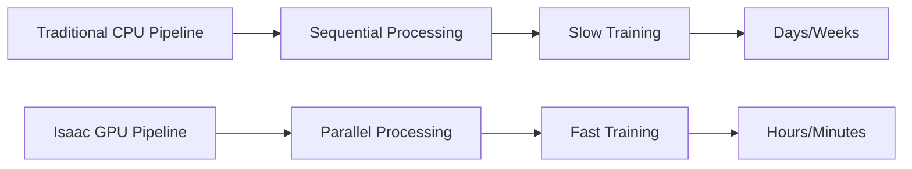
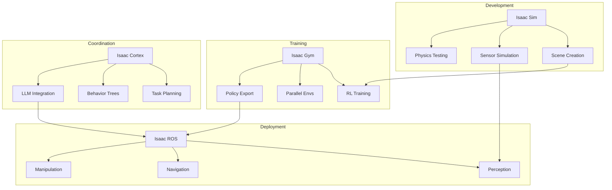
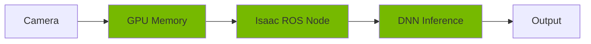
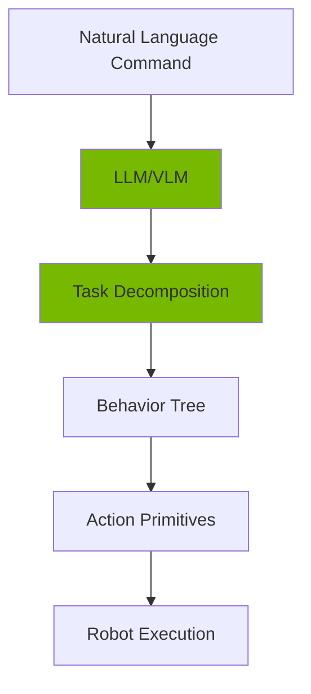
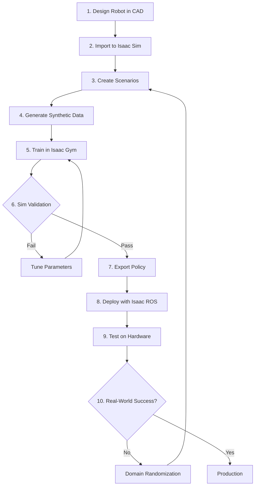
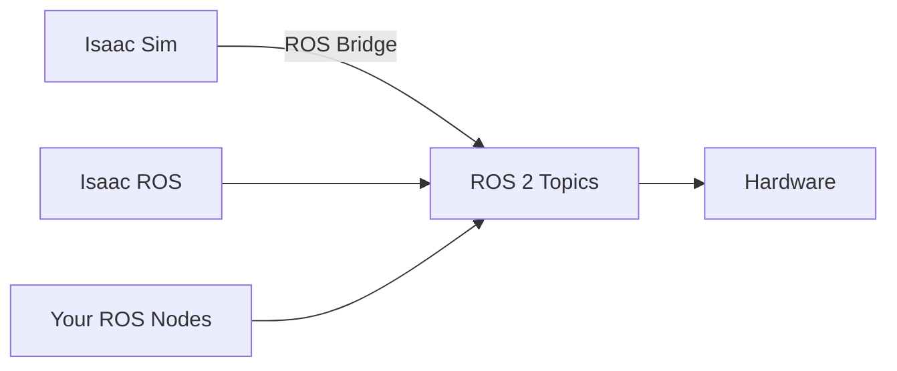

# Chapter 3.1: Understanding the Isaac Ecosystem

## Overview

The NVIDIA Isaac platform represents a paradigm shift in robotics development—moving from sequential, CPU-bound workflows to massively parallel, GPU-accelerated pipelines. This chapter provides a comprehensive overview of the Isaac ecosystem, helping you understand which tools to use for different stages of robot development.

## The Genesis: Why Isaac Was Created

### The Robotics Data Problem

Traditional robotics development faces critical challenges:

| Challenge | Impact | Isaac Solution |
|-----------|--------|----------------|
| **Data Scarcity** | Expensive real-world collection | Infinite synthetic data |
| **Safety Risks** | Hardware damage during testing | Safe simulation environment |
| **Iteration Speed** | Slow physical prototyping | Instant virtual testing |
| **Scalability** | Single robot at a time | Thousands of parallel instances |
| **Perception Labeling** | Manual annotation (hours) | Automatic labels (seconds) |

### The GPU Advantage

NVIDIA's core insight: **Robotics is a GPU problem**.



## The Isaac Platform Architecture

### Complete Ecosystem Overview



## Core Components Deep Dive

### 1. Isaac Sim: The Photorealistic Simulator

**Purpose:** High-fidelity robot simulation with RTX ray tracing

#### Built on NVIDIA Omniverse

- **USD (Universal Scene Description):** Pixar's format for 3D scenes
- **RTX Rendering:** Real-time ray tracing for computer vision
- **PhysX 5:** GPU-accelerated physics engine
- **Material Definition Language (MDL):** Physically accurate materials

#### Key Features

```python
# Isaac Sim capabilities
capabilities = {
    "rendering": "RTX ray tracing (path tracing, photon mapping)",
    "physics": "GPU-accelerated rigid body, soft body, fluids",
    "sensors": "RGB, depth, lidar, IMU, contact sensors",
    "robots": "URDF, USD import with automatic articulation",
    "extensibility": "Python API for custom behaviors"
}
```

#### When to Use Isaac Sim

✅ **Use Isaac Sim For:**

- Photorealistic sensor data generation
- Computer vision model training (object detection, segmentation)
- Testing navigation algorithms in complex environments
- Validating robot designs before hardware build
- Creating marketing/demo videos

❌ **Don't Use Isaac Sim For:**

- Large-scale RL training (use Isaac Gym instead)
- Simple physics testing (Gazebo is sufficient)
- Real-time embedded deployment (too heavy)

### 2. Isaac Gym: The RL Powerhouse

**Purpose:** Massively parallel reinforcement learning training

#### Architecture


#### Key Innovations

1. **GPU-Centric Design:** Entire simulation runs on GPU (no CPU bottleneck)
2. **Vectorized Environments:** Thousands of simultaneous rollouts
3. **Direct-to-Tensor:** Observations go straight to neural network (no copying)

#### Performance Comparison

| Metric             | Traditional CPU RL | Isaac Gym  |
| ------------------ | ------------------ | ---------- |
| **Parallel Envs**  | 10-100             | 10,000+    |
| **Samples/Second** | 1K-10K             | 1M+        |
| **Training Time**  | Days/Weeks         | Hours      |
| **Hardware**       | CPU cluster        | Single GPU |

#### When to Use Isaac Gym

✅ **Use Isaac Gym For:**

- Training humanoid locomotion policies
- Manipulation task learning (grasping, assembly)
- Large-scale hyperparameter sweeps
- Curriculum learning scenarios

❌ **Don't Use Isaac Gym For:**

- Photorealistic rendering (no ray tracing)
- Complex sensor simulation (limited sensor types)
- Deployment (training only)

### 3. Isaac ROS: Production-Grade Deployment

**Purpose:** Hardware-accelerated ROS 2 packages for real robots

#### The NITROS Framework

**NITROS (NVIDIA Isaac Transport for ROS)** eliminates CPU-GPU data copying:



Traditional ROS 2 would copy data to CPU, then back to GPU (2x overhead).

#### Available GEMs (Graph-Enabled Modules)

| GEM Category     | Examples                          | Purpose                 |
| ---------------- | --------------------------------- | ----------------------- |
| **Perception**   | DNN Inference, Pose Estimation    | Object/person detection |
| **SLAM**         | Visual SLAM, Nvblox               | Real-time mapping       |
| **Navigation**   | Path Planning, Obstacle Avoidance | Nav2 integration        |
| **Manipulation** | AprilTag, Pose Refinement         | Precise grasping        |
| **Sensors**      | Realsense, Hawk Camera            | Hardware interfaces     |

#### When to Use Isaac ROS

✅ **Use Isaac ROS For:**

- Deploying trained models on NVIDIA hardware (Jetson, x86 + RTX)
- Real-time perception (object detection, tracking)
- Hardware-accelerated SLAM and navigation
- Production robot systems

❌ **Don't Use Isaac ROS For:**

- Non-NVIDIA hardware (no GPU acceleration)
- Simple tasks not requiring GPU (overkill)
- Simulation (use Isaac Sim instead)

### 4. Isaac Cortex: AI Coordination Layer

**Purpose:** High-level task planning and behavior coordination

#### What Isaac Cortex Adds



#### Key Features

1. **Mission Planning:** Break complex tasks into subtasks
2. **Behavior Trees:** Reactive, hierarchical control
3. **Foundation Model Integration:** GPT-4, Gemini for reasoning
4. **Action Libraries:** Pre-built primitives (navigate, grasp, place)

#### When to Use Isaac Cortex

✅ **Use Isaac Cortex For:**

- Long-horizon task planning
- Human-robot interaction scenarios
- Multi-step manipulation tasks
- Adaptive behavior based on environment

❌ **Don't Use Isaac Cortex For:**

- Low-level motor control (too high-level)
- Simple reactive behaviors (overkill)
- Real-time control loops (planning overhead)

## The Isaac Development Workflow

### End-to-End Pipeline



### Workflow Example: Humanoid Walking

Let's walk through training a humanoid robot to walk:

#### Step 1: Design & Import (Isaac Sim)

```python
# Import humanoid URDF into Isaac Sim
from omni.isaac.core.utils.stage import add_reference_to_stage

robot_usd = add_reference_to_stage(
    usd_path="path/to/humanoid.urdf",
    prim_path="/World/Humanoid"
)
```

#### Step 2: Generate Training Data (Isaac Sim)

```python
# Create diverse terrains for training
terrains = [
    "flat_ground",
    "stairs",
    "uneven_terrain",
    "slopes"
]

for terrain in terrains:
    create_environment(terrain)
    record_sensor_data()
```

#### Step 3: Train Policy (Isaac Gym)

```python
# Train locomotion with PPO
from isaacgymenvs.tasks.humanoid import Humanoid

env = Humanoid(num_envs=4096)  # 4096 parallel robots
policy = train_ppo(env, num_iterations=10000)
```

#### Step 4: Deploy (Isaac ROS)

```python
# Load policy on real robot
policy_node = IsaacROSPolicyNode(
    model_path="trained_policy.onnx",
    input_topic="/joint_states",
    output_topic="/joint_commands"
)
```

## Omniverse Foundation

### What is Omniverse?

NVIDIA Omniverse is a platform for 3D collaboration and simulation. Isaac Sim is built on top of it.

#### Omniverse Architecture

```
┌─────────────────────────────────────┐
│        Isaac Sim Application         │
├─────────────────────────────────────┤
│       Omniverse Kit Framework        │
├─────────────────────────────────────┤
│  RTX Renderer │ PhysX │ USD Core    │
├─────────────────────────────────────┤
│         Omniverse Nucleus            │
│      (Collaboration Server)          │
└─────────────────────────────────────┘
```

#### Key Omniverse Concepts

1. **USD (Universal Scene Description)**
   - Open-source format by Pixar
   - Hierarchical scene composition
   - Non-destructive editing (layering)

2. **Nucleus Server**
   - Central asset repository
   - Real-time collaboration
   - Version control for 3D scenes

3. **Extensions**
   - Modular functionality
   - Python/C++ APIs
   - Community marketplace

### Why USD Matters for Robotics

```python
# USD allows non-destructive composition
from pxr import Usd, UsdGeom

# Base robot definition
stage = Usd.Stage.Open("base_humanoid.usd")

# Add sensors without modifying original
layer = stage.GetRootLayer().subLayerPaths.append("sensors.usd")

# Result: Base robot + sensors, both independently editable
```

## Integration with Other Tools

### Isaac + ROS 2



### Isaac + PyTorch

```python
# Direct tensor interface (no copying)
observations = env.get_observations()  # Already on GPU
actions = policy(observations)  # Inference on GPU
env.step(actions)  # Back to simulation, still on GPU
```

### Isaac + Computer Vision Pipelines

```python
# Synthetic data → Training pipeline
isaac_sim.export_annotations(format="COCO")
train_yolov8(dataset="isaac_synthetic")
deploy_to_isaac_ros()
```

## Hardware Acceleration Details

### GPU Requirements by Task

| Task                        | Minimum GPU | Recommended GPU | VRAM |
| --------------------------- | ----------- | --------------- | ---- |
| **Isaac Sim (Basic)**       | RTX 3060    | RTX 4070 Ti     | 8GB  |
| **Isaac Sim (Raytracing)**  | RTX 4070    | RTX 4090        | 12GB |
| **Isaac Gym (Small Scale)** | RTX 3070    | RTX 4080        | 10GB |
| **Isaac Gym (Large Scale)** | RTX 4090    | A6000           | 24GB |
| **Isaac ROS (Jetson)**      | Jetson Orin | Jetson AGX Orin | 32GB |
| **Isaac ROS (x86)**         | RTX 4060    | RTX 4070        | 8GB  |

### PhysX GPU Acceleration

```python
# Enable GPU physics (massive speedup)
sim_params = gymapi.SimParams()
sim_params.use_gpu_pipeline = True
sim_params.physx.use_gpu = True

# Result: 100x speedup for rigid body simulation
```

## Licensing and Access

### Isaac Sim

- **Free** for individual developers
- Commercial use requires NVIDIA Omniverse Enterprise license
- Runs locally (no cloud requirement)

### Isaac Gym

- **Free** for research and commercial use
- Open-source examples and documentation
- Requires RTX GPU (no cloud option)

### Isaac ROS

- **Free** and open-source (Apache 2.0)
- Runs on Jetson and x86 + RTX
- Production deployment allowed

## Comparison with Alternatives

### Isaac Sim vs. Gazebo

| Feature            | Isaac Sim                    | Gazebo               |
| ------------------ | ---------------------------- | -------------------- |
| **Rendering**      | RTX ray tracing              | OpenGL rasterization |
| **Physics**        | GPU PhysX                    | CPU ODE/Bullet       |
| **Sensors**        | Photorealistic               | Simplified           |
| **Performance**    | High (GPU)                   | Medium (CPU)         |
| **Learning Curve** | Steep                        | Moderate             |
| **Best For**       | CV training, visual fidelity | Quick prototyping    |

### Isaac Gym vs. PyBullet

| Feature              | Isaac Gym      | PyBullet  |
| -------------------- | -------------- | --------- |
| **Parallel Envs**    | 10,000+        | 10-100    |
| **GPU Acceleration** | Native         | None      |
| **Training Speed**   | Hours          | Days      |
| **Rendering**        | Basic          | Basic     |
| **Best For**         | Large-scale RL | Simple RL |

### Isaac ROS vs. Standard ROS 2

| Feature        | Isaac ROS            | Standard ROS 2   |
| -------------- | -------------------- | ---------------- |
| **Perception** | GPU-accelerated      | CPU-bound        |
| **Latency**    | &lt;10ms              | 50-100ms         |
| **Throughput** | 30+ FPS              | 5-15 FPS         |
| **Hardware**   | NVIDIA GPU required  | Any              |
| **Best For**   | Real-time perception | General robotics |

## When NOT to Use Isaac

Despite its power, Isaac isn't always the right choice:

❌ **Skip Isaac If:**

1. **No NVIDIA GPU:** Isaac requires NVIDIA hardware (no AMD/Intel support)
2. **Simple Tasks:** Basic simulation (Gazebo is sufficient)
3. **Educational Projects:** Lighter tools (Webots, CoppeliaSim)
4. **Limited Resources:** Small laptop without dedicated GPU
5. **Web Deployment:** Isaac requires local GPU (can't run in browser)

## Getting Started Checklist

Before diving into Isaac, ensure you have:

### Software Prerequisites

- [ ] Ubuntu 22.04 LTS (required)
- [ ] NVIDIA Driver 525+ installed
- [ ] CUDA 12.0+ installed
- [ ] Python 3.10+ with pip
- [ ] ROS 2 Humble installed (for Isaac ROS)

### Hardware Prerequisites

- [ ] NVIDIA RTX GPU (4070 Ti minimum, 4090 recommended)
- [ ] 64GB RAM minimum
- [ ] 500GB+ free SSD space
- [ ] Stable internet (initial download ~50GB)

### Account Setup

- [ ] NVIDIA Developer Account (free)
- [ ] Omniverse Launcher installed
- [ ] Isaac Sim 4.0+ downloaded
- [ ] Isaac Gym cloned from GitHub

## Summary

In this chapter, you learned:

- ✅ The motivation behind NVIDIA Isaac and the robotics data problem
- ✅ Four core components: Isaac Sim, Gym, ROS, and Cortex
- ✅ When to use each tool in the Isaac ecosystem
- ✅ The complete development workflow from design to deployment
- ✅ Integration with Omniverse and USD format
- ✅ Hardware requirements and GPU acceleration details
- ✅ Comparison with alternative simulation platforms
- ✅ Licensing and access information

## Next Steps

Now that you understand the ecosystem, you're ready to install and use Isaac Sim!

**Continue to:** [Chapter 3.2: Getting Started with Isaac Sim →](chapter-3-2-isaac-sim-basics)

## Additional Resources

- [Isaac Sim Official Documentation](https://docs.omniverse.nvidia.com/isaacsim/latest/index.html)
- [Isaac Gym Paper (NVIDIA Research)](https://arxiv.org/abs/2108.10470)
- [Isaac ROS GitHub](https://github.com/NVIDIA-ISAAC-ROS)
- [Omniverse USD Documentation](https://docs.omniverse.nvidia.com/prod_usd/prod_usd/overview.html)
- [PhysX 5 SDK Documentation](https://nvidia-omniverse.github.io/PhysX/physx/5.1.1/index.html)
- [NVIDIA Developer Blog](https://developer.nvidia.com/blog/tag/isaac/)