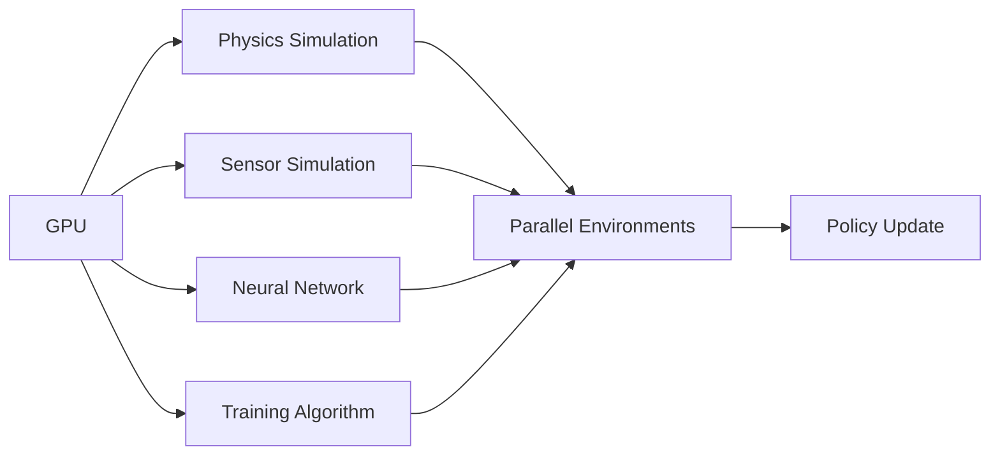

# Chapter 3.4: Robot Training with Isaac Gym

## Overview

Isaac Gym provides a GPU-accelerated physics simulation and reinforcement learning environment that enables training of complex robot behaviors at unprecedented scale. This chapter covers reinforcement learning in Isaac Gym, humanoid locomotion training, parallel environment scaling, reward function design, and exporting trained policies for deployment.

By the end of this chapter, you'll understand how to set up Isaac Gym environments, design effective reward functions, train complex robot behaviors, and export policies for real-world deployment.

## Introduction to Isaac Gym

### What is Isaac Gym?

Isaac Gym is NVIDIA's reinforcement learning environment that runs entirely on GPU, eliminating the CPU-GPU communication bottleneck that limits traditional RL frameworks. This allows for:

- **Massively Parallel Training**: Thousands of environments running simultaneously
- **Direct GPU Simulation**: Physics, sensors, and neural networks all on GPU
- **High-Performance Training**: 1000x+ faster than CPU-based alternatives

### Key Architecture Components



### Isaac Gym vs. Traditional RL Environments

| Feature | Traditional RL | Isaac Gym |
|---------|----------------|-----------|
| **Parallel Environments** | 10-100 | 10,000+ |
| **Physics Acceleration** | CPU-based | GPU PhysX |
| **Data Transfer** | CPU↔GPU | GPU-native |
| **Training Speed** | Days/Weeks | Hours |
| **Memory Management** | System RAM | GPU VRAM |

## Setting Up Isaac Gym Environments

### Installation and Dependencies

```bash
# Install Isaac Gym (separate from Isaac Sim)
git clone https://github.com/NVIDIA-Omniverse/IsaacGymEnvs.git
cd IsaacGymEnvs

# Install Python dependencies
pip install -e .
```

### Basic Environment Structure

Isaac Gym environments follow a standardized structure:

```python
import isaacgym
from isaacgym import gymapi, gymtorch
from isaacgym.torch_utils import *
import torch

class RobotEnv:
    def __init__(self, cfg):
        # Initialize physics simulation
        self.gym = gymapi.acquire_gym()
        self.sim = self.gym.create_sim()

        # Create ground plane
        self._create_ground_plane()

        # Create environments
        self._create_envs()

        # Setup tensors
        self._setup_tensors()

    def _create_ground_plane(self):
        """Create ground plane for the simulation"""
        plane_params = gymapi.PlaneParams()
        plane_params.normal = gymapi.Vec3(0.0, 0.0, 1.0)
        plane_params.distance = 0
        self.gym.add_ground(self.sim, plane_params)

    def _create_envs(self):
        """Create multiple parallel environments"""
        # Calculate environment placement
        env_spacing = self.cfg["env"]["env_spacing"]
        num_per_row = int(np.sqrt(self.num_envs))

        for i in range(self.num_envs):
            # Create environment
            env = self.gym.create_env(
                self.sim,
                gymapi.Vec3(-env_spacing, -env_spacing, 0),
                gymapi.Vec3(env_spacing, env_spacing, env_spacing),
                num_per_row
            )

            # Add actors to environment
            self._add_actors_to_env(env, i)

    def _setup_tensors(self):
        """Setup GPU tensors for observations, actions, rewards"""
        # Initialize tensor buffers
        self.obs_buf = torch.zeros((self.num_envs, self.num_obs), device=self.device, dtype=torch.float)
        self.rew_buf = torch.zeros(self.num_envs, device=self.device, dtype=torch.float)
        self.reset_buf = torch.ones(self.num_envs, device=self.device, dtype=torch.long)
        self.actions = torch.zeros((self.num_envs, self.num_actions), device=self.device, dtype=torch.float)
```

### Robot Asset Loading

Loading robot models into Isaac Gym environments:

```python
def load_robot_asset(self):
    """Load robot asset and configure DOF properties"""

    # Load asset from URDF/USD
    asset_root = "path/to/assets"
    asset_file = "robot.urdf"  # or .usd

    asset_options = gymapi.AssetOptions()
    asset_options.fix_base_link = False  # Robot is free-floating
    asset_options.default_dof_drive_mode = gymapi.DOF_MODE_POS  # Position control
    asset_options.collapse_fixed_joints = True  # Simplify kinematic chain

    robot_asset = self.gym.load_asset(self.sim, asset_root, asset_file, asset_options)

    # Configure DOF properties
    dof_props = self.gym.get_asset_dof_properties(robot_asset)

    # Set drive gains for position control
    dof_props["kp"] = [500.0] * len(dof_props["kp"])  # Proportional gain
    dof_props["kd"] = [50.0] * len(dof_props["kd"])   # Derivative gain

    # Set velocity limits
    dof_props["velocity"] = [10.0] * len(dof_props["velocity"])

    return robot_asset, dof_props
```

## Humanoid Locomotion Training

### The Challenge of Bipedal Locomotion

Training humanoid robots to walk is one of the most challenging problems in robotics. The key challenges include:

- **Dynamic Balance**: Maintaining stability while moving
- **Contact Dynamics**: Handling complex foot-ground interactions
- **High-Dimensional Action Space**: Many joints to control simultaneously
- **Sparse Rewards**: Difficulty in designing reward functions

### Environment Design for Locomotion

```python
class HumanoidLocomotionEnv(RobotEnv):
    def __init__(self, cfg):
        super().__init__(cfg)
        self.target_speed = cfg["env"]["target_speed"]
        self.max_episode_length = cfg["env"]["max_episode_length"]

    def _setup_tensors(self):
        """Setup tensors specific to locomotion"""
        super()._setup_tensors()

        # Additional tensors for locomotion
        self.base_quat = torch.zeros((self.num_envs, 4), device=self.device, dtype=torch.float)
        self.base_lin_vel = torch.zeros((self.num_envs, 3), device=self.device, dtype=torch.float)
        self.base_ang_vel = torch.zeros((self.num_envs, 3), device=self.device, dtype=torch.float)
        self.dof_pos = torch.zeros((self.num_envs, self.num_dof), device=self.device, dtype=torch.float)
        self.dof_vel = torch.zeros((self.num_envs, self.num_dof), device=self.device, dtype=torch.float)

    def compute_observations(self):
        """Compute observations for locomotion policy"""
        # Base orientation (relative to gravity)
        base_quat = self.base_quat
        base_lin_vel = self.base_lin_vel
        base_ang_vel = self.base_ang_vel

        # Joint positions and velocities
        dof_pos = self.dof_pos
        dof_vel = self.dof_vel

        # Command (e.g., desired speed)
        commands = self.commands  # [v_x, v_y, omega]

        # Combine into observation vector
        obs = torch.cat([
            quat_rotate_inverse(base_quat, base_lin_vel[:, :3]),  # Velocity in local frame
            quat_rotate_inverse(base_quat, base_ang_vel),        # Angular velocity in local frame
            dof_pos,                                             # Joint positions
            dof_vel,                                             # Joint velocities
            commands                                             # Desired commands
        ], dim=-1)

        return obs
```

### Reward Function Design for Locomotion

Designing effective reward functions is crucial for successful locomotion training:

```python
def compute_reward(self):
    """Compute reward for humanoid locomotion"""

    # Velocity tracking reward
    lin_vel_error = torch.sum(torch.square(self.target_vel - self.base_lin_vel[:, :2]), dim=1)
    vel_reward = torch.exp(-lin_vel_error / 0.25)  # Gaussian reward

    # Action smoothness penalty
    actions = self.actions
    prev_actions = self.prev_actions
    action_rate_penalty = torch.sum(torch.square(actions - prev_actions), dim=1)

    # Joint position limits penalty
    dof_pos = self.dof_pos
    target_pos = self.default_dof_pos
    joint_pos_penalty = torch.sum(torch.square(dof_pos - target_pos), dim=1)

    # Upward orientation reward
    base_quat = self.base_quat
    base_z_vec = quat_rotate(base_quat, self.gravity_vec)
    up_reward = torch.square(base_z_vec[:, 2])  # Encourage upright posture

    # Foot contact reward (for walking gait)
    contact_forces = self.contact_forces
    left_foot_contact = contact_forces[:, self.left_foot_idx, 2] > 1.0
    right_foot_contact = contact_forces[:, self.right_foot_idx, 2] > 1.0

    # Combine all rewards
    total_reward = (
        vel_reward * 1.0 +
        up_reward * 0.5 -
        action_rate_penalty * 0.01 -
        joint_pos_penalty * 0.001
    )

    # Clip rewards to prevent extreme values
    total_reward = torch.clamp(total_reward, -10.0, 10.0)

    return total_reward
```

### Training Hyperparameters for Locomotion

```python
# Configuration for humanoid locomotion training
locomotion_config = {
    "env": {
        "num_envs": 4096,           # Number of parallel environments
        "env_spacing": 2.5,         # Distance between environments
        "episode_length": 1000,     # Max steps per episode
        "control_freq": 60,         # Control frequency (Hz)
        "sim_freq": 240,            # Simulation frequency (Hz)
        "target_speed": 2.0,        # Desired forward speed (m/s)
    },
    "rl": {
        "algo": "PPO",              # Proximal Policy Optimization
        "clip_param": 0.2,          # PPO clip parameter
        "num_learning_epochs": 4,   # Learning epochs per update
        "num_mini_batches": 4,      # Number of mini-batches
        "gamma": 0.99,              # Discount factor
        "lam": 0.95,                # GAE lambda
        "learning_rate": 1e-3,      # Learning rate
        "learning_rate_schedule": "adaptive",  # Learning rate schedule
    },
    "policy": {
        "actor_hidden_dims": [512, 256, 128],  # Actor network layers
        "critic_hidden_dims": [512, 256, 128], # Critic network layers
        "activation": "elu",                   # Activation function
    }
}
```

## Parallel Environment Scaling

### Understanding Parallelization in Isaac Gym

Isaac Gym achieves massive parallelization by:

1. **Vectorized Environments**: All environments execute the same operations simultaneously
2. **Tensor-Based Operations**: Observations, actions, and rewards stored as tensors
3. **GPU Memory Layout**: Optimized for parallel processing

### Batch Operations

```python
def reset_idx(self, env_ids):
    """Reset specific environments in the batch"""

    # Randomize starting positions
    positions = torch.rand((len(env_ids), 3), device=self.device) * 0.5
    positions[:, 2] += 1.0  # Start above ground

    # Randomize starting orientations
    orientations = randomize_quaternions(len(env_ids), device=self.device)

    # Reset DOF states
    dof_pos = self.default_dof_pos[env_ids] + 0.1 * torch.randn_like(self.default_dof_pos[env_ids])
    dof_vel = 0.1 * torch.randn_like(self.default_dof_pos[env_ids])

    # Write to simulation tensors
    self.root_tensor[env_ids, :3] = positions
    self.root_tensor[env_ids, 3:7] = orientations
    self.dof_state_tensor[env_ids, :, 0] = dof_pos
    self.dof_state_tensor[env_ids, :, 1] = dof_vel

    # Reset episode statistics
    self.reset_buf[env_ids] = 0
    self.progress_buf[env_ids] = 0
```

### Memory Management for Large-Scale Training

```python
class MemoryEfficientTraining:
    def __init__(self, max_envs=8192):
        self.max_envs = max_envs
        self.current_envs = 0

    def dynamic_env_scaling(self, performance_metrics):
        """Dynamically adjust number of environments based on performance"""

        if performance_metrics["gpu_utilization"] < 0.7:
            # Increase environments if GPU is underutilized
            new_envs = min(self.current_envs * 1.1, self.max_envs)
        elif performance_metrics["gpu_utilization"] > 0.95:
            # Decrease environments if GPU is overloaded
            new_envs = max(self.current_envs * 0.9, 512)
        else:
            # Maintain current number if utilization is good
            new_envs = self.current_envs

        return int(new_envs)

    def memory_optimization(self):
        """Optimize memory usage during training"""

        # Use half precision where possible
        torch.set_default_tensor_type('torch.cuda.HalfTensor')

        # Enable memory efficient attention if using transformer policies
        torch.backends.cuda.matmul.allow_tf32 = True
        torch.backends.cudnn.allow_tf32 = True
```

## Advanced Reward Function Design

### Shaping Rewards for Complex Behaviors

Effective reward shaping is crucial for training complex behaviors:

```python
class AdvancedRewardFunction:
    def __init__(self, cfg):
        self.cfg = cfg
        self.weights = cfg["reward"]["weights"]

    def compute_comprehensive_reward(self, env):
        """Compute comprehensive reward with multiple components"""

        # Primary task rewards
        task_reward = self._task_reward(env)

        # Stability rewards
        stability_reward = self._stability_reward(env)

        # Energy efficiency rewards
        energy_reward = self._energy_efficiency_reward(env)

        # Safety rewards
        safety_reward = self._safety_reward(env)

        # Combine rewards with weights
        total_reward = (
            self.weights["task"] * task_reward +
            self.weights["stability"] * stability_reward +
            self.weights["energy"] * energy_reward +
            self.weights["safety"] * safety_reward
        )

        return total_reward

    def _task_reward(self, env):
        """Reward for completing the main task"""
        # For locomotion: forward velocity
        forward_vel = env.base_lin_vel[:, 0]  # x-component
        target_vel = env.commands[:, 0]       # desired velocity

        vel_error = torch.abs(forward_vel - target_vel)
        task_reward = torch.exp(-vel_error / 0.5)

        return task_reward

    def _stability_reward(self, env):
        """Reward for maintaining stable posture"""
        # Penalize excessive body orientation deviation
        base_quat = env.base_quat
        up_vec = quat_rotate(base_quat, env.gravity_vec)
        stability_reward = torch.square(up_vec[:, 2])  # z-component of up vector

        # Penalize excessive angular velocity
        ang_vel_penalty = torch.sum(torch.square(env.base_ang_vel), dim=1)

        return stability_reward - 0.1 * ang_vel_penalty

    def _energy_efficiency_reward(self, env):
        """Reward for energy-efficient movement"""
        # Penalize excessive joint velocities and torques
        dof_vel = env.dof_vel
        actions = env.actions

        # Joint velocity penalty
        vel_penalty = torch.sum(torch.square(dof_vel), dim=1)

        # Action magnitude penalty
        action_penalty = torch.sum(torch.square(actions), dim=1)

        energy_penalty = vel_penalty + action_penalty
        energy_reward = torch.exp(-0.1 * energy_penalty)

        return energy_reward

    def _safety_reward(self, env):
        """Reward for safe behavior"""
        # Penalize self-collisions
        contacts = env.contact_forces
        self_collision_penalty = torch.sum(torch.abs(contacts[:, env.self_collision_indices, :]), dim=[1, 2])

        # Penalize falling
        height_penalty = torch.clamp(0.3 - env.root_states[:, 2], min=0)  # Minimum height of 0.3m

        safety_penalty = self_collision_penalty + 10.0 * height_penalty
        safety_reward = torch.exp(-0.1 * safety_penalty)

        return safety_reward
```

### Curriculum Learning for Complex Skills

```python
class CurriculumLearning:
    def __init__(self, curriculum_phases):
        self.phases = curriculum_phases
        self.current_phase = 0
        self.phase_progress = 0.0

    def update_curriculum(self, success_rate):
        """Update curriculum based on training progress"""

        if success_rate > self.phases[self.current_phase]["threshold"]:
            self.phase_progress += 0.01  # Slow progression

            if self.phase_progress >= 1.0 and self.current_phase < len(self.phases) - 1:
                self.current_phase += 1
                self.phase_progress = 0.0
                print(f"Advancing to curriculum phase {self.current_phase + 1}")

                # Update environment parameters for next phase
                self._update_env_params(self.current_phase)
        else:
            # Slow down progression if performance drops
            self.phase_progress = max(0.0, self.phase_progress - 0.005)

    def _update_env_params(self, phase_idx):
        """Update environment parameters for current phase"""

        phase_params = self.phases[phase_idx]

        # Update terrain difficulty
        if "terrain" in phase_params:
            self.terrain_difficulty = phase_params["terrain"]["difficulty"]

        # Update reward weights
        if "rewards" in phase_params:
            self.reward_weights = phase_params["rewards"]["weights"]

        # Update action space (if needed)
        if "actions" in phase_params:
            self.action_scale = phase_params["actions"]["scale"]
```

## Exporting Trained Policies

### Policy Export for Deployment

```python
def export_policy_to_onnx(self, policy, export_path):
    """Export trained policy to ONNX format for deployment"""

    # Create dummy input for tracing
    dummy_input = torch.randn(1, self.num_obs, device=self.device)

    # Trace the policy
    traced_policy = torch.jit.trace(policy, dummy_input)

    # Export to ONNX
    torch.onnx.export(
        traced_policy,
        dummy_input,
        export_path,
        export_params=True,
        opset_version=11,
        input_names=['observations'],
        output_names=['actions'],
        dynamic_axes={
            'observations': {0: 'batch_size'},
            'actions': {0: 'batch_size'}
        }
    )

    print(f"Policy exported to {export_path}")

def export_policy_to_tensorrt(self, onnx_path, engine_path):
    """Convert ONNX policy to TensorRT for optimized inference"""

    import tensorrt as trt

    # Create TensorRT builder
    builder = trt.Builder(trt.Logger(trt.Logger.WARNING))
    network = builder.create_network(1 << int(trt.NetworkDefinitionCreationFlag.EXPLICIT_BATCH))
    parser = trt.OnnxParser(network, trt.Logger())

    # Parse ONNX model
    with open(onnx_path, 'rb') as model:
        parser.parse(model.read())

    # Configure optimization profile
    config = builder.create_builder_config()
    config.max_workspace_size = 1 << 20  # 1MB

    # Build TensorRT engine
    engine = builder.build_engine(network, config)

    # Save engine
    with open(engine_path, 'wb') as f:
        f.write(engine.serialize())

    print(f"TensorRT engine saved to {engine_path}")
```

### Real-World Deployment Considerations

```python
class PolicyDeployment:
    def __init__(self, model_path, device="cuda"):
        self.device = device

        # Load model based on format
        if model_path.endswith('.onnx'):
            self.load_onnx_model(model_path)
        elif model_path.endswith('.pt'):
            self.load_pytorch_model(model_path)
        elif model_path.endswith('.engine'):
            self.load_tensorrt_model(model_path)

    def preprocess_observations(self, raw_obs):
        """Preprocess raw sensor observations for policy"""
        # Normalize observations
        normalized_obs = (raw_obs - self.obs_mean) / self.obs_std

        # Ensure correct tensor format
        if not isinstance(normalized_obs, torch.Tensor):
            normalized_obs = torch.tensor(normalized_obs, dtype=torch.float32)

        normalized_obs = normalized_obs.to(self.device)

        return normalized_obs

    def postprocess_actions(self, raw_actions):
        """Postprocess policy actions for robot control"""
        # Scale actions to robot limits
        scaled_actions = raw_actions * self.action_scale + self.action_offset

        # Apply safety limits
        scaled_actions = torch.clamp(scaled_actions,
                                   min=self.action_limits[0],
                                   max=self.action_limits[1])

        return scaled_actions.cpu().numpy()

    def inference_with_safety(self, observations):
        """Run inference with safety checks"""
        try:
            # Preprocess observations
            processed_obs = self.preprocess_observations(observations)

            # Run policy inference
            with torch.no_grad():
                raw_actions = self.model(processed_obs)

            # Postprocess actions
            final_actions = self.postprocess_actions(raw_actions)

            # Safety validation
            if self._validate_actions(final_actions):
                return final_actions
            else:
                print("Safety validation failed, returning safe actions")
                return self._get_safe_fallback_actions()

        except Exception as e:
            print(f"Inference error: {e}, returning safe fallback")
            return self._get_safe_fallback_actions()

    def _validate_actions(self, actions):
        """Validate actions are within safe bounds"""
        # Check for NaN or Inf values
        if torch.isnan(actions).any() or torch.isinf(actions).any():
            return False

        # Check action magnitude
        if torch.max(torch.abs(actions)) > self.max_action_threshold:
            return False

        return True

    def _get_safe_fallback_actions(self):
        """Return safe default actions in case of failure"""
        return torch.zeros(self.action_dim, device=self.device).cpu().numpy()
```

## Training Optimization Techniques

### Advanced Training Algorithms

```python
class AdvancedTrainingAlgorithms:
    def __init__(self, env, algorithm="PPO"):
        self.env = env
        self.algorithm = algorithm

        if algorithm == "PPO":
            self.trainer = PPOTrainer(env)
        elif algorithm == "SAC":
            self.trainer = SACTrainer(env)
        elif algorithm == "TD3":
            self.trainer = TD3Trainer(env)

    def adaptive_learning_rate(self, performance_history):
        """Adjust learning rate based on training progress"""

        if len(performance_history) < 10:
            return self.current_lr

        recent_perf = np.mean(performance_history[-10:])
        prev_perf = np.mean(performance_history[-20:-10])

        if recent_perf > prev_perf * 1.01:  # Slight improvement
            # Reduce learning rate to fine-tune
            self.current_lr *= 0.95
        elif recent_perf < prev_perf * 0.99:  # Performance degradation
            # Increase learning rate to escape local minima
            self.current_lr *= 1.1
        # Otherwise, keep learning rate the same

        # Keep within bounds
        self.current_lr = np.clip(self.current_lr, 1e-5, 1e-2)

        return self.current_lr

    def curriculum_training(self):
        """Implement curriculum learning for complex tasks"""

        # Define curriculum stages
        curriculum = [
            {"stage": "basic", "difficulty": 0.3, "threshold": 0.6},
            {"stage": "moderate", "difficulty": 0.6, "threshold": 0.7},
            {"stage": "advanced", "difficulty": 1.0, "threshold": 0.8}
        ]

        current_stage = 0

        for episode in range(self.total_episodes):
            # Adjust environment based on current stage
            self.env.set_difficulty(curriculum[current_stage]["difficulty"])

            # Train for one episode
            episode_reward = self.train_episode()

            # Check if ready to advance
            avg_reward = self.get_average_reward()
            if avg_reward > curriculum[current_stage]["threshold"]:
                if current_stage < len(curriculum) - 1:
                    current_stage += 1
                    print(f"Advancing to {curriculum[current_stage]['stage']} stage")
```

### Hyperparameter Optimization

```python
def optimize_hyperparameters(env, search_space, n_trials=100):
    """Use Optuna for hyperparameter optimization"""

    import optuna

    def objective(trial):
        # Suggest hyperparameters
        lr = trial.suggest_float('lr', 1e-5, 1e-2, log=True)
        gamma = trial.suggest_float('gamma', 0.9, 0.999)
        clip_param = trial.suggest_float('clip_param', 0.1, 0.3)
        ent_coef = trial.suggest_float('ent_coef', 0.0, 0.1)

        # Configure environment with suggested parameters
        config = {
            'lr': lr,
            'gamma': gamma,
            'clip_param': clip_param,
            'ent_coef': ent_coef
        }

        # Train model with these parameters
        trainer = PPOTrainer(env, config)
        avg_reward = trainer.train(n_episodes=1000)  # Short training run

        return avg_reward  # Maximize reward

    # Run optimization
    study = optuna.create_study(direction='maximize')
    study.optimize(objective, n_trials=n_trials)

    print(f"Best hyperparameters: {study.best_params}")
    print(f"Best reward: {study.best_value}")

    return study.best_params
```

## Practical Exercise: Training a Simple Walker

Let's implement a complete training example:

```python
def train_simple_walker():
    """Complete example of training a simple 2D walker"""

    # Initialize Isaac Gym
    gym = gymapi.acquire_gym()

    # Create simulation
    sim_params = gymapi.SimParams()
    sim_params.up_axis = gymapi.UP_AXIS_Z
    sim_params.gravity = gymapi.Vec3(0, 0, -9.81)
    sim_params.use_gpu_pipeline = True  # Enable GPU physics

    sim = gym.create_sim(0, 0, 3, sim_params)

    # Create ground plane
    plane_params = gymapi.PlaneParams()
    plane_params.normal = gymapi.Vec3(0, 0, 1)
    plane_params.distance = 0
    gym.add_ground(sim, plane_params, gymapi.MaterialProperties())

    # Create environments
    envs = []
    robot_asset = gym.load_asset(sim, "path/to/simple_walker.urdf", gymapi.AssetOptions())

    num_envs = 2048
    spacing = 2.0

    for i in range(num_envs):
        # Create environment
        env = gym.create_env(sim, gymapi.Vec3(-spacing, -spacing, 0),
                           gymapi.Vec3(spacing, spacing, spacing), 1)
        envs.append(env)

        # Add robot to environment
        pose = gymapi.Transform()
        pose.p = gymapi.Vec3(0, 0, 1.0)
        pose.r = gymapi.Quat(0, 0, 0, 1)

        robot = gym.create_actor(env, robot_asset, pose, "walker", i, 1)

        # Set DOF properties
        dof_props = gym.get_actor_dof_properties(env, robot)
        dof_props["driveMode"].fill(gymapi.DOF_MODE_EFFORT)  # Effort control
        dof_props["stiffness"].fill(800.0)
        dof_props["damping"].fill(100.0)
        gym.set_actor_dof_properties(env, robot, dof_props)

    # Initialize training
    print("Starting walker training...")

    # Training loop would go here
    # This is a simplified example - actual implementation would include:
    # - Policy network definition
    # - PPO or other RL algorithm
    # - Observation/reward computation
    # - Action application
    # - Training updates

    print("Training completed!")

if __name__ == "__main__":
    train_simple_walker()
```

## Troubleshooting Common Issues

### Performance Issues

```python
def diagnose_performance_issues():
    """Common performance issues and solutions"""

    issues = {
        "low_gpu_utilization": {
            "symptoms": ["GPU usage < 70%", "Slow training"],
            "solutions": [
                "Increase number of parallel environments",
                "Reduce episode length",
                "Optimize reward computation"
            ]
        },
        "memory_overflow": {
            "symptoms": ["CUDA out of memory", "Training crashes"],
            "solutions": [
                "Reduce batch size",
                "Use gradient checkpointing",
                "Enable mixed precision training"
            ]
        },
        "unstable_training": {
            "symptoms": ["Rewards diverge", "Policy collapses"],
            "solutions": [
                "Reduce learning rate",
                "Add entropy regularization",
                "Improve reward shaping"
            ]
        },
        "slow_convergence": {
            "symptoms": ["Slow improvement", "Long training time"],
            "solutions": [
                "Tune hyperparameters",
                "Improve network architecture",
                "Use curriculum learning"
            ]
        }
    }

    return issues
```

## Best Practices for Isaac Gym Training

### Environment Design Best Practices

1. **Start Simple**: Begin with basic environments before adding complexity
2. **Modular Design**: Keep environment components modular and reusable
3. **Robust Reset**: Implement robust environment reset mechanisms
4. **Proper Scaling**: Normalize observations and scale actions appropriately

### Training Best Practices

1. **Hyperparameter Tuning**: Systematically tune hyperparameters
2. **Curriculum Learning**: Gradually increase task difficulty
3. **Regular Evaluation**: Evaluate policy on test environments regularly
4. **Reproducibility**: Set random seeds for reproducible results

### Deployment Best Practices

1. **Safety Checks**: Implement comprehensive safety checks
2. **Fallback Policies**: Have safe fallback behaviors
3. **Monitoring**: Monitor policy behavior in real-time
4. **Gradual Deployment**: Deploy gradually with human oversight

## Summary

In this chapter, you learned:

- ✅ The architecture and capabilities of Isaac Gym
- ✅ How to set up Isaac Gym environments for robot training
- ✅ Techniques for humanoid locomotion training
- ✅ Methods for scaling training with parallel environments
- ✅ Advanced reward function design for complex behaviors
- ✅ Curriculum learning for skill progression
- ✅ How to export and deploy trained policies
- ✅ Optimization techniques for efficient training
- ✅ Best practices for successful robot training

## Next Steps

Now that you understand robot training with Isaac Gym, you're ready to explore Isaac ROS for production robotics!

**Continue to:** [Chapter 3.5: Isaac ROS for Production Robotics →](chapter-3-5-isaac-ros)

## Additional Resources

- [Isaac Gym Documentation](https://docs.omniverse.nvidia.com/isaacgym/latest/index.html)
- [Isaac Gym Environments GitHub](https://github.com/NVIDIA-Omniverse/IsaacGymEnvs)
- [Reinforcement Learning in Robotics](https://arxiv.org/abs/2103.13022)
- [Deep Reinforcement Learning for Robotics](https://arxiv.org/abs/2002.00578)
- [NVIDIA AI Robotics Research](https://research.nvidia.com/robotics)