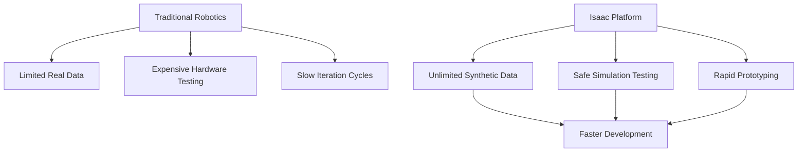
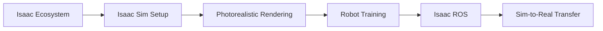
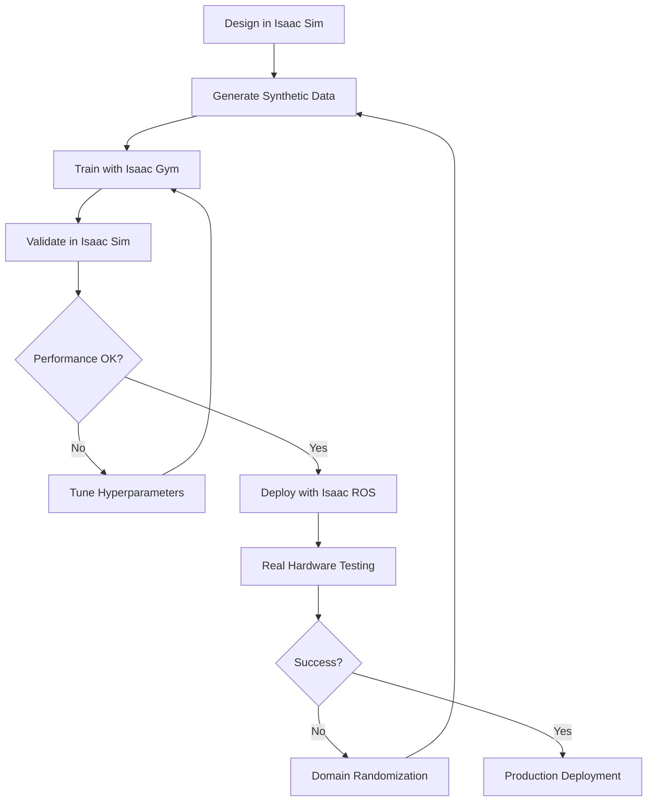

# Module 3: The AI-Robot Brain (NVIDIA Isaac™)

## Introduction

Welcome to the cutting edge of AI-powered robotics. **NVIDIA Isaac™** represents the convergence of GPU-accelerated computing, photorealistic simulation, and production-grade AI frameworks—creating an ecosystem where robots can be trained at scale using synthetic data and deployed with real-time performance.

This module takes you beyond basic simulation into the realm of **industrial-grade robotics development**, where you'll learn to leverage NVIDIA's complete robotics platform for perception, manipulation, and navigation.

## The Isaac Advantage

Traditional robotics development faces a critical bottleneck: **data scarcity**. Real-world data collection is expensive, time-consuming, and dangerous. NVIDIA Isaac solves this through:

- **Synthetic Data Generation:** Create infinite labeled datasets in simulation
- **Photorealistic Rendering:** Physics-accurate RTX ray tracing for domain randomization
- **Hardware Acceleration:** GPU-accelerated inference pipelines (TensorRT, Triton)
- **Sim-to-Real Transfer:** Proven techniques for deploying trained models on real robots

### Why Isaac Matters

## The Isaac Ecosystem

NVIDIA Isaac isn't just a simulator—it's a complete robotics development platform:

### Core Components

1. **Isaac Sim**
   - Photorealistic physics simulation built on NVIDIA Omniverse
   - RTX ray-traced rendering for computer vision
   - USD-based scene composition

2. **Isaac ROS**
   - Hardware-accelerated ROS 2 packages
   - GPU-optimized perception pipelines
   - Pre-built GEMs for common tasks

3. **Isaac Gym**
   - Reinforcement learning environment
   - Parallel physics simulation (10,000+ environments)
   - Direct-to-GPU tensors for training

4. **Isaac Cortex**
   - AI-powered behavior coordination
   - Mission planning and task execution
   - Integration with foundation models

## Module Focus

This module covers the essential NVIDIA Isaac platform for humanoid robot development:

### Core Topics

1. **Isaac Sim Environment**
   - Setting up Omniverse-based simulation
   - Understanding USD workflows
   - Importing and configuring humanoid models

2. **Photorealistic Rendering & Synthetic Data**
   - RTX ray tracing for visual fidelity
   - Domain randomization techniques
   - Automated data labeling and annotation

3. **Robot Training with Isaac Gym**
   - Massively parallel RL training
   - Reward shaping for humanoid locomotion
   - Sim-to-real transfer strategies

4. **Isaac ROS Integration**
   - Hardware-accelerated perception
   - Real-time object detection and tracking
   - Navigation stack integration (Nav2)

## Learning Path

This module builds progressively from setup to deployment:

## Chapters

### [Chapter 3.1: Understanding the Isaac Ecosystem](chapter-3-1-isaac-ecosystem)

Overview of NVIDIA's robotics platform, Omniverse foundation, Isaac Sim architecture, and when to use each Isaac tool.

### [Chapter 3.2: Getting Started with Isaac Sim](chapter-3-2-isaac-sim-basics)

Installation and setup, navigating the Isaac Sim interface, importing URDF/USD assets, basic scene creation, and running your first simulation.

### [Chapter 3.3: Photorealistic Rendering & Synthetic Data](chapter-3-3-photorealistic-rendering)

RTX ray tracing fundamentals, material and lighting setup, domain randomization strategies, semantic segmentation and bounding boxes, building training datasets.

### [Chapter 3.4: Robot Training with Isaac Gym](chapter-3-4-robot-training)

Reinforcement learning in Isaac Gym, humanoid locomotion training, parallel environment scaling, reward function design, and exporting trained policies.

### [Chapter 3.5: Isaac ROS for Production Robotics](chapter-3-5-isaac-ros)

Hardware-accelerated perception pipelines, NITROS framework, integrating Isaac ROS GEMs, real-time object detection, and SLAM with NVIDIA hardware.

## Prerequisites for This Module

- Completed Module 1 (ROS 2) and Module 2 (Gazebo/Unity)
- Strong Python programming skills
- Basic understanding of deep learning (PyTorch/TensorFlow)
- Familiarity with computer vision concepts

## Hardware Requirements

:::warning CRITICAL
Isaac Sim requires **significant GPU resources**. This is the most demanding module.
:::

**Minimum Setup:**

- **GPU:** NVIDIA RTX 4070 Ti (12GB VRAM) or better
- **CPU:** 8-core processor
- **RAM:** 64GB minimum
- **Storage:** 500GB SSD (Omniverse cache)
- **OS:** Ubuntu 22.04 LTS

**Recommended Setup:**

- **GPU:** NVIDIA RTX 4090 (24GB VRAM) or A6000
- **CPU:** 16-core processor (AMD Ryzen 9 / Intel i9)
- **RAM:** 128GB
- **Storage:** 1TB NVMe SSD

## Software You'll Use

- **NVIDIA Omniverse Launcher**
- **Isaac Sim 4.0+** (built on Omniverse)
- **Isaac Gym** (standalone RL environment)
- **Isaac ROS 2** (Humble Hawksbill)
- **PyTorch 2.0+** with CUDA support
- **ROS 2 Humble** integration

## The Isaac Development Workflow

## Real-World Applications

By mastering Isaac, you'll be equipped to work on:

### Industrial Robotics

- **Warehouse Automation:** Pick-and-place with humanoid robots
- **Manufacturing:** Assembly line assistance
- **Logistics:** Autonomous material handling

### Service Robotics

- **Healthcare:** Patient assistance and monitoring
- **Hospitality:** Reception and concierge robots
- **Retail:** Inventory management and customer service

### Research & Development

- **Humanoid Locomotion:** Bipedal walking research
- **Manipulation:** Dexterous grasping
- **Human-Robot Interaction:** Natural collaboration

## Module Assessment

By the end of this module, you'll complete the **Isaac Humanoid Navigation Project**:

- Set up a photorealistic environment in Isaac Sim
- Generate synthetic training data with domain randomization
- Train a humanoid robot to navigate obstacles using Isaac Gym
- Deploy the trained policy through Isaac ROS
- Validate performance in simulation before hardware deployment

## Estimated Time

⏱️ **4 weeks** (Weeks 9-12 of the course)

- 20-25 hours of content
- 15-20 hours of hands-on practice
- 10-15 hours for the assessment project

## Industry Context

### Companies Using Isaac

- **Agility Robotics (Digit):** Humanoid warehouse robots
- **Figure AI:** General-purpose humanoid development
- **1X Technologies (NEO):** Consumer humanoid robots
- **Boston Dynamics:** AI-powered navigation research
- **BMW, Mercedes-Benz:** Factory automation testing

### Career Opportunities

Mastering Isaac opens roles in:

- Robotics Simulation Engineer
- AI/ML Robotics Developer
- Perception Systems Engineer
- Humanoid Robotics Researcher
- Sim-to-Real Transfer Specialist

## Key Takeaways from This Module

By completing Module 3, you will:

1. ✅ Master NVIDIA's complete robotics platform
2. ✅ Generate infinite synthetic training data
3. ✅ Train humanoid robots with reinforcement learning
4. ✅ Deploy GPU-accelerated perception pipelines
5. ✅ Understand sim-to-real transfer techniques
6. ✅ Use photorealistic simulation for robot validation
7. ✅ Integrate Isaac with ROS 2 for production systems

## What Makes Isaac Different?

| Feature             | Traditional Sim      | Isaac Platform                 |
| ------------------- | -------------------- | ------------------------------ |
| **Rendering**       | OpenGL/rasterization | RTX ray tracing                |
| **Physics**         | CPU-based            | GPU-accelerated (PhysX)        |
| **Training**        | Sequential           | Massively parallel (10K+ envs) |
| **Perception**      | CPU processing       | GPU-native (NITROS)            |
| **Data Generation** | Manual labeling      | Automatic synthetic labels     |
| **Deployment**      | Custom integration   | Isaac ROS packages             |

---

## Get Started

Ready to harness the power of NVIDIA's robotics platform?

**Begin with:** [Chapter 3.1: Understanding the Isaac Ecosystem →](chapter-3-1-isaac-ecosystem)

## Additional Resources

- [NVIDIA Isaac Sim Documentation](https://docs.omniverse.nvidia.com/isaacsim/latest/index.html)
- [Isaac ROS Documentation](https://nvidia-isaac-ros.github.io/index.html)
- [Isaac Gym Paper](https://arxiv.org/abs/2108.10470)
- [Omniverse Platform Overview](https://www.nvidia.com/en-us/omniverse/)
- [NVIDIA Developer Forums](https://forums.developer.nvidia.com/c/omniverse/isaac-sim/69)