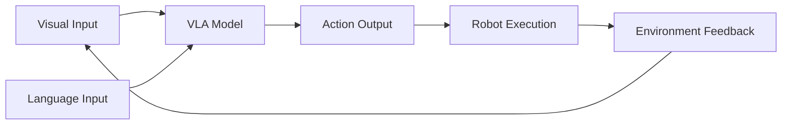
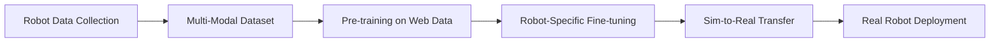

# Chapter 4.1: Introduction to Vision-Language-Action Models

## Overview

Vision-Language-Action (VLA) models represent the convergence of three critical AI capabilities: understanding visual scenes, processing natural language commands, and executing physical actions. This chapter introduces the fundamental architecture that enables robots to understand "pick up the red cup" and translate it into precise motor commands. We'll explore the theoretical foundations and practical implementations that make conversational robotics possible.

## What Are VLA Models?

Vision-Language-Action models are multi-modal neural networks that integrate three key capabilities:

1. **Vision Processing**: Understanding the visual environment through cameras and sensors
2. **Language Understanding**: Interpreting natural language commands and queries
3. **Action Generation**: Translating high-level goals into executable robot actions



### The Multi-Modal Challenge

Traditional robotics approaches separate perception, planning, and control into distinct modules. VLA models take a more holistic approach, learning joint representations that connect visual observations with linguistic commands and motor actions. This enables more natural and flexible human-robot interaction.

### Key Architectural Patterns

VLA models typically follow one of these architectural patterns:

| Pattern | Description | Advantages | Use Cases |
|---------|-------------|------------|-----------|
| **Separate Encoders** | Vision and language processed separately, fused at decision layer | Modular design, easier to debug | Research applications |
| **Unified Encoder** | Shared representations for vision and language | Better generalization | Industrial robots |
| **Transformer-based** | Attention mechanisms across modalities | Long-range dependencies | Complex manipulation |

## State-of-the-Art VLA Systems

### Google RT-2 (Robotic Transformer 2)

RT-2 represents a breakthrough in scaling VLA models by leveraging large-scale web data to learn generalizable robot policies. The model can understand novel commands and execute them on real robots without task-specific training.

```python
# Example RT-2 integration with ROS 2
import rclpy
from rclpy.node import Node
from sensor_msgs.msg import Image
from std_msgs.msg import String

class RT2Node(Node):
    def __init__(self):
        super().__init__('rt2_node')
        self.vision_sub = self.create_subscription(Image, 'camera/image', self.vision_callback, 10)
        self.command_sub = self.create_subscription(String, 'voice_command', self.command_callback, 10)
        self.action_pub = self.create_publisher(String, 'robot_action', 10)

    def process_vla_command(self, image, command):
        """
        Process visual and linguistic inputs to generate robot actions
        """
        # Vision-language fusion
        visual_features = self.extract_visual_features(image)
        language_features = self.encode_command(command)

        # Joint representation
        fused_features = self.fusion_layer(visual_features, language_features)

        # Action generation
        action = self.action_head(fused_features)

        return action
```

### OpenVLA: Open-Source VLA Foundation Model

OpenVLA democratizes access to VLA capabilities by providing an open-source foundation model trained on diverse robotic data. It enables researchers and developers to build custom VLA applications without starting from scratch.

### Physical Intelligence π0

The π0 model represents the next generation of general robot foundation models, designed to handle the full complexity of embodied intelligence across diverse environments and tasks.

## VLA Training Pipeline

Training VLA models requires large-scale datasets that connect visual observations, language commands, and robot actions:



### Data Requirements

- **Visual Data**: RGB-D images, depth maps, point clouds
- **Language Data**: Natural language commands, task descriptions
- **Action Data**: Joint angles, end-effector positions, gripper states
- **Temporal Sequences**: Multi-step task execution trajectories

## Integration with ROS 2

VLA models integrate seamlessly with ROS 2 through custom nodes that handle multi-modal processing:

```python
class VLAPipelineNode(Node):
    def __init__(self):
        super().__init__('vla_pipeline')

        # Publishers and subscribers
        self.vision_sub = self.create_subscription(Image, 'camera/rgb/image_raw', self.vision_callback, 10)
        self.depth_sub = self.create_subscription(Image, 'camera/depth/image_raw', self.depth_callback, 10)
        self.command_sub = self.create_subscription(String, 'natural_language_command', self.command_callback, 10)
        self.action_pub = self.create_publisher(String, 'robot_action_primitive', 10)

        # VLA model
        self.vla_model = self.load_vla_model()

    def vision_callback(self, msg):
        self.current_image = msg

    def command_callback(self, msg):
        if hasattr(self, 'current_image'):
            action = self.process_vla_request(self.current_image, msg.data)
            self.action_pub.publish(action)

    def process_vla_request(self, image, command):
        """
        Process visual and linguistic inputs through VLA model
        """
        # Preprocess inputs
        processed_image = self.preprocess_image(image)
        processed_command = self.preprocess_command(command)

        # Forward pass through VLA model
        action_primitive = self.vla_model(processed_image, processed_command)

        # Convert to ROS message
        action_msg = String()
        action_msg.data = action_primitive
        return action_msg
```

## Practical Example: Object Manipulation

Let's build a simple VLA system that can identify and manipulate objects based on natural language commands:

```python
import torch
import clip
from PIL import Image
import numpy as np

class SimpleVLA:
    def __init__(self):
        # Load pre-trained CLIP model
        self.clip_model, self.preprocess = clip.load("ViT-B/32")

        # Define action primitives
        self.action_primitives = {
            'pick_up': 'grasp_object',
            'move_to': 'navigate_to_location',
            'place_on': 'place_object',
            'push': 'push_object',
            'pull': 'pull_object'
        }

    def process_command(self, image_path, command):
        """
        Process visual scene and natural language command
        """
        image = self.preprocess(Image.open(image_path)).unsqueeze(0)
        text = clip.tokenize([command])

        with torch.no_grad():
            logits_per_image, logits_per_text = self.clip_model(image, text)
            probs = logits_per_text.softmax(dim=-1).cpu().numpy()

        # Determine action based on command
        action = self.classify_action(command)
        target_object = self.identify_target_object(image_path, command)

        return {
            'action': action,
            'target_object': target_object,
            'confidence': float(probs[0][0])
        }

    def classify_action(self, command):
        """
        Extract action from natural language command
        """
        for keyword, primitive in self.action_primitives.items():
            if keyword in command.lower():
                return primitive
        return 'unknown'

    def identify_target_object(self, image_path, command):
        """
        Identify the target object based on command
        """
        # In a real implementation, this would use object detection
        # For now, we'll extract object names from the command
        command_lower = command.lower()
        common_objects = ['cup', 'bottle', 'box', 'book', 'phone', 'ball', 'toy']

        for obj in common_objects:
            if obj in command_lower:
                return obj

        return 'unknown_object'
```

## Best Practices

### 1. Multi-Modal Alignment
Ensure that visual and linguistic representations are properly aligned. This requires careful preprocessing and normalization of inputs.

### 2. Robustness to Environmental Changes
VLA models should handle lighting changes, occlusions, and different viewpoints. Use data augmentation and domain randomization during training.

### 3. Safety and Verification
Always implement safety checks for VLA-generated actions. Verify that planned actions are safe before execution.

### 4. Interpretability
Provide explanations for VLA decisions to build trust and enable debugging.

## Common Pitfalls

- **Overfitting to Training Distribution**: VLA models may fail on novel objects or environments
- **Latency Issues**: Multi-modal processing can be computationally expensive
- **Ambiguity Resolution**: Natural language commands may be ambiguous without sufficient context
- **Safety Concerns**: Generated actions may be unsafe without proper verification

## Summary

In this chapter, you learned:

- ✅ The architecture of VLA models and how they integrate vision, language, and action
- ✅ State-of-the-art VLA systems (RT-2, OpenVLA, π0)
- ✅ The training pipeline for VLA models
- ✅ How to integrate VLA systems with ROS 2
- ✅ Practical implementation of a simple VLA system
- ✅ Best practices for building robust VLA applications

## Next Steps

Ready to add speech recognition to your robot? In the next chapter, we'll explore how to implement voice command processing using OpenAI Whisper.

**Continue to:** [Chapter 4.2: Speech Recognition with Whisper →](./chapter-4-2-whisper-speech)

## Additional Resources

- [RT-2 Paper (Google DeepMind)](https://arxiv.org/abs/2307.15818)
- [OpenVLA Documentation](https://openvla.github.io/)
- [CLIP Paper (OpenAI)](https://arxiv.org/abs/2103.00020)
- [Physical Intelligence π0 Model](https://www.physicalintelligence.ai/)
- [ROS 2 Navigation2 Stack](https://navigation.ros.org/)