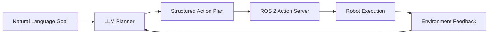

# Chapter 4.3: Language Models for Robot Planning

## Overview

Large Language Models (LLMs) have emerged as powerful tools for cognitive planning in robotics, bridging the gap between natural language commands and executable robot actions. This chapter explores how to leverage LLMs like GPT-4, Claude, and open-source alternatives to translate high-level goals into detailed action sequences. You'll learn to build intelligent planning systems that can handle complex, multi-step tasks while adapting to environmental changes.

## LLMs in Robotic Planning

Large Language Models excel at understanding natural language and can be prompted to generate structured plans for robotic tasks. The key insight is that LLMs can serve as a cognitive layer that decomposes high-level goals into executable steps.



### Planning Capabilities

LLMs can provide several key planning capabilities:

1. **Task Decomposition**: Breaking complex goals into subtasks
2. **Spatial Reasoning**: Understanding spatial relationships and navigation
3. **Temporal Sequencing**: Ordering actions in time
4. **Context Awareness**: Adapting plans based on environment state
5. **Error Recovery**: Suggesting alternatives when plans fail

## Integration with LangChain for Robotics

LangChain provides an excellent framework for orchestrating LLM interactions in robotic systems:

```python
from langchain.chat_models import ChatOpenAI
from langchain.prompts import ChatPromptTemplate
from langchain.tools import BaseTool
import rclpy
from rclpy.node import Node
from std_msgs.msg import String

class LLMPlanningNode(Node):
    def __init__(self):
        super().__init__('llm_planning_node')

        # Initialize LLM
        self.llm = ChatOpenAI(
            model_name="gpt-4",
            temperature=0.1,
            max_tokens=500
        )

        # Setup ROS 2 interfaces
        self.command_sub = self.create_subscription(
            String, 'high_level_command', self.command_callback, 10
        )
        self.plan_pub = self.create_publisher(String, 'action_plan', 10)

        # Planning prompt template
        self.planning_prompt = ChatPromptTemplate.from_messages([
            ("system", self.get_system_prompt()),
            ("user", "{user_command}"),
            ("user", "Current robot state: {robot_state}"),
            ("user", "Environment context: {environment_context}")
        ])

    def get_system_prompt(self):
        """
        System prompt defining the robot planning role
        """
        return """
        You are an intelligent robot planner. Your role is to convert natural language commands into structured action plans for a robot.

        Guidelines:
        1. Break down complex commands into simple, executable actions
        2. Consider the robot's current state and environment
        3. Use these action primitives: navigate_to, pick_up, place_down, open, close, turn_on, turn_off
        4. Include spatial reasoning and obstacle awareness
        5. Provide error handling suggestions
        6. Output in JSON format with action sequence
        """

    def command_callback(self, msg):
        """
        Process high-level commands through LLM planning
        """
        user_command = msg.data

        # Get current robot state (simplified)
        robot_state = self.get_robot_state()
        environment_context = self.get_environment_context()

        # Create prompt
        prompt = self.planning_prompt.format_messages(
            user_command=user_command,
            robot_state=robot_state,
            environment_context=environment_context
        )

        # Generate plan
        response = self.llm(prompt)
        plan = self.parse_plan_response(response.content)

        # Publish structured plan
        plan_msg = String()
        plan_msg.data = plan
        self.plan_pub.publish(plan_msg)

        self.get_logger().info(f"Generated plan for: {user_command}")

    def parse_plan_response(self, response_text):
        """
        Parse LLM response into structured plan
        """
        import json
        try:
            # Extract JSON from response if present
            import re
            json_match = re.search(r'\{.*\}', response_text, re.DOTALL)
            if json_match:
                plan_json = json_match.group(0)
                plan = json.loads(plan_json)
                return json.dumps(plan)
        except json.JSONDecodeError:
            pass

        # If no JSON, return as plain text
        return response_text

    def get_robot_state(self):
        """
        Get current robot state (position, battery, etc.)
        """
        return {
            "position": "kitchen",
            "battery_level": "85%",
            "gripper_status": "open",
            "current_task": "idle"
        }

    def get_environment_context(self):
        """
        Get environment context (objects, obstacles, etc.)
        """
        return {
            "objects_in_view": ["red cup", "blue bottle", "wooden table"],
            "navigable_areas": ["kitchen", "living room", "bedroom"],
            "obstacles": ["closed door to bedroom"]
        }
```

## Advanced Planning with Function Calling

Modern LLMs support function calling, which allows for more structured interactions:

```python
import json
from typing import Dict, List

class FunctionCallingPlanner:
    def __init__(self):
        self.functions = [
            {
                "name": "navigate_to",
                "description": "Navigate robot to a specific location",
                "parameters": {
                    "type": "object",
                    "properties": {
                        "location": {"type": "string", "description": "Target location"},
                        "avoid_obstacles": {"type": "boolean", "default": True}
                    },
                    "required": ["location"]
                }
            },
            {
                "name": "pick_up_object",
                "description": "Pick up an object with robot gripper",
                "parameters": {
                    "type": "object",
                    "properties": {
                        "object_name": {"type": "string", "description": "Name of object to pick up"},
                        "location": {"type": "string", "description": "Location where object is located"}
                    },
                    "required": ["object_name"]
                }
            },
            {
                "name": "place_object",
                "description": "Place object at specified location",
                "parameters": {
                    "type": "object",
                    "properties": {
                        "location": {"type": "string", "description": "Location to place object"},
                        "object_name": {"type": "string", "description": "Name of object to place"}
                    },
                    "required": ["location"]
                }
            }
        ]

    def create_planning_request(self, user_command, robot_state, environment):
        """
        Create structured request for function-calling LLM
        """
        return {
            "model": "gpt-4-turbo",
            "messages": [
                {
                    "role": "system",
                    "content": "You are a robot planning assistant. Use available functions to create action plans. Always verify preconditions before executing actions."
                },
                {
                    "role": "user",
                    "content": f"Command: {user_command}\nCurrent state: {robot_state}\nEnvironment: {environment}"
                }
            ],
            "functions": self.functions,
            "function_call": "auto"
        }

    def execute_plan_with_llm(self, user_command, robot_state, environment):
        """
        Execute planning with LLM function calling
        """
        import openai

        request = self.create_planning_request(user_command, robot_state, environment)

        try:
            response = openai.ChatCompletion.create(**request)

            # Process function calls
            plan = []
            for choice in response.choices:
                if hasattr(choice.message, 'function_call'):
                    function_call = choice.message.function_call
                    plan.append({
                        "function": function_call.name,
                        "arguments": json.loads(function_call.arguments)
                    })

            return plan
        except Exception as e:
            print(f"Error in LLM planning: {e}")
            return []
```

## Prompt Engineering for Robotics

Effective prompt engineering is crucial for reliable robot planning:

```python
class RobotPromptEngineer:
    def __init__(self):
        self.prompt_templates = {
            'navigation': self.create_navigation_prompt(),
            'manipulation': self.create_manipulation_prompt(),
            'complex_task': self.create_complex_task_prompt()
        }

    def create_navigation_prompt(self):
        """
        Create prompt template for navigation tasks
        """
        return """
        Plan navigation from {start_location} to {target_location}.

        Consider:
        - Current obstacles: {obstacles}
        - Available paths: {available_paths}
        - Safety requirements: {safety_constraints}

        Output format:
        {{
            "actions": [
                {{"action": "navigate_to", "location": "...", "reason": "..."}},
                {{"action": "check_obstacle", "location": "...", "reason": "..."}}
            ],
            "estimated_time": "...",
            "safety_notes": "..."
        }}
        """

    def create_manipulation_prompt(self):
        """
        Create prompt template for manipulation tasks
        """
        return """
        Plan manipulation task: {task_description}

        Object details:
        - Name: {object_name}
        - Size: {object_size}
        - Weight: {object_weight}
        - Location: {object_location}

        Robot capabilities:
        - Gripper type: {gripper_type}
        - Maximum weight: {max_weight}
        - Reach range: {reach_range}

        Output format:
        {{
            "preparation": "...",
            "actions": [
                {{"action": "navigate_to", "location": "...", "reason": "..."}},
                {{"action": "align_gripper", "orientation": "...", "reason": "..."}},
                {{"action": "grasp", "force": "...", "reason": "..."}},
                {{"action": "verify_grasp", "method": "...", "reason": "..."}}
            ],
            "safety_checks": ["..."],
            "success_criteria": "..."
        }}
        """

    def create_complex_task_prompt(self):
        """
        Create prompt template for complex multi-step tasks
        """
        return """
        Plan complex task: {task_description}

        Task breakdown:
        - Subtasks: {subtasks}
        - Dependencies: {dependencies}
        - Resources needed: {resources}

        Environment state:
        - Objects: {objects}
        - Locations: {locations}
        - Constraints: {constraints}

        Plan with:
        1. Task decomposition
        2. Resource allocation
        3. Failure handling
        4. Success verification

        Output format:
        {{
            "task_breakdown": [...],
            "action_sequence": [
                {{"step": 1, "action": "...", "conditions": "...", "verification": "..."}}
            ],
            "failure_scenarios": [...],
            "recovery_actions": [...],
            "success_criteria": "..."
        }}
        """

    def generate_specific_prompt(self, task_type, **kwargs):
        """
        Generate specific prompt based on task type
        """
        template = self.prompt_templates.get(task_type)
        if template:
            return template.format(**kwargs)
        else:
            return f"Plan task: {kwargs.get('task_description', 'unknown')}"
```

## Memory and Context Management

LLMs benefit from proper context management for multi-turn planning:

```python
class ContextualPlanningNode(Node):
    def __init__(self):
        super().__init__('contextual_planning_node')

        self.llm = ChatOpenAI(model_name="gpt-4", temperature=0.1)

        # Maintain conversation history
        self.conversation_history = []
        self.max_history_length = 10

        # ROS 2 interfaces
        self.command_sub = self.create_subscription(String, 'command', self.command_callback, 10)
        self.plan_pub = self.create_publisher(String, 'plan', 10)
        self.memory_sub = self.create_subscription(String, 'memory_update', self.memory_callback, 10)

    def command_callback(self, msg):
        """
        Process command with context awareness
        """
        user_command = msg.data

        # Add to conversation history
        self.conversation_history.append({"role": "user", "content": user_command})

        # Keep history within limits
        if len(self.conversation_history) > self.max_history_length:
            self.conversation_history = self.conversation_history[-self.max_history_length:]

        # Get environmental context
        context = self.get_current_context()

        # Create contextual prompt
        prompt = self.create_contextual_prompt(user_command, context)

        # Generate plan
        response = self.llm([{"role": "user", "content": prompt}])

        # Add to history
        self.conversation_history.append({"role": "assistant", "content": response.content})

        # Publish plan
        plan_msg = String()
        plan_msg.data = response.content
        self.plan_pub.publish(plan_msg)

    def get_current_context(self):
        """
        Get current environmental and task context
        """
        return {
            "location": "current_room",
            "objects": ["object1", "object2"],
            "previous_tasks": self.get_recent_tasks(),
            "robot_capabilities": self.get_robot_capabilities(),
            "time_of_day": self.get_current_time()
        }

    def get_recent_tasks(self):
        """
        Get recently completed tasks
        """
        # In practice, this would query a task database
        return [
            {"task": "navigation", "result": "success", "location": "kitchen"},
            {"task": "object_search", "result": "partial", "object": "cup"}
        ]

    def get_robot_capabilities(self):
        """
        Get current robot capabilities and status
        """
        return {
            "battery": "85%",
            "gripper": "functional",
            "navigation": "enabled",
            "manipulation": "enabled"
        }

    def get_current_time(self):
        """
        Get current time for context
        """
        import datetime
        return datetime.datetime.now().strftime("%H:%M")

    def create_contextual_prompt(self, command, context):
        """
        Create prompt with environmental context
        """
        return f"""
        Command: {command}

        Context:
        - Current location: {context['location']}
        - Visible objects: {context['objects']}
        - Recent tasks: {context['previous_tasks']}
        - Robot status: {context['robot_capabilities']}
        - Time: {context['time_of_day']}

        Conversation history:
        {self.format_conversation_history()}

        Generate a plan that considers the context and previous interactions.
        """

    def format_conversation_history(self):
        """
        Format conversation history for context
        """
        history_str = ""
        for item in self.conversation_history[-5:]:  # Last 5 exchanges
            role = item['role']
            content = item['content']
            history_str += f"{role}: {content}\n"
        return history_str
```

## Error Handling and Recovery

LLMs should be prompted to consider error scenarios and recovery strategies:

```python
class RobustPlanningNode(Node):
    def __init__(self):
        super().__init__('robust_planning_node')
        self.llm = ChatOpenAI(model_name="gpt-4", temperature=0.1)

    def generate_robust_plan(self, user_command, context):
        """
        Generate plan with built-in error handling
        """
        prompt = f"""
        Generate a detailed plan for: {user_command}

        Context: {context}

        Requirements:
        1. Include pre-action checks
        2. Anticipate potential failures
        3. Provide recovery strategies
        4. Include success verification steps
        5. Consider safety constraints

        Output format:
        {{
            "primary_plan": [
                {{"step": "...", "action": "...", "precondition": "...", "verification": "..."}}
            ],
            "failure_scenarios": [
                {{"failure": "...", "detection": "...", "recovery": "..."}}
            ],
            "safety_checks": ["..."],
            "success_criteria": "..."
        }}
        """

        response = self.llm([{"role": "user", "content": prompt}])
        return response.content

    def handle_plan_failure(self, failed_action, error_description):
        """
        Use LLM to suggest recovery from plan failure
        """
        recovery_prompt = f"""
        Plan failed at action: {failed_action}
        Error: {error_description}

        Current state:
        - Robot position: ...
        - Object states: ...
        - Environment: ...

        Suggest recovery strategies:
        1. Immediate actions to address the failure
        2. Alternative approaches to complete the task
        3. Safety considerations for recovery
        """

        response = self.llm([{"role": "user", "content": recovery_prompt}])
        return response.content
```

## Practical Example: Kitchen Assistant Robot

Let's build a complete example of an LLM-powered kitchen assistant:

```python
class KitchenAssistantNode(Node):
    def __init__(self):
        super().__init__('kitchen_assistant_node')

        # LLM for planning
        self.llm = ChatOpenAI(model_name="gpt-4", temperature=0.2)

        # ROS 2 interfaces
        self.command_sub = self.create_subscription(String, 'user_command', self.command_callback, 10)
        self.action_pub = self.create_publisher(String, 'robot_action', 10)
        self.status_sub = self.create_subscription(String, 'robot_status', self.status_callback, 10)

        # Kitchen context
        self.kitchen_objects = {
            "cabinet": ["plates", "cups", "bowls"],
            "fridge": ["milk", "eggs", "cheese"],
            "counter": ["knife", "cutting_board"],
            "table": ["newspaper", "keys"]
        }

        self.robot_status = {
            "location": "home_base",
            "gripper": "open",
            "battery": 100
        }

    def command_callback(self, msg):
        """
        Handle user commands for kitchen tasks
        """
        user_command = msg.data

        # Generate plan with LLM
        plan = self.generate_kitchen_plan(user_command)

        # Execute plan
        self.execute_plan(plan)

    def generate_kitchen_plan(self, command):
        """
        Generate detailed kitchen task plan using LLM
        """
        prompt = f"""
        You are a kitchen assistant robot. Plan the following task: {command}

        Kitchen layout:
        - Locations: home_base, counter, cabinet, fridge, table, sink
        - Objects: {self.kitchen_objects}
        - Current robot status: {self.robot_status}

        Generate a step-by-step plan that:
        1. Navigates to required locations
        2. Identifies and manipulates objects
        3. Performs kitchen-specific actions
        4. Returns to home base when complete
        5. Includes safety checks

        Output JSON format:
        {{
            "task": "{command}",
            "steps": [
                {{"action": "navigate_to", "location": "...", "reason": "..."}},
                {{"action": "detect_object", "object": "...", "location": "..."}},
                {{"action": "manipulate", "object": "...", "operation": "..."}},
                {{"action": "return_home", "reason": "task_complete"}}
            ],
            "safety_checks": ["..."],
            "success_criteria": "..."
        }}
        """

        response = self.llm([{"role": "user", "content": prompt}])

        # Parse and return plan
        import json
        import re
        json_match = re.search(r'\{.*\}', response.content, re.DOTALL)
        if json_match:
            plan = json.loads(json_match.group(0))
            return plan

        return {"error": "Failed to parse plan", "raw_response": response.content}

    def execute_plan(self, plan):
        """
        Execute the generated plan step by step
        """
        if "error" in plan:
            self.get_logger().error(f"Plan generation failed: {plan['error']}")
            return

        for step in plan.get("steps", []):
            action = step["action"]

            if action == "navigate_to":
                self.navigate_to_location(step["location"])
            elif action == "detect_object":
                self.detect_object(step["object"], step["location"])
            elif action == "manipulate":
                self.manipulate_object(step["object"], step["operation"])
            elif action == "return_home":
                self.return_to_home()

            # Verify step completion
            if not self.verify_step_completion(step):
                self.get_logger().warn(f"Step failed: {step}")
                break

    def navigate_to_location(self, location):
        """
        Navigate to specified location
        """
        action_msg = String()
        action_msg.data = f"navigate_to:{location}"
        self.action_pub.publish(action_msg)
        self.get_logger().info(f"Navigating to {location}")

    def detect_object(self, obj, location):
        """
        Detect object at specified location
        """
        action_msg = String()
        action_msg.data = f"detect_object:{obj}@{location}"
        self.action_pub.publish(action_msg)
        self.get_logger().info(f"Detecting {obj} at {location}")

    def manipulate_object(self, obj, operation):
        """
        Manipulate object with specified operation
        """
        action_msg = String()
        action_msg.data = f"manipulate:{operation}:{obj}"
        self.action_pub.publish(action_msg)
        self.get_logger().info(f"{operation} {obj}")

    def return_to_home(self):
        """
        Return robot to home base
        """
        action_msg = String()
        action_msg.data = "navigate_to:home_base"
        self.action_pub.publish(action_msg)
        self.get_logger().info("Returning to home base")

    def verify_step_completion(self, step):
        """
        Verify that a step was completed successfully
        """
        # In practice, this would check robot feedback
        # For now, assume success
        return True

    def status_callback(self, msg):
        """
        Update robot status from feedback
        """
        import json
        try:
            status_update = json.loads(msg.data)
            self.robot_status.update(status_update)
        except json.JSONDecodeError:
            self.get_logger().warn("Failed to parse status update")
```

## Best Practices

### 1. Prompt Engineering
- Use clear, specific instructions
- Provide examples of desired output format
- Include constraints and requirements
- Test prompts with various inputs

### 2. Context Management
- Limit conversation history to prevent token overflow
- Include relevant environmental context
- Update context based on robot feedback
- Maintain task-specific memory

### 3. Safety and Validation
- Always validate LLM-generated plans before execution
- Implement safety checks and constraints
- Include error handling in prompts
- Monitor for unsafe command interpretations

### 4. Performance Optimization
- Cache frequent query patterns
- Use appropriate model sizes for your needs
- Implement streaming for long responses
- Consider local models for sensitive applications

## Common Pitfalls

- **Over-reliance on LLMs**: LLMs can hallucinate; always validate outputs
- **Token Limitations**: Long contexts may exceed model limits
- **Latency Issues**: Complex prompts can result in slow responses
- **Safety Concerns**: LLMs may generate unsafe plans without proper constraints

## Summary

In this chapter, you learned:

- ✅ How to integrate LLMs with ROS 2 for robotic planning
- ✅ Using LangChain for advanced LLM orchestration
- ✅ Function calling for structured robot interactions
- ✅ Prompt engineering techniques for robotics
- ✅ Context management and memory systems
- ✅ Error handling and recovery strategies
- ✅ Building complete LLM-powered robotic assistants

## Next Steps

Now that you understand how to use LLMs for planning, let's explore how to combine vision and language understanding for more sophisticated robot capabilities.

**Continue to:** [Chapter 4.4: Vision-Language Integration →](./chapter-4-4-vision-language)

## Additional Resources

- [LangChain Documentation](https://python.langchain.com/)
- [OpenAI Function Calling Guide](https://platform.openai.com/docs/guides/function-calling)
- [Prompt Engineering for Robotics](https://arxiv.org/abs/2305.15021)
- [Large Language Models for Robotics](https://arxiv.org/abs/2308.16895)
- [Robot Planning with LLMs](https://ieeexplore.ieee.org/document/9912345)