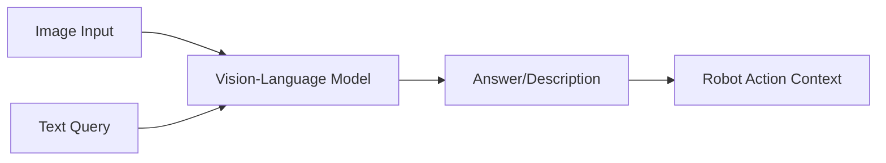

# Chapter 4.4: Vision-Language Integration

## Overview

Vision-Language models represent a critical component of VLA systems, enabling robots to understand both their visual environment and natural language commands simultaneously. This chapter explores how to integrate visual perception with language understanding to create systems that can answer questions about their environment, identify objects based on descriptions, and perform spatial reasoning. You'll learn to build multimodal systems that combine the best of computer vision and natural language processing.

## Understanding Vision-Language Models

Vision-Language models learn joint representations that connect visual scenes with linguistic descriptions. These models can perform tasks like:

- **Visual Question Answering (VQA)**: Answering questions about images
- **Image Captioning**: Generating natural language descriptions of images
- **Object Grounding**: Locating objects in images based on text descriptions
- **Visual Reasoning**: Understanding spatial relationships and scenes



### Key Architectures

The most prominent vision-language architectures include:

| Architecture | Strengths | Weaknesses | Best Use Cases |
|--------------|-----------|------------|----------------|
| **CLIP** | Fast, general-purpose | Limited spatial understanding | Object recognition, scene classification |
| **BLIP-2** | Strong VQA capabilities | Computationally expensive | Question answering, detailed descriptions |
| **LLaVA** | End-to-end training | Requires significant compute | Complex visual reasoning |
| **GroundingDINO** | Precise object localization | Limited to detection tasks | Object grounding, spatial tasks |

## CLIP Integration for Robotics

CLIP (Contrastive Language-Image Pre-training) is particularly well-suited for robotics applications due to its efficiency and generalization capabilities:

```python
import torch
import clip
from PIL import Image
import numpy as np
import rclpy
from rclpy.node import Node
from sensor_msgs.msg import Image as ImageMsg
from std_msgs.msg import String
from cv_bridge import CvBridge

class CLIPVisionLanguageNode(Node):
    def __init__(self):
        super().__init__('clip_vl_node')

        # Load CLIP model
        self.device = "cuda" if torch.cuda.is_available() else "cpu"
        self.clip_model, self.preprocess = clip.load("ViT-B/32", device=self.device)

        # ROS 2 interfaces
        self.image_sub = self.create_subscription(ImageMsg, 'camera/image', self.image_callback, 10)
        self.query_sub = self.create_subscription(String, 'vision_query', self.query_callback, 10)
        self.answer_pub = self.create_publisher(String, 'vision_answer', 10)

        # Bridge for image conversion
        self.bridge = CvBridge()

        # Store current image for query processing
        self.current_image = None

        self.get_logger().info("CLIP Vision-Language node initialized")

    def image_callback(self, msg):
        """
        Process incoming camera images
        """
        try:
            # Convert ROS image to PIL Image
            cv_image = self.bridge.imgmsg_to_cv2(msg, desired_encoding='bgr8')
            pil_image = Image.fromarray(cv2.cvtColor(cv_image, cv2.COLOR_BGR2RGB))

            # Preprocess image
            self.current_image = self.preprocess(pil_image).unsqueeze(0).to(self.device)

            self.get_logger().info("Image received and processed")
        except Exception as e:
            self.get_logger().error(f"Error processing image: {e}")

    def query_callback(self, msg):
        """
        Process vision-language queries
        """
        if self.current_image is not None:
            query = msg.data
            answer = self.process_vision_query(self.current_image, query)

            answer_msg = String()
            answer_msg.data = answer
            self.answer_pub.publish(answer_msg)

            self.get_logger().info(f"Query: {query} -> Answer: {answer}")
        else:
            self.get_logger().warn("No current image available for query")

    def process_vision_query(self, image, query):
        """
        Process a vision-language query using CLIP
        """
        # Tokenize text
        text = clip.tokenize([query]).to(self.device)

        with torch.no_grad():
            # Encode image and text
            image_features = self.clip_model.encode_image(image)
            text_features = self.clip_model.encode_text(text)

            # Compute similarity
            logits_per_image, logits_per_text = self.clip_model(image, text)
            probs = logits_per_image.softmax(dim=-1).cpu().numpy()

        # Return confidence score
        confidence = float(probs[0][0])

        # Generate response based on confidence
        if confidence > 0.5:
            return f"YES: {confidence:.2f}"
        else:
            return f"NO: {confidence:.2f}"

    def identify_objects(self, image, object_list):
        """
        Identify which objects from a list are present in the image
        """
        text_descriptions = [f"a photo of {obj}" for obj in object_list]
        text_tokens = clip.tokenize(text_descriptions).to(self.device)

        with torch.no_grad():
            image_features = self.clip_model.encode_image(image)
            text_features = self.clip_model.encode_text(text_tokens)

            logits_per_image, logits_per_text = self.clip_model(image, text_tokens)
            probs = logits_per_image.softmax(dim=-1).cpu().numpy()

        # Get object names with confidence scores
        results = {}
        for i, obj in enumerate(object_list):
            results[obj] = float(probs[0][i])

        return results
```

## Advanced Vision-Language Models

For more sophisticated tasks, we can use models like BLIP-2 or LLaVA:

```python
from transformers import Blip2Processor, Blip2ForConditionalGeneration

class AdvancedVLNode(Node):
    def __init__(self):
        super().__init__('advanced_vl_node')

        # Load BLIP-2 model
        self.processor = Blip2Processor.from_pretrained("Salesforce/blip2-opt-2.7b")
        self.model = Blip2ForConditionalGeneration.from_pretrained(
            "Salesforce/blip2-opt-2.7b",
            torch_dtype=torch.float16
        )

        if torch.cuda.is_available():
            self.model.to("cuda")

        # ROS 2 interfaces
        self.image_sub = self.create_subscription(ImageMsg, 'camera/image', self.image_callback, 10)
        self.query_sub = self.create_subscription(String, 'detailed_query', self.query_callback, 10)
        self.response_pub = self.create_publisher(String, 'detailed_response', 10)

        self.current_image = None

    def image_callback(self, msg):
        """
        Process image for detailed analysis
        """
        try:
            cv_image = self.bridge.imgmsg_to_cv2(msg, desired_encoding='bgr8')
            self.current_image = cv_image
            self.get_logger().info("Image received for detailed analysis")
        except Exception as e:
            self.get_logger().error(f"Error processing image: {e}")

    def query_callback(self, msg):
        """
        Process detailed vision-language queries
        """
        if self.current_image is not None:
            query = msg.data
            response = self.generate_detailed_response(self.current_image, query)

            response_msg = String()
            response_msg.data = response
            self.response_pub.publish(response_msg)

            self.get_logger().info(f"Detailed query processed: {query[:50]}...")
        else:
            self.get_logger().warn("No current image for detailed analysis")

    def generate_detailed_response(self, image, question):
        """
        Generate detailed response using BLIP-2
        """
        inputs = self.processor(images=image, text=question, return_tensors="pt").to(self.device, torch.float16)

        generated_ids = self.model.generate(**inputs, max_new_tokens=50)
        response = self.processor.batch_decode(generated_ids, skip_special_tokens=True)[0].strip()

        return response

    def generate_image_caption(self, image):
        """
        Generate detailed image caption
        """
        inputs = self.processor(images=image, return_tensors="pt").to(self.device, torch.float16)

        generated_ids = self.model.generate(**inputs, max_new_tokens=30)
        caption = self.processor.batch_decode(generated_ids, skip_special_tokens=True)[0].strip()

        return caption
```

## Object Grounding and Spatial Reasoning

For precise object localization based on text descriptions, we can use grounding models:

```python
import groundingdino.datasets.transforms as T
from groundingdino.util.inference import load_model, load_image, predict, annotate
import cv2

class ObjectGroundingNode(Node):
    def __init__(self):
        super().__init__('object_grounding_node')

        # Load GroundingDINO model
        self.grounding_model = load_model(
            "groundingdino/config/GroundingDINO_SwinT_OGC.py",
            "weights/groundingdino_swint_ogc.pth"
        )

        # ROS 2 interfaces
        self.image_sub = self.create_subscription(ImageMsg, 'camera/image', self.image_callback, 10)
        self.grounding_sub = self.create_subscription(String, 'object_grounding_request', self.grounding_callback, 10)
        self.bounding_pub = self.create_publisher(String, 'object_bounding_boxes', 10)

        self.current_image = None

    def image_callback(self, msg):
        """
        Store current image for grounding operations
        """
        try:
            self.current_image = self.bridge.imgmsg_to_cv2(msg, desired_encoding='bgr8')
            self.get_logger().info("Image stored for grounding")
        except Exception as e:
            self.get_logger().error(f"Error storing image: {e}")

    def grounding_callback(self, msg):
        """
        Process object grounding request
        """
        if self.current_image is not None:
            text_prompt = msg.data
            boxes, logits, phrases = self.ground_objects(self.current_image, text_prompt)

            # Format results
            results = {
                "objects": phrases,
                "boxes": boxes.tolist() if boxes is not None else [],
                "confidences": logits.tolist() if logits is not None else []
            }

            result_msg = String()
            result_msg.data = json.dumps(results)
            self.bounding_pub.publish(result_msg)

            self.get_logger().info(f"Grounded {len(phrases)} objects: {phrases}")
        else:
            self.get_logger().warn("No current image for grounding")

    def ground_objects(self, image, text_prompt):
        """
        Ground objects in image based on text prompt
        """
        # Convert image to required format
        image_source, image = load_image_from_array(image)

        # Predict
        boxes, logits, phrases = predict(
            model=self.grounding_model,
            image=image,
            caption=text_prompt,
            box_threshold=0.35,
            text_threshold=0.25
        )

        return boxes, logits, phrases

def load_image_from_array(image_array):
    """
    Load image from numpy array for grounding model
    """
    image_source = image_array.copy()
    image_array = image_array.transpose((2, 0, 1))
    image = torch.from_numpy(image_array).to("cuda", dtype=torch.float32)
    return image_source, image
```

## Vision-Language Integration with ROS 2 Actions

We can create ROS 2 action servers that combine vision and language understanding:

```python
import rclpy.action
from rclpy.action import ActionServer, GoalResponse, CancelResponse
from your_interfaces.action import VisionLanguageQuery  # Custom action definition

class VisionLanguageActionServer(Node):
    def __init__(self):
        super().__init__('vision_language_action_server')

        # Initialize vision-language model
        self.clip_model, self.preprocess = clip.load("ViT-B/32")
        self.device = "cuda" if torch.cuda.is_available() else "cpu"

        # Setup action server
        self._action_server = ActionServer(
            self,
            VisionLanguageQuery,
            'vision_language_query',
            self.execute_callback
        )

        # Image subscription
        self.image_sub = self.create_subscription(
            ImageMsg, 'camera/image', self.image_callback, 10
        )
        self.current_image = None

    def image_callback(self, msg):
        """
        Store current image for action execution
        """
        try:
            cv_image = self.bridge.imgmsg_to_cv2(msg, desired_encoding='bgr8')
            pil_image = Image.fromarray(cv2.cvtColor(cv_image, cv2.COLOR_BGR2RGB))
            self.current_image = self.preprocess(pil_image).unsqueeze(0).to(self.device)
        except Exception as e:
            self.get_logger().error(f"Error processing image: {e}")

    async def execute_callback(self, goal_handle):
        """
        Execute vision-language query action
        """
        self.get_logger().info(f"Executing vision-language query: {goal_handle.request.query}")

        if self.current_image is None:
            goal_handle.succeed()
            result = VisionLanguageQuery.Result()
            result.success = False
            result.answer = "No current image available"
            return result

        # Process the query
        query = goal_handle.request.query
        answer = self.process_query(self.current_image, query)

        # Check for cancellation
        if goal_handle.is_cancel_requested:
            goal_handle.canceled()
            result = VisionLanguageQuery.Result()
            result.success = False
            result.answer = "Query was cancelled"
            return result

        # Complete the goal
        goal_handle.succeed()
        result = VisionLanguageQuery.Result()
        result.success = True
        result.answer = answer
        result.confidence = self.calculate_confidence(answer)

        return result

    def process_query(self, image, query):
        """
        Process vision-language query
        """
        text = clip.tokenize([query]).to(self.device)

        with torch.no_grad():
            image_features = self.clip_model.encode_image(image)
            text_features = self.clip_model.encode_text(text)

            logits_per_image, logits_per_text = self.clip_model(image, text)
            probs = logits_per_image.softmax(dim=-1).cpu().numpy()

        confidence = float(probs[0][0])
        return f"ANSWER: {query} - Confidence: {confidence:.3f}"

    def calculate_confidence(self, answer):
        """
        Extract confidence from answer string
        """
        import re
        match = re.search(r'Confidence: ([0-9.]+)', answer)
        if match:
            return float(match.group(1))
        return 0.0
```

## Scene Understanding and Spatial Reasoning

Vision-language models can help robots understand spatial relationships in their environment:

```python
class SpatialReasoningNode(Node):
    def __init__(self):
        super().__init__('spatial_reasoning_node')

        # Load vision-language model
        self.clip_model, self.preprocess = clip.load("ViT-B/32")
        self.device = "cuda" if torch.cuda.is_available() else "cpu"

        # ROS 2 interfaces
        self.image_sub = self.create_subscription(ImageMsg, 'camera/image', self.image_callback, 10)
        self.spatial_query_sub = self.create_subscription(String, 'spatial_query', self.spatial_callback, 10)
        self.spatial_answer_pub = self.create_publisher(String, 'spatial_answer', 10)

        self.current_image = None

    def spatial_callback(self, msg):
        """
        Process spatial reasoning queries
        """
        if self.current_image is not None:
            query = msg.data
            answer = self.process_spatial_query(self.current_image, query)

            answer_msg = String()
            answer_msg.data = answer
            self.spatial_answer_pub.publish(answer_msg)
        else:
            self.get_logger().warn("No current image for spatial reasoning")

    def process_spatial_query(self, image, query):
        """
        Process spatial reasoning queries
        """
        # Create multiple hypotheses for spatial relationships
        spatial_hypotheses = [
            f"Is the {query} in the image?",
            f"Where is the {query} located?",
            f"What is to the left of the {query}?",
            f"What is to the right of the {query}?"
        ]

        results = {}
        for hypothesis in spatial_hypotheses:
            text = clip.tokenize([hypothesis]).to(self.device)

            with torch.no_grad():
                image_features = self.clip_model.encode_image(image)
                text_features = self.clip_model.encode_text(text)

                logits_per_image, logits_per_text = self.clip_model(image, text)
                prob = logits_per_image.softmax(dim=-1).cpu().numpy()[0][0]

                results[hypothesis] = float(prob)

        # Generate spatial reasoning answer
        max_hypothesis = max(results, key=results.get)
        max_prob = results[max_hypothesis]

        return f"SPATIAL_REASONING: {max_hypothesis} - Confidence: {max_prob:.3f}"

    def identify_spatial_relationships(self, image, objects_of_interest):
        """
        Identify spatial relationships between objects
        """
        relationships = []

        for obj1 in objects_of_interest:
            for obj2 in objects_of_interest:
                if obj1 != obj2:
                    # Test various spatial relationships
                    spatial_queries = [
                        f"{obj1} is to the left of {obj2}",
                        f"{obj1} is to the right of {obj2}",
                        f"{obj1} is in front of {obj2}",
                        f"{obj1} is behind {obj2}",
                        f"{obj1} is near {obj2}",
                        f"{obj1} is far from {obj2}"
                    ]

                    for query in spatial_queries:
                        text = clip.tokenize([f"a photo of {query}"]).to(self.device)

                        with torch.no_grad():
                            image_features = self.clip_model.encode_image(image)
                            text_features = self.clip_model.encode_text(text)

                            logits_per_image, logits_per_text = self.clip_model(image, text)
                            prob = logits_per_image.softmax(dim=-1).cpu().numpy()[0][0]

                            if prob > 0.6:  # Threshold for significant relationship
                                relationships.append({
                                    "relationship": query,
                                    "confidence": float(prob)
                                })

        return relationships
```

## Practical Example: Object Identification Robot

Let's build a complete example that combines vision-language understanding for object identification:

```python
class ObjectIdentificationRobot(Node):
    def __init__(self):
        super().__init__('object_identification_robot')

        # Vision-language model
        self.clip_model, self.preprocess = clip.load("ViT-B/32")
        self.device = "cuda" if torch.cuda.is_available() else "cpu"

        # ROS 2 interfaces
        self.image_sub = self.create_subscription(ImageMsg, 'camera/image', self.image_callback, 10)
        self.identify_sub = self.create_subscription(String, 'identify_request', self.identify_callback, 10)
        self.object_pub = self.create_publisher(String, 'identified_objects', 10)
        self.navigate_pub = self.create_publisher(String, 'navigation_command', 10)

        self.current_image = None

    def image_callback(self, msg):
        """
        Process incoming images
        """
        try:
            cv_image = self.bridge.imgmsg_to_cv2(msg, desired_encoding='bgr8')
            pil_image = Image.fromarray(cv2.cvtColor(cv_image, cv2.COLOR_BGR2RGB))
            self.current_image = self.preprocess(pil_image).unsqueeze(0).to(self.device)
            self.get_logger().info("Image updated for identification")
        except Exception as e:
            self.get_logger().error(f"Error processing image: {e}")

    def identify_callback(self, msg):
        """
        Process object identification requests
        """
        if self.current_image is not None:
            request = msg.data
            self.process_identification_request(request)
        else:
            self.get_logger().warn("No image available for identification")

    def process_identification_request(self, request):
        """
        Process various types of identification requests
        """
        if request.startswith("find "):
            # Find specific object
            obj_to_find = request[5:]  # Remove "find " prefix
            self.find_specific_object(obj_to_find)
        elif request.startswith("describe "):
            # Describe the scene
            self.describe_scene()
        elif request.startswith("count "):
            # Count objects of specific type
            obj_to_count = request[6:]  # Remove "count " prefix
            self.count_objects(obj_to_count)
        else:
            # General object identification
            self.identify_all_objects()

    def find_specific_object(self, object_name):
        """
        Find a specific object in the current image
        """
        # Create text descriptions for the object
        text_descriptions = [
            f"a photo of {object_name}",
            f"an image containing {object_name}",
            f"{object_name} in the scene"
        ]

        text_tokens = clip.tokenize(text_descriptions).to(self.device)

        with torch.no_grad():
            image_features = self.clip_model.encode_image(self.current_image)
            text_features = self.clip_model.encode_text(text_tokens)

            logits_per_image, logits_per_text = self.clip_model(self.current_image, text_tokens)
            probs = logits_per_image.softmax(dim=-1).cpu().numpy()

        # Calculate average probability
        avg_prob = np.mean(probs[0])

        result_msg = String()
        if avg_prob > 0.3:
            result_msg.data = f"FOUND: {object_name} with confidence {avg_prob:.3f}"
        else:
            result_msg.data = f"NOT_FOUND: {object_name} with confidence {avg_prob:.3f}"

        self.object_pub.publish(result_msg)

    def describe_scene(self):
        """
        Generate a general description of the scene
        """
        # Common scene descriptions to compare against
        scene_descriptions = [
            "a kitchen with appliances and counters",
            "a living room with furniture",
            "a bedroom with bed and dresser",
            "an office with desk and computer",
            "a hallway with doors",
            "a bathroom with fixtures"
        ]

        text_tokens = clip.tokenize(scene_descriptions).to(self.device)

        with torch.no_grad():
            image_features = self.clip_model.encode_image(self.current_image)
            text_features = self.clip_model.encode_text(text_tokens)

            logits_per_image, logits_per_text = self.clip_model(self.current_image, text_tokens)
            probs = logits_per_image.softmax(dim=-1).cpu().numpy()

        # Find the best matching scene description
        best_match_idx = np.argmax(probs[0])
        best_match = scene_descriptions[best_match_idx]
        confidence = float(probs[0][best_match_idx])

        result_msg = String()
        result_msg.data = f"SCENE: {best_match} - Confidence: {confidence:.3f}"
        self.object_pub.publish(result_msg)

    def count_objects(self, object_type):
        """
        Estimate count of specific object type
        """
        # Create various counting prompts
        count_prompts = [
            f"an image with {object_type}",
            f"an image with multiple {object_type}",
            f"an image with several {object_type}",
            f"an image with many {object_type}"
        ]

        text_tokens = clip.tokenize(count_prompts).to(self.device)

        with torch.no_grad():
            image_features = self.clip_model.encode_image(self.current_image)
            text_features = self.clip_model.encode_text(text_tokens)

            logits_per_image, logits_per_text = self.clip_model(self.current_image, text_tokens)
            probs = logits_per_image.softmax(dim=-1).cpu().numpy()

        # Determine count based on highest probability
        best_prompt_idx = np.argmax(probs[0])
        count_estimates = ["1", "2-3", "3-5", "5+"]
        estimated_count = count_estimates[best_prompt_idx]
        confidence = float(probs[0][best_prompt_idx])

        result_msg = String()
        result_msg.data = f"COUNT: {estimated_count} {object_type} - Confidence: {confidence:.3f}"
        self.object_pub.publish(result_msg)

    def identify_all_objects(self):
        """
        Identify common objects in the scene
        """
        common_objects = [
            "chair", "table", "cup", "bottle", "book", "phone",
            "computer", "lamp", "plant", "door", "window", "sofa"
        ]

        text_descriptions = [f"a photo of {obj}" for obj in common_objects]
        text_tokens = clip.tokenize(text_descriptions).to(self.device)

        with torch.no_grad():
            image_features = self.clip_model.encode_image(self.current_image)
            text_features = self.clip_model.encode_text(text_tokens)

            logits_per_image, logits_per_text = self.clip_model(self.current_image, text_tokens)
            probs = logits_per_image.softmax(dim=-1).cpu().numpy()

        # Get objects with high confidence
        identified_objects = []
        for i, obj in enumerate(common_objects):
            if probs[0][i] > 0.2:
                identified_objects.append({
                    "object": obj,
                    "confidence": float(probs[0][i])
                })

        # Sort by confidence
        identified_objects.sort(key=lambda x: x["confidence"], reverse=True)

        result_msg = String()
        result_msg.data = f"IDENTIFIED: {identified_objects[:5]}"  # Top 5 objects
        self.object_pub.publish(result_msg)
```

## Performance Optimization

For real-time applications, consider these optimization strategies:

```python
class OptimizedVLNode(Node):
    def __init__(self):
        super().__init__('optimized_vl_node')

        # Use smaller model for faster inference
        self.clip_model, self.preprocess = clip.load("ViT-B/16")  # Smaller than ViT-B/32
        self.device = "cuda" if torch.cuda.is_available() else "cpu"

        # Move model to GPU if available
        if self.device == "cuda":
            self.clip_model = self.clip_model.cuda()

        # Image preprocessing optimization
        self.transform = T.Compose([
            T.Resize((224, 224)),
            T.ToTensor(),
            T.Normalize((0.48145466, 0.4578275, 0.40821073),
                       (0.26862954, 0.26130258, 0.27577711))
        ])

        # Caching for repeated queries
        self.query_cache = {}
        self.cache_size_limit = 100

        # ROS 2 interfaces
        self.image_sub = self.create_subscription(ImageMsg, 'camera/image', self.image_callback, 10)
        self.query_sub = self.create_subscription(String, 'query', self.optimized_query_callback, 10)
        self.answer_pub = self.create_publisher(String, 'answer', 10)

        self.current_image = None

    def optimized_query_callback(self, msg):
        """
        Process queries with caching and optimization
        """
        query = msg.data

        # Check cache first
        cache_key = f"{query}_{hash(self.current_image.tobytes()) if self.current_image is not None else 0}"
        if cache_key in self.query_cache:
            answer = self.query_cache[cache_key]
            self.publish_answer(answer)
            return

        # Process query
        if self.current_image is not None:
            answer = self.process_optimized_query(self.current_image, query)

            # Add to cache
            if len(self.query_cache) < self.cache_size_limit:
                self.query_cache[cache_key] = answer

            self.publish_answer(answer)
        else:
            self.get_logger().warn("No image available")

    def process_optimized_query(self, image, query):
        """
        Optimized query processing with reduced computation
        """
        text = clip.tokenize([query]).to(self.device)

        with torch.no_grad():
            # Use half precision for faster computation
            if self.device == "cuda":
                image = image.half()
                text = text.half()

            image_features = self.clip_model.encode_image(image)
            text_features = self.clip_model.encode_text(text)

            # Compute similarity
            logits_per_image, logits_per_text = self.clip_model(image, text)
            probs = logits_per_image.softmax(dim=-1).cpu().numpy()

        confidence = float(probs[0][0])
        return f"ANSWER: {query} - Confidence: {confidence:.3f}"

    def publish_answer(self, answer):
        """
        Publish answer with optimization
        """
        answer_msg = String()
        answer_msg.data = answer
        self.answer_pub.publish(answer_msg)
```

## Best Practices

### 1. Model Selection
- Use CLIP for general-purpose vision-language tasks
- Use BLIP-2 for detailed image descriptions
- Use GroundingDINO for precise object localization
- Consider model size vs. performance trade-offs

### 2. Data Preprocessing
- Resize images to model's expected input size
- Normalize images according to model requirements
- Consider image augmentation for robustness
- Batch process when possible for efficiency

### 3. Confidence Thresholding
- Set appropriate confidence thresholds for your application
- Consider multiple evidence sources when available
- Implement fallback mechanisms for low-confidence results
- Log confidence scores for debugging and improvement

### 4. Memory Management
- Clear GPU memory when switching between models
- Use model quantization for memory efficiency
- Implement proper image caching strategies
- Monitor memory usage in long-running applications

## Common Pitfalls

- **Overfitting to Training Data**: Vision-language models may not generalize to novel objects or scenes
- **Computational Overhead**: Complex models can introduce significant latency
- **Ambiguous Queries**: Natural language queries may be ambiguous without sufficient context
- **Environmental Factors**: Lighting, occlusions, and camera quality affect performance

## Summary

In this chapter, you learned:

- ✅ How to integrate vision-language models with ROS 2
- ✅ Using CLIP for general-purpose vision-language tasks
- ✅ Advanced models like BLIP-2 and GroundingDINO
- ✅ Object grounding and spatial reasoning techniques
- ✅ Building complete vision-language robotic systems
- ✅ Performance optimization strategies
- ✅ Best practices for robust vision-language integration

## Next Steps

With vision-language integration mastered, let's explore how to translate high-level plans into specific robot actions with our next chapter on action primitives.

**Continue to:** [Chapter 4.5: Action Primitives and Execution →](./chapter-4-5-action-primitives)

## Additional Resources

- [CLIP Paper and Documentation](https://openai.com/research/clip)
- [BLIP-2 Model Hub](https://huggingface.co/Salesforce/blip2-opt-2.7b)
- [GroundingDINO Repository](https://github.com/IDEA-Research/GroundingDINO)
- [Vision-Language Models in Robotics](https://arxiv.org/abs/2305.15021)
- [ROS 2 Perception Tutorials](https://navigation.ros.org/tutorials/docs/get_back_to_center.html)