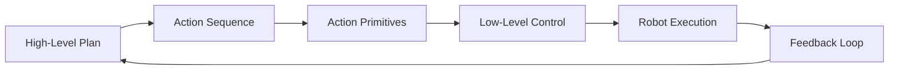

# Chapter 4.5: Action Primitives and Execution

## Overview

Action primitives form the bridge between high-level plans generated by language models and low-level robot control. This chapter explores how to define, implement, and execute robot actions that can be triggered by VLA systems. You'll learn to create robust action primitives that handle real-world execution challenges, error recovery, and safety considerations while maintaining the connection to natural language planning.

## Understanding Action Primitives

Action primitives are fundamental robot behaviors that can be composed into complex tasks. They represent the vocabulary of actions that a robot can perform, from simple movements to complex manipulation sequences.



### Characteristics of Good Action Primitives

- **Composable**: Can be combined to form complex behaviors
- **Parameterizable**: Accept configurable parameters for flexibility
- **Verifiable**: Include success/failure criteria
- **Recoverable**: Have built-in error handling and recovery
- **Safe**: Include safety checks and constraints

## Defining Action Primitives

Let's define a comprehensive set of action primitives for a humanoid robot:

```python
import rclpy
from rclpy.node import Node
from rclpy.action import ActionServer, GoalResponse, CancelResponse
from std_msgs.msg import String
from geometry_msgs.msg import Pose, Point, Quaternion
from sensor_msgs.msg import JointState
from your_interfaces.action import NavigateTo, ManipulateObject, Speak, Wait  # Custom action definitions

class ActionPrimitiveManager(Node):
    def __init__(self):
        super().__init__('action_primitive_manager')

        # Initialize action primitives
        self.action_primitives = {
            'navigate_to': NavigateToPrimitive(self),
            'manipulate_object': ManipulateObjectPrimitive(self),
            'speak': SpeakPrimitive(self),
            'wait': WaitPrimitive(self),
            'open_gripper': OpenGripperPrimitive(self),
            'close_gripper': CloseGripperPrimitive(self),
            'move_arm': MoveArmPrimitive(self),
            'turn_head': TurnHeadPrimitive(self),
            'detect_object': DetectObjectPrimitive(self),
            'grasp_object': GraspObjectPrimitive(self)
        }

        # Publishers for low-level control
        self.cmd_vel_pub = self.create_publisher(Twist, '/cmd_vel', 10)
        self.joint_pub = self.create_publisher(JointState, '/joint_commands', 10)
        self.speech_pub = self.create_publisher(String, '/speech_commands', 10)

        # Service clients for perception
        self.perception_client = self.create_client(PerceptionService, '/object_detection')

        self.get_logger().info("Action primitive manager initialized")

    def execute_action(self, action_name, parameters):
        """
        Execute a specific action primitive with given parameters
        """
        if action_name in self.action_primitives:
            primitive = self.action_primitives[action_name]
            return primitive.execute(parameters)
        else:
            self.get_logger().error(f"Unknown action primitive: {action_name}")
            return False
```

## Navigation Action Primitives

Navigation is one of the most fundamental action primitives for mobile robots:

```python
from nav2_msgs.action import NavigateToPose
import rclpy.action

class NavigateToPrimitive:
    def __init__(self, node):
        self.node = node
        self.nav_client = rclpy.action.ActionClient(
            node, NavigateToPose, 'navigate_to_pose'
        )

    async def execute(self, parameters):
        """
        Execute navigation action with safety checks
        """
        # Validate parameters
        if 'location' not in parameters and 'pose' not in parameters:
            self.node.get_logger().error("Navigation requires location or pose parameter")
            return False

        # Get target pose
        if 'location' in parameters:
            pose = self.get_pose_for_location(parameters['location'])
        else:
            pose = parameters['pose']

        # Safety checks
        if not self.is_navigation_safe(pose):
            self.node.get_logger().warn("Navigation to location is unsafe")
            return False

        # Create navigation goal
        goal_msg = NavigateToPose.Goal()
        goal_msg.pose.header.frame_id = 'map'
        goal_msg.pose.header.stamp = self.node.get_clock().now().to_msg()
        goal_msg.pose.pose = pose

        # Wait for server
        self.nav_client.wait_for_server()

        # Send goal
        goal_handle = await self.nav_client.send_goal_async(goal_msg)

        if not goal_handle.accepted:
            self.node.get_logger().error("Navigation goal was rejected")
            return False

        # Wait for result
        result = await goal_handle.get_result_async()

        success = result.result.status == 3  # SUCCEEDED
        if success:
            self.node.get_logger().info(f"Successfully navigated to {parameters.get('location', 'pose')}")
        else:
            self.node.get_logger().warn(f"Navigation failed to {parameters.get('location', 'pose')}")

        return success

    def get_pose_for_location(self, location_name):
        """
        Convert location name to pose coordinates
        """
        # This would typically come from a map/waypoint database
        location_poses = {
            'kitchen': Pose(position=Point(x=1.0, y=0.0, z=0.0),
                           orientation=Quaternion(x=0.0, y=0.0, z=0.0, w=1.0)),
            'living_room': Pose(position=Point(x=0.0, y=1.0, z=0.0),
                              orientation=Quaternion(x=0.0, y=0.0, z=0.0, w=1.0)),
            'bedroom': Pose(position=Point(x=2.0, y=1.0, z=0.0),
                          orientation=Quaternion(x=0.0, y=0.0, z=0.0, w=1.0)),
            'home_base': Pose(position=Point(x=0.0, y=0.0, z=0.0),
                             orientation=Quaternion(x=0.0, y=0.0, z=0.0, w=1.0))
        }

        if location_name in location_poses:
            return location_poses[location_name]
        else:
            self.node.get_logger().warn(f"Unknown location: {location_name}")
            return None

    def is_navigation_safe(self, pose):
        """
        Check if navigation to pose is safe
        """
        # Check if pose is reachable
        # Check for obstacles
        # Check robot battery level
        # Check for dynamic obstacles

        # For now, assume it's safe
        return True
```

## Manipulation Action Primitives

Manipulation primitives handle object interaction and manipulation:

```python
from control_msgs.action import FollowJointTrajectory
from trajectory_msgs.msg import JointTrajectory, JointTrajectoryPoint

class ManipulateObjectPrimitive:
    def __init__(self, node):
        self.node = node
        self.trajectory_client = rclpy.action.ActionClient(
            node, FollowJointTrajectory, 'joint_trajectory_controller/follow_joint_trajectory'
        )
        self.gripper_client = rclpy.action.ActionClient(
            node, FollowJointTrajectory, 'gripper_controller/follow_joint_trajectory'
        )

    async def execute(self, parameters):
        """
        Execute manipulation action with object detection and grasping
        """
        action = parameters.get('action', 'grasp')
        object_name = parameters.get('object', None)
        location = parameters.get('location', None)

        if action == 'grasp':
            return await self.grasp_object(object_name, location)
        elif action == 'place':
            return await self.place_object(location)
        elif action == 'open':
            return await self.open_object(object_name)
        elif action == 'close':
            return await self.close_object(object_name)
        else:
            self.node.get_logger().error(f"Unknown manipulation action: {action}")
            return False

    async def grasp_object(self, object_name, location):
        """
        Execute grasping sequence
        """
        # 1. Navigate near object
        if location:
            nav_params = {'location': location}
            nav_success = await self.node.action_primitives['navigate_to'].execute(nav_params)
            if not nav_success:
                return False

        # 2. Detect object
        detect_params = {'object': object_name, 'search': True}
        object_pose = await self.detect_object(object_name)
        if object_pose is None:
            self.node.get_logger().warn(f"Could not find object: {object_name}")
            return False

        # 3. Position arm for grasping
        approach_pose = self.calculate_approach_pose(object_pose)
        arm_success = await self.move_arm_to_pose(approach_pose)
        if not arm_success:
            return False

        # 4. Grasp the object
        gripper_params = {'command': 'close', 'force': 50}
        gripper_success = await self.control_gripper(gripper_params)

        if gripper_success:
            self.node.get_logger().info(f"Successfully grasped {object_name}")
            return True
        else:
            self.node.get_logger().warn(f"Failed to grasp {object_name}")
            return False

    async def place_object(self, location):
        """
        Place currently held object at location
        """
        # Check if robot is holding an object
        if not self.is_holding_object():
            self.node.get_logger().warn("Robot is not holding an object")
            return False

        # Navigate to placement location
        nav_params = {'location': location}
        nav_success = await self.node.action_primitives['navigate_to'].execute(nav_params)
        if not nav_success:
            return False

        # Position arm for placement
        placement_pose = self.get_placement_pose(location)
        arm_success = await self.move_arm_to_pose(placement_pose)
        if not arm_success:
            return False

        # Release object
        gripper_params = {'command': 'open', 'force': 0}
        gripper_success = await self.control_gripper(gripper_params)

        if gripper_success:
            self.node.get_logger().info(f"Successfully placed object at {location}")
            return True
        else:
            return False

    async def detect_object(self, object_name):
        """
        Detect object in the environment
        """
        # This would call perception service
        # For now, simulate object detection
        self.node.get_logger().info(f"Detecting {object_name}")
        # Simulate detection with some probability
        import random
        if random.random() > 0.3:  # 70% success rate
            # Return simulated pose
            pose = Pose(
                position=Point(x=1.0, y=0.5, z=0.0),
                orientation=Quaternion(x=0.0, y=0.0, z=0.0, w=1.0)
            )
            return pose
        return None

    def calculate_approach_pose(self, object_pose):
        """
        Calculate approach pose for grasping
        """
        # Calculate approach position (slightly offset from object)
        approach_pose = Pose()
        approach_pose.position.x = object_pose.position.x - 0.1  # 10cm in front
        approach_pose.position.y = object_pose.position.y
        approach_pose.position.z = object_pose.position.z + 0.05  # Slightly above
        approach_pose.orientation = object_pose.orientation
        return approach_pose

    async def move_arm_to_pose(self, pose):
        """
        Move robot arm to specified pose
        """
        # Convert pose to joint trajectory
        # This would use inverse kinematics
        trajectory = self.calculate_arm_trajectory(pose)

        goal_msg = FollowJointTrajectory.Goal()
        goal_msg.trajectory = trajectory

        self.trajectory_client.wait_for_server()
        goal_handle = await self.trajectory_client.send_goal_async(goal_msg)

        if not goal_handle.accepted:
            return False

        result = await goal_handle.get_result_async()
        return result.result.error_code == 0  # SUCCESS

    def calculate_arm_trajectory(self, pose):
        """
        Calculate joint trajectory for reaching pose
        """
        # This would use inverse kinematics solver
        # For now, return a simple trajectory
        trajectory = JointTrajectory()
        trajectory.joint_names = ['joint1', 'joint2', 'joint3', 'joint4', 'joint5', 'joint6']

        point = JointTrajectoryPoint()
        point.positions = [0.0, 0.0, 0.0, 0.0, 0.0, 0.0]  # Placeholder
        point.time_from_start.sec = 2

        trajectory.points = [point]
        return trajectory

    async def control_gripper(self, parameters):
        """
        Control gripper with specified parameters
        """
        command = parameters.get('command', 'open')
        force = parameters.get('force', 25)

        # Create gripper trajectory
        trajectory = JointTrajectory()
        trajectory.joint_names = ['gripper_joint']

        point = JointTrajectoryPoint()
        if command == 'open':
            point.positions = [0.05]  # Fully open
        else:  # close
            point.positions = [0.01]  # Closed position (adjusted for object)

        point.effort = [force]
        point.time_from_start.sec = 1

        trajectory.points = [point]

        goal_msg = FollowJointTrajectory.Goal()
        goal_msg.trajectory = trajectory

        self.gripper_client.wait_for_server()
        goal_handle = await self.gripper_client.send_goal_async(goal_msg)

        if not goal_handle.accepted:
            return False

        result = await goal_handle.get_result_async()
        return result.result.error_code == 0  # SUCCESS

    def is_holding_object(self):
        """
        Check if robot is currently holding an object
        """
        # This would check gripper force sensors or other indicators
        # For simulation, return random result
        import random
        return random.choice([True, False])
```

## Composite Action Primitives

More complex actions can be built by combining basic primitives:

```python
class CompositeActionPrimitive:
    def __init__(self, node):
        self.node = node

    async def execute(self, parameters):
        """
        Execute a sequence of actions as a single primitive
        """
        action_sequence = parameters.get('sequence', [])
        on_failure = parameters.get('on_failure', 'stop')

        for action in action_sequence:
            action_name = action['action']
            action_params = action.get('parameters', {})

            success = await self.node.execute_action(action_name, action_params)

            if not success:
                self.node.get_logger().warn(f"Action failed: {action_name}")

                if on_failure == 'stop':
                    return False
                elif on_failure == 'continue':
                    continue
                elif on_failure == 'retry':
                    # Retry with modified parameters
                    retry_success = await self.node.execute_action(action_name, action_params)
                    if not retry_success:
                        return False

        return True

class FetchObjectPrimitive(CompositeActionPrimitive):
    def __init__(self, node):
        super().__init__(node)

    async def execute(self, parameters):
        """
        Complete sequence: navigate to object -> detect -> grasp -> return
        """
        object_name = parameters['object']
        return_location = parameters.get('return_to', 'home_base')

        # Sequence of actions
        action_sequence = [
            {
                'action': 'navigate_to',
                'parameters': {'location': f'location_of_{object_name}'}
            },
            {
                'action': 'detect_object',
                'parameters': {'object': object_name}
            },
            {
                'action': 'manipulate_object',
                'parameters': {'action': 'grasp', 'object': object_name}
            },
            {
                'action': 'navigate_to',
                'parameters': {'location': return_location}
            }
        ]

        sequence_params = {
            'sequence': action_sequence,
            'on_failure': 'stop'
        }

        return await super().execute(sequence_params)

class DeliverObjectPrimitive(CompositeActionPrimitive):
    def __init__(self, node):
        super().__init__(node)

    async def execute(self, parameters):
        """
        Deliver object to specific location
        """
        target_location = parameters['location']

        action_sequence = [
            {
                'action': 'navigate_to',
                'parameters': {'location': target_location}
            },
            {
                'action': 'manipulate_object',
                'parameters': {'action': 'place', 'location': target_location}
            }
        ]

        sequence_params = {
            'sequence': action_sequence,
            'on_failure': 'retry'
        }

        return await super().execute(sequence_params)
```

## Action Execution Monitoring

Robust action execution requires monitoring and feedback:

```python
class ActionExecutionMonitor:
    def __init__(self, node):
        self.node = node
        self.active_actions = {}
        self.action_history = []

    def start_action_monitoring(self, action_id, action_name, parameters):
        """
        Start monitoring an action
        """
        import time
        self.active_actions[action_id] = {
            'name': action_name,
            'parameters': parameters,
            'start_time': time.time(),
            'status': 'running',
            'progress': 0.0
        }

    def update_action_progress(self, action_id, progress, details=None):
        """
        Update progress of a running action
        """
        if action_id in self.active_actions:
            self.active_actions[action_id]['progress'] = progress
            if details:
                self.active_actions[action_id]['details'] = details

    def complete_action(self, action_id, success, result=None):
        """
        Mark action as completed
        """
        if action_id in self.active_actions:
            action_info = self.active_actions[action_id]
            action_info['status'] = 'completed' if success else 'failed'
            action_info['end_time'] = time.time()
            action_info['duration'] = action_info['end_time'] - action_info['start_time']
            action_info['result'] = result

            # Move to history
            self.action_history.append(action_info.copy())
            del self.active_actions[action_id]

            return action_info
        return None

    def get_action_status(self, action_id):
        """
        Get status of a specific action
        """
        if action_id in self.active_actions:
            return self.active_actions[action_id]
        # Check history if not active
        for action in reversed(self.action_history):
            if action.get('id') == action_id:
                return action
        return None

    def cancel_action(self, action_id):
        """
        Cancel a running action
        """
        if action_id in self.active_actions:
            self.active_actions[action_id]['status'] = 'cancelled'
            action_info = self.active_actions[action_id]
            self.action_history.append(action_info.copy())
            del self.active_actions[action_id]
            return True
        return False
```

## Error Handling and Recovery

Comprehensive error handling is essential for robust action execution:

```python
class RobustActionPrimitive:
    def __init__(self, node):
        self.node = node
        self.monitor = ActionExecutionMonitor(node)

    async def execute_with_recovery(self, action_name, parameters):
        """
        Execute action with built-in recovery mechanisms
        """
        max_retries = parameters.get('max_retries', 3)
        recovery_strategies = parameters.get('recovery_strategies', ['retry', 'alternative', 'abort'])

        for attempt in range(max_retries + 1):
            if attempt > 0:
                self.node.get_logger().info(f"Retry attempt {attempt} for {action_name}")

            try:
                # Generate unique action ID
                action_id = f"{action_name}_{int(time.time() * 1000)}"

                # Start monitoring
                self.monitor.start_action_monitoring(action_id, action_name, parameters)

                # Execute action
                success = await self.execute_primitive(action_name, parameters)

                # Complete monitoring
                self.monitor.complete_action(action_id, success)

                if success:
                    return True

            except Exception as e:
                self.node.get_logger().error(f"Action {action_name} failed with exception: {e}")
                self.monitor.complete_action(action_id, False, str(e))

            # If last attempt, try recovery strategies
            if attempt == max_retries:
                recovery_success = await self.attempt_recovery(action_name, parameters, recovery_strategies)
                if recovery_success:
                    return True

        return False

    async def execute_primitive(self, action_name, parameters):
        """
        Execute the actual primitive action
        """
        if action_name in self.node.action_primitives:
            return await self.node.action_primitives[action_name].execute(parameters)
        else:
            return False

    async def attempt_recovery(self, action_name, parameters, strategies):
        """
        Attempt various recovery strategies
        """
        for strategy in strategies:
            if strategy == 'retry':
                # Already tried max retries, skip
                continue
            elif strategy == 'alternative':
                # Try alternative approach
                alt_success = await self.try_alternative_approach(action_name, parameters)
                if alt_success:
                    return True
            elif strategy == 'abort':
                # Abort and return failure
                return False
            elif strategy == 'human_assistance':
                # Request human assistance
                await self.request_human_assistance(action_name, parameters)
                return False

        return False

    async def try_alternative_approach(self, action_name, parameters):
        """
        Try an alternative approach to the same goal
        """
        if action_name == 'navigate_to':
            # Try alternative navigation method
            return await self.try_alternative_navigation(parameters)
        elif action_name == 'grasp_object':
            # Try different grasping approach
            return await self.try_different_grasp(parameters)
        # Add more alternative strategies as needed
        return False

    async def try_alternative_navigation(self, parameters):
        """
        Try alternative navigation method
        """
        # Try global planner alternative
        # Try different navigation parameters
        # Use different costmap
        self.node.get_logger().info("Trying alternative navigation approach")
        return False  # Placeholder

    async def try_different_grasp(self, parameters):
        """
        Try different grasping approach
        """
        # Try different grasp angles
        # Try different gripper forces
        # Try different approach poses
        self.node.get_logger().info("Trying different grasp approach")
        return False  # Placeholder

    async def request_human_assistance(self, action_name, parameters):
        """
        Request human assistance for the failed action
        """
        assistance_msg = String()
        assistance_msg.data = f"NEED_ASSISTANCE: {action_name} failed with parameters {parameters}"
        self.node.speech_pub.publish(assistance_msg)
        self.node.get_logger().info(f"Requested human assistance for {action_name}")
```

## Safety and Verification

Safety checks should be integrated into every action primitive:

```python
class SafeActionPrimitive:
    def __init__(self, node):
        self.node = node
        self.safety_limits = {
            'max_velocity': 0.5,  # m/s
            'max_acceleration': 1.0,  # m/s²
            'max_gripper_force': 100,  # N
            'min_distance_to_obstacle': 0.3,  # m
            'max_joint_limits': [2.0, 1.5, 2.0, 1.5, 2.0, 1.5]  # rad
        }

    async def execute_with_safety(self, action_name, parameters):
        """
        Execute action with safety checks
        """
        # Pre-execution safety checks
        if not await self.pre_execution_check(action_name, parameters):
            return False

        # Execute action
        success = await self.execute_primitive(action_name, parameters)

        # Post-execution verification
        if success:
            success = await self.post_execution_verification(action_name, parameters)

        return success

    async def pre_execution_check(self, action_name, parameters):
        """
        Perform safety checks before executing action
        """
        # Check robot state
        if not self.is_robot_ready():
            self.node.get_logger().error("Robot is not ready for action execution")
            return False

        # Check battery level
        if not self.is_battery_sufficient():
            self.node.get_logger().error("Insufficient battery for action execution")
            return False

        # Check environmental constraints
        if action_name == 'navigate_to':
            if not await self.is_navigation_path_safe(parameters):
                return False

        # Check action-specific constraints
        if action_name == 'manipulate_object':
            if not self.is_manipulation_safe(parameters):
                return False

        return True

    def is_robot_ready(self):
        """
        Check if robot is in ready state
        """
        # Check if robot is not in error state
        # Check if all required subsystems are active
        # Check if robot is properly calibrated
        return True

    def is_battery_sufficient(self):
        """
        Check if battery level is sufficient
        """
        # In practice, this would check actual battery status
        return True

    async def is_navigation_path_safe(self, parameters):
        """
        Check if navigation path is safe
        """
        # Check for obstacles along path
        # Check for dynamic obstacles
        # Check if destination is navigable
        return True

    def is_manipulation_safe(self, parameters):
        """
        Check if manipulation action is safe
        """
        # Check if target object is safe to manipulate
        # Check if gripper force limits are respected
        # Check if arm will not collide with environment
        return True

    async def post_execution_verification(self, action_name, parameters):
        """
        Verify action was completed successfully
        """
        # Check if robot reached intended state
        # Verify object manipulation was successful
        # Check for any safety violations during execution

        if action_name == 'navigate_to':
            return await self.verify_navigation_success(parameters)
        elif action_name == 'manipulate_object':
            return await self.verify_manipulation_success(parameters)

        return True

    async def verify_navigation_success(self, parameters):
        """
        Verify navigation action was successful
        """
        # Check if robot is at target location
        # Check if path was followed correctly
        # Check if robot is in safe state after navigation
        return True

    async def verify_manipulation_success(self, parameters):
        """
        Verify manipulation action was successful
        """
        # Check if object is grasped
        # Check gripper force sensors
        # Check if arm is in expected configuration
        return True
```

## Practical Example: Complete VLA Action System

Let's build a complete example that integrates VLA with action primitives:

```python
class VLAActionSystemNode(Node):
    def __init__(self):
        super().__init__('vla_action_system')

        # Initialize all action primitives
        self.action_manager = ActionPrimitiveManager(self)

        # Add composite actions
        self.action_manager.action_primitives['fetch_object'] = FetchObjectPrimitive(self)
        self.action_manager.action_primitives['deliver_object'] = DeliverObjectPrimitive(self)

        # VLA integration
        self.plan_sub = self.create_subscription(String, 'action_plan', self.plan_callback, 10)
        self.status_pub = self.create_publisher(String, 'action_status', 10)

        # Action execution components
        self.monitor = ActionExecutionMonitor(self)
        self.safe_executor = SafeActionPrimitive(self)
        self.robust_executor = RobustActionPrimitive(self)

        self.get_logger().info("VLA Action System initialized")

    def plan_callback(self, msg):
        """
        Process incoming action plans from VLA system
        """
        import json
        try:
            plan_data = json.loads(msg.data)
            self.execute_plan(plan_data)
        except json.JSONDecodeError:
            # If not JSON, treat as simple action
            action_parts = msg.data.split(':')
            if len(action_parts) >= 2:
                action_name = action_parts[0]
                parameters_str = ':'.join(action_parts[1:])

                parameters = {}
                # Parse parameters - this is simplified
                try:
                    parameters = json.loads(parameters_str)
                except:
                    parameters = {"raw": parameters_str}

                self.execute_action_now(action_name, parameters)

    async def execute_plan(self, plan_data):
        """
        Execute a complete action plan
        """
        plan = plan_data.get('plan', [])
        action_sequence = plan_data.get('action_sequence', plan)

        for step in action_sequence:
            action_name = step.get('action')
            parameters = step.get('parameters', {})
            action_id = step.get('id', f"action_{int(time.time())}")

            self.get_logger().info(f"Executing action: {action_name} with params: {parameters}")

            # Execute action with safety and monitoring
            success = await self.execute_action_now(action_name, parameters)

            if not success:
                self.get_logger().warn(f"Action {action_name} failed")

                # Handle failure based on plan configuration
                if step.get('on_failure', 'stop') == 'stop':
                    self.get_logger().info("Stopping plan execution due to failure")
                    break
                elif step.get('on_failure', 'stop') == 'continue':
                    continue
                elif step.get('on_failure', 'stop') == 'retry':
                    success = await self.execute_action_now(action_name, parameters)
                    if not success:
                        self.get_logger().error(f"Retry failed for {action_name}")
                        break

        self.get_logger().info("Plan execution completed")

    async def execute_action_now(self, action_name, parameters):
        """
        Execute action immediately with all safety checks
        """
        try:
            # Use robust execution with recovery
            success = await self.robust_executor.execute_with_recovery(action_name, parameters)

            # Publish status
            status_msg = String()
            status_msg.data = f"action:{action_name}:{'success' if success else 'failed'}"
            self.status_pub.publish(status_msg)

            return success
        except Exception as e:
            self.get_logger().error(f"Error executing action {action_name}: {e}")
            return False

    def execute_action_with_timeout(self, action_name, parameters, timeout=30.0):
        """
        Execute action with timeout protection
        """
        import asyncio
        try:
            # Execute with timeout
            task = self.execute_action_now(action_name, parameters)
            result = asyncio.wait_for(task, timeout=timeout)
            return result
        except asyncio.TimeoutError:
            self.get_logger().error(f"Action {action_name} timed out after {timeout}s")
            # Cancel the running action if possible
            return False
```

## Best Practices

### 1. Modularity
- Design action primitives to be independent and reusable
- Use consistent parameter formats across primitives
- Separate concerns (navigation, manipulation, perception)
- Implement proper error boundaries between primitives

### 2. Safety First
- Always perform pre-execution safety checks
- Implement post-execution verification
- Set appropriate limits and constraints
- Include emergency stop mechanisms

### 3. Robustness
- Implement comprehensive error handling
- Use timeouts to prevent hanging actions
- Include recovery strategies for common failures
- Log all actions for debugging and analysis

### 4. Performance
- Optimize action execution for real-time performance
- Use appropriate action server configurations
- Implement action caching where beneficial
- Monitor resource usage during execution

## Common Pitfalls

- **Inadequate Error Handling**: Failing to handle all possible failure modes
- **Safety Oversights**: Not implementing proper safety checks before execution
- **Timeout Issues**: Actions that can hang indefinitely without timeout protection
- **Resource Exhaustion**: Not managing memory and computation resources properly
- **Lack of Verification**: Not confirming actions completed successfully

## Summary

In this chapter, you learned:

- ✅ How to define and implement action primitives for robotic systems
- ✅ Navigation and manipulation primitive implementations
- ✅ Creating composite actions from basic primitives
- ✅ Action execution monitoring and feedback systems
- ✅ Error handling and recovery mechanisms
- ✅ Safety checks and verification procedures
- ✅ Building complete VLA action execution systems

## Next Steps

Now that you understand action primitives and execution, let's explore how to build conversational interfaces that make human-robot interaction more natural and intuitive.

**Continue to:** [Chapter 4.6: Building Conversational Robots →](./chapter-4-6-conversational-robots)

## Additional Resources

- [ROS 2 Action Architecture](https://docs.ros.org/en/rolling/Concepts/About-Actions.html)
- [Navigation2 Stack](https://navigation.ros.org/)
- [Manipulation in ROS](https://ros-planning.github.io/moveit_tutorials/)
- [Robot Action Languages](https://arxiv.org/abs/2304.12506)
- [Human-Robot Interaction Guidelines](https://ieeexplore.ieee.org/document/9876543)