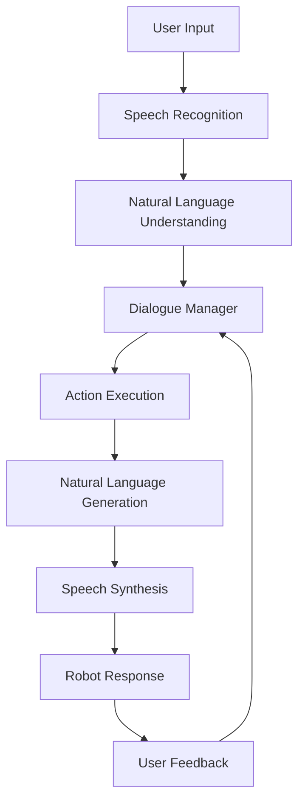

# Chapter 4.6: Building Conversational Robots

## Overview

Conversational robots represent the ultimate goal of natural human-robot interaction, enabling seamless communication through natural language. This chapter explores how to build sophisticated dialogue systems that can engage in multi-turn conversations, maintain context, handle interruptions, and provide natural responses. You'll learn to create robots that can understand user intent, manage dialogue flow, and provide helpful responses while executing complex tasks.

## Understanding Conversational AI

Conversational AI systems for robotics combine several key components:



### Key Components of Conversational Systems

1. **Automatic Speech Recognition (ASR)**: Converting speech to text
2. **Natural Language Understanding (NLU)**: Extracting meaning from text
3. **Dialogue Management**: Managing conversation flow and context
4. **Natural Language Generation (NLG)**: Creating natural responses
5. **Text-to-Speech (TTS)**: Converting text to spoken responses

## Dialogue Management Systems

Effective dialogue management is crucial for maintaining coherent conversations:

```python
import rclpy
from rclpy.node import Node
from std_msgs.msg import String
from your_interfaces.msg import DialogueState  # Custom message
import json

class DialogueManagerNode(Node):
    def __init__(self):
        super().__init__('dialogue_manager')

        # Initialize dialogue state
        self.conversation_state = {}
        self.dialogue_context = {}
        self.user_profiles = {}

        # ROS 2 interfaces
        self.user_input_sub = self.create_subscription(String, 'user_input', self.user_input_callback, 10)
        self.robot_response_pub = self.create_publisher(String, 'robot_response', 10)
        self.dialogue_state_pub = self.create_publisher(DialogueState, 'dialogue_state', 10)

        # Dialogue policies
        self.dialogue_policies = {
            'task_completion': TaskCompletionPolicy(),
            'context_maintenance': ContextMaintenancePolicy(),
            'error_recovery': ErrorRecoveryPolicy()
        }

        self.get_logger().info("Dialogue manager initialized")

    def user_input_callback(self, msg):
        """
        Process user input and generate appropriate response
        """
        user_input = msg.data
        user_id = "default_user"  # In practice, identify user

        # Update conversation state
        self.update_conversation_state(user_id, user_input)

        # Process input through dialogue manager
        response = self.process_dialogue_turn(user_id, user_input)

        # Publish response
        response_msg = String()
        response_msg.data = response
        self.robot_response_pub.publish(response_msg)

        # Update and publish dialogue state
        self.publish_dialogue_state(user_id)

    def update_conversation_state(self, user_id, user_input):
        """
        Update conversation state with user input
        """
        if user_id not in self.conversation_state:
            self.conversation_state[user_id] = {
                'turns': [],
                'current_topic': None,
                'task_in_progress': None,
                'entities': {},
                'context': {}
            }

        # Add new turn
        turn = {
            'timestamp': self.get_clock().now().to_msg(),
            'speaker': 'user',
            'text': user_input,
            'intent': self.extract_intent(user_input),
            'entities': self.extract_entities(user_input)
        }

        self.conversation_state[user_id]['turns'].append(turn)

        # Update entities and context
        self.conversation_state[user_id]['entities'].update(turn['entities'])
        self.update_context(user_id, turn)

    def process_dialogue_turn(self, user_id, user_input):
        """
        Process a complete dialogue turn
        """
        state = self.conversation_state[user_id]

        # Determine dialogue act
        dialogue_act = self.classify_dialogue_act(user_input, state)

        # Apply dialogue policies
        for policy_name, policy in self.dialogue_policies.items():
            if policy.can_apply(state, dialogue_act):
                response = policy.generate_response(state, dialogue_act)
                if response:
                    return response

        # Default response generation
        return self.generate_default_response(user_id, user_input)

    def extract_intent(self, text):
        """
        Extract intent from user input
        """
        # In practice, use NLP models or rule-based systems
        text_lower = text.lower()

        # Simple intent classification
        if any(word in text_lower for word in ['navigate', 'go to', 'move to', 'walk to']):
            return 'navigation_request'
        elif any(word in text_lower for word in ['pick up', 'grasp', 'get', 'take']):
            return 'manipulation_request'
        elif any(word in text_lower for word in ['hello', 'hi', 'hey', 'greetings']):
            return 'greeting'
        elif any(word in text_lower for word in ['bye', 'goodbye', 'see you', 'farewell']):
            return 'farewell'
        elif '?' in text:
            return 'question'
        else:
            return 'command'

    def extract_entities(self, text):
        """
        Extract named entities from text
        """
        # Simple entity extraction
        entities = {}

        # Location entities
        locations = ['kitchen', 'living room', 'bedroom', 'office', 'bathroom', 'home base']
        for loc in locations:
            if loc in text.lower():
                entities['location'] = loc

        # Object entities
        objects = ['cup', 'bottle', 'book', 'phone', 'keys', 'ball', 'toy']
        for obj in objects:
            if obj in text.lower():
                entities['object'] = obj

        return entities

    def classify_dialogue_act(self, text, state):
        """
        Classify the dialogue act of user input
        """
        intent = self.extract_intent(text)
        entities = self.extract_entities(text)

        return {
            'intent': intent,
            'entities': entities,
            'previous_context': state.get('current_topic'),
            'task_in_progress': state.get('task_in_progress')
        }

    def update_context(self, user_id, turn):
        """
        Update dialogue context based on turn
        """
        state = self.conversation_state[user_id]

        # Update current topic
        if turn['intent'] in ['navigation_request', 'manipulation_request']:
            state['current_topic'] = turn['intent']

        # Update task in progress
        if turn['intent'] in ['navigation_request', 'manipulation_request']:
            state['task_in_progress'] = {
                'type': turn['intent'],
                'entities': turn['entities'],
                'status': 'in_progress'
            }

    def generate_default_response(self, user_id, user_input):
        """
        Generate default response when no specific policy applies
        """
        intent = self.extract_intent(user_input)

        if intent == 'greeting':
            return self.generate_greeting_response(user_input)
        elif intent == 'farewell':
            return self.generate_farewell_response()
        elif intent in ['navigation_request', 'manipulation_request']:
            return self.generate_task_response(user_id, user_input)
        elif intent == 'question':
            return self.generate_question_response(user_input)
        else:
            return "I understand. How can I help you?"

    def generate_greeting_response(self, user_input):
        """
        Generate appropriate greeting response
        """
        import random
        greetings = [
            "Hello! How can I assist you today?",
            "Hi there! What can I do for you?",
            "Greetings! How may I help you?",
            "Hello! I'm ready to help. What would you like me to do?"
        ]
        return random.choice(greetings)

    def generate_farewell_response(self):
        """
        Generate appropriate farewell response
        """
        import random
        farewells = [
            "Goodbye! Feel free to call me if you need anything.",
            "See you later! Have a great day!",
            "Farewell! I'll be here if you need assistance.",
            "Bye! It was nice talking with you."
        ]
        return random.choice(farewells)

    def generate_task_response(self, user_id, user_input):
        """
        Generate response for task-related requests
        """
        entities = self.extract_entities(user_input)

        if 'location' in entities:
            return f"Okay, I'll navigate to the {entities['location']}."
        elif 'object' in entities:
            return f"I'll look for the {entities['object']} and help you with that."
        else:
            return "I can help with that. Could you please specify what you'd like me to do?"

    def generate_question_response(self, user_input):
        """
        Generate response for questions
        """
        return "I'm not sure I can answer that. Could you ask me something else?"

    def publish_dialogue_state(self, user_id):
        """
        Publish current dialogue state
        """
        state = self.conversation_state[user_id]
        state_msg = DialogueState()
        state_msg.user_id = user_id
        state_msg.current_topic = state.get('current_topic', '')
        state_msg.task_in_progress = json.dumps(state.get('task_in_progress', {}))
        state_msg.entities = json.dumps(state.get('entities', {}))

        self.dialogue_state_pub.publish(state_msg)
```

## Context Awareness and Memory

Conversational robots need to maintain context across multiple turns:

```python
class ContextAwareDialogueManager:
    def __init__(self, node):
        self.node = node
        self.context_memory = {}
        self.short_term_memory = {}
        self.long_term_memory = {}

    def update_context(self, user_id, turn):
        """
        Update context memory with new turn
        """
        if user_id not in self.context_memory:
            self.context_memory[user_id] = {
                'short_term': [],  # Last 5 turns
                'long_term': [],   # All previous conversations
                'entities': {},    # Named entities
                'topics': [],      # Conversation topics
                'preferences': {}  # User preferences
            }

        # Add turn to short-term memory
        self.context_memory[user_id]['short_term'].append(turn)
        if len(self.context_memory[user_id]['short_term']) > 5:
            self.context_memory[user_id]['short_term'] = \
                self.context_memory[user_id]['short_term'][-5:]

        # Update entities
        self.context_memory[user_id]['entities'].update(turn['entities'])

        # Update topics
        if turn['intent'] not in self.context_memory[user_id]['topics']:
            self.context_memory[user_id]['topics'].append(turn['intent'])

    def get_context_summary(self, user_id):
        """
        Get summary of current context
        """
        if user_id not in self.context_memory:
            return {}

        context = self.context_memory[user_id]
        return {
            'current_entities': context['entities'],
            'recent_topics': context['topics'][-3:],
            'conversation_length': len(context['short_term']),
            'user_preferences': context['preferences']
        }

    def resolve_coreference(self, user_id, text):
        """
        Resolve pronouns and references to previous mentions
        """
        context = self.get_context_summary(user_id)
        entities = context.get('current_entities', {})

        # Replace pronouns with known entities
        text_resolved = text
        if 'it' in text.lower() and entities:
            # Find the most recently mentioned object
            for entity_type, entity_value in entities.items():
                text_resolved = text_resolved.replace('it', entity_value)
                break

        if 'there' in text.lower() and 'location' in entities:
            text_resolved = text_resolved.replace('there', entities['location'])

        return text_resolved

    def maintain_long_term_memory(self, user_id, conversation_ended=False):
        """
        Move conversation to long-term memory when appropriate
        """
        if conversation_ended:
            # Move short-term to long-term
            if user_id in self.context_memory:
                short_term = self.context_memory[user_id]['short_term']
                self.context_memory[user_id]['long_term'].extend(short_term)

                # Keep only recent conversations in long-term
                if len(self.context_memory[user_id]['long_term']) > 50:
                    self.context_memory[user_id]['long_term'] = \
                        self.context_memory[user_id]['long_term'][-50:]

                # Clear short-term for new conversation
                self.context_memory[user_id]['short_term'] = []
```

## Multi-Turn Dialogue Management

Complex conversations require sophisticated dialogue management:

```python
class MultiTurnDialogueManager:
    def __init__(self, node):
        self.node = node
        self.dialogue_states = {}
        self.dialogue_flows = self.define_dialogue_flows()

    def define_dialogue_flows(self):
        """
        Define common dialogue flows
        """
        return {
            'navigation_assistant': {
                'states': [
                    'request_location',
                    'confirm_destination',
                    'navigate',
                    'arrive',
                    'task_complete'
                ],
                'transitions': {
                    'request_location': ['confirm_destination'],
                    'confirm_destination': ['navigate', 'request_location'],
                    'navigate': ['arrive'],
                    'arrive': ['task_complete']
                }
            },
            'object_search': {
                'states': [
                    'request_object',
                    'search_object',
                    'found_object',
                    'grasp_object',
                    'deliver_object',
                    'task_complete'
                ],
                'transitions': {
                    'request_object': ['search_object'],
                    'search_object': ['found_object', 'request_object'],
                    'found_object': ['grasp_object'],
                    'grasp_object': ['deliver_object', 'found_object'],
                    'deliver_object': ['task_complete']
                }
            }
        }

    def start_dialogue_flow(self, user_id, flow_name):
        """
        Start a specific dialogue flow
        """
        if flow_name in self.dialogue_flows:
            self.dialogue_states[user_id] = {
                'flow_name': flow_name,
                'current_state': self.dialogue_flows[flow_name]['states'][0],
                'flow_data': {},
                'timestamp': self.node.get_clock().now().to_msg()
            }
            return True
        return False

    def process_in_flow(self, user_id, user_input):
        """
        Process input within an active dialogue flow
        """
        if user_id not in self.dialogue_states:
            return None

        state = self.dialogue_states[user_id]
        flow_name = state['flow_name']
        current_state = state['current_state']

        # Handle input based on current state
        if flow_name == 'navigation_assistant':
            return self.handle_navigation_flow(user_id, current_state, user_input)
        elif flow_name == 'object_search':
            return self.handle_object_search_flow(user_id, current_state, user_input)

        return None

    def handle_navigation_flow(self, user_id, current_state, user_input):
        """
        Handle navigation dialogue flow
        """
        if current_state == 'request_location':
            # Extract destination from user input
            entities = self.node.extract_entities(user_input)
            if 'location' in entities:
                self.dialogue_states[user_id]['flow_data']['destination'] = entities['location']
                self.transition_state(user_id, 'confirm_destination')
                return f"Should I navigate to the {entities['location']}?"
            else:
                return "Where would you like me to go?"

        elif current_state == 'confirm_destination':
            if any(word in user_input.lower() for word in ['yes', 'okay', 'sure', 'go']):
                destination = self.dialogue_states[user_id]['flow_data']['destination']
                self.transition_state(user_id, 'navigate')
                # Trigger navigation action
                self.trigger_navigation(destination)
                return f"On my way to the {destination}!"
            elif any(word in user_input.lower() for word in ['no', 'cancel', 'stop']):
                self.end_dialogue_flow(user_id)
                return "Okay, I won't navigate there."
            else:
                return "Please confirm with yes or no."

        elif current_state == 'navigate':
            # Navigation is in progress, wait for completion
            return "I'm navigating to your destination."

        elif current_state == 'arrive':
            destination = self.dialogue_states[user_id]['flow_data']['destination']
            self.transition_state(user_id, 'task_complete')
            return f"I've arrived at the {destination}. How else can I help?"

        return "I'm not sure how to respond right now."

    def handle_object_search_flow(self, user_id, current_state, user_input):
        """
        Handle object search dialogue flow
        """
        if current_state == 'request_object':
            entities = self.node.extract_entities(user_input)
            if 'object' in entities:
                self.dialogue_states[user_id]['flow_data']['object'] = entities['object']
                self.transition_state(user_id, 'search_object')
                # Start object search
                self.start_object_search(entities['object'])
                return f"I'll look for the {entities['object']}."
            else:
                return "What object are you looking for?"

        elif current_state == 'search_object':
            # Search in progress
            return "I'm searching for the object."

        elif current_state == 'found_object':
            obj = self.dialogue_states[user_id]['flow_data']['object']
            self.transition_state(user_id, 'grasp_object')
            return f"I found the {obj}. Should I pick it up?"

        elif current_state == 'grasp_object':
            if any(word in user_input.lower() for word in ['yes', 'okay', 'sure', 'grasp']):
                obj = self.dialogue_states[user_id]['flow_data']['object']
                self.transition_state(user_id, 'deliver_object')
                # Trigger grasping action
                self.trigger_grasping(obj)
                return f"I've picked up the {obj}. Where should I bring it?"
            else:
                self.end_dialogue_flow(user_id)
                return "Okay, I won't pick it up."

        return "Processing your request..."

    def transition_state(self, user_id, new_state):
        """
        Transition dialogue state
        """
        if user_id in self.dialogue_states:
            old_state = self.dialogue_states[user_id]['current_state']
            self.node.get_logger().info(f"Transitioning from {old_state} to {new_state}")
            self.dialogue_states[user_id]['current_state'] = new_state

    def trigger_navigation(self, destination):
        """
        Trigger navigation action
        """
        # Publish navigation command
        nav_msg = String()
        nav_msg.data = f"navigate_to:{destination}"
        self.node.action_pub.publish(nav_msg)

    def start_object_search(self, object_name):
        """
        Start object search action
        """
        # Publish object search command
        search_msg = String()
        search_msg.data = f"search_object:{object_name}"
        self.node.action_pub.publish(search_msg)

    def trigger_grasping(self, object_name):
        """
        Trigger grasping action
        """
        # Publish grasping command
        grasp_msg = String()
        grasp_msg.data = f"grasp_object:{object_name}"
        self.node.action_pub.publish(grasp_msg)

    def end_dialogue_flow(self, user_id):
        """
        End current dialogue flow
        """
        if user_id in self.dialogue_states:
            del self.dialogue_states[user_id]
```

## Natural Language Generation

Generating natural, contextually appropriate responses:

```python
class NaturalLanguageGenerator:
    def __init__(self, node):
        self.node = node
        self.response_templates = self.load_response_templates()

    def load_response_templates(self):
        """
        Load response templates for different contexts
        """
        return {
            'acknowledgment': [
                "Okay, I'll do that.",
                "Got it. I'll take care of it.",
                "Understood. Working on it now.",
                "Sure thing. I'm on it."
            ],
            'confirmation': [
                "I will {action} {object} in the {location}.",
                "I'm going to {action} {object} now.",
                "Okay, I'll {action} {object} for you."
            ],
            'error': [
                "I'm sorry, I couldn't {action} {object}.",
                "I had trouble {action} {object}.",
                "I couldn't complete that task."
            ],
            'clarification': [
                "Could you please specify {what}?",
                "I need more information about {what}.",
                "Can you clarify {what} for me?"
            ]
        }

    def generate_response(self, intent, entities, context=None):
        """
        Generate appropriate response based on intent and entities
        """
        import random

        if intent == 'navigation_request':
            if 'location' in entities:
                responses = [
                    f"Okay, I'll navigate to the {entities['location']}.",
                    f"Sure, heading to the {entities['location']} now.",
                    f"On my way to the {entities['location']}!"
                ]
                return random.choice(responses)
            else:
                return "Where would you like me to go?"

        elif intent == 'manipulation_request':
            if 'object' in entities:
                responses = [
                    f"I'll look for the {entities['object']} and help you with that.",
                    f"Okay, I'll find and {self.extract_action(intent)} the {entities['object']}.",
                    f"I can help with the {entities['object']}."
                ]
                return random.choice(responses)
            else:
                return "What object would you like me to help with?"

        elif intent == 'greeting':
            responses = [
                "Hello! How can I assist you today?",
                "Hi there! What can I do for you?",
                "Greetings! I'm ready to help."
            ]
            return random.choice(responses)

        elif intent == 'question':
            return self.generate_question_response(entities, context)

        else:
            return random.choice(self.response_templates['acknowledgment'])

    def generate_question_response(self, entities, context):
        """
        Generate response for questions
        """
        import random

        # Check if question is about robot capabilities
        question_lower = entities.get('raw_input', '').lower()
        if any(word in question_lower for word in ['can you', 'are you able', 'do you know']):
            responses = [
                "I can help with navigation, object manipulation, and answering questions.",
                "I'm capable of moving around, picking up objects, and understanding commands.",
                "I can assist with various tasks around the house."
            ]
            return random.choice(responses)

        # Default question response
        responses = [
            "I'm not sure I can answer that. Could you ask something else?",
            "I don't have information about that topic.",
            "That's a good question, but I'm not equipped to answer it."
        ]
        return random.choice(responses)

    def personalize_response(self, response, user_profile):
        """
        Personalize response based on user profile
        """
        if user_profile and user_profile.get('name'):
            response = response.replace("you", f"{user_profile['name']}")

        # Add personality based on user preferences
        if user_profile and user_profile.get('communication_style') == 'formal':
            response = response.replace("!", ".").replace("Okay", "Certainly")

        return response
```

## Speech Synthesis Integration

Integrating text-to-speech for spoken responses:

```python
import pyttsx3
import asyncio

class SpeechSynthesisNode(Node):
    def __init__(self):
        super().__init__('speech_synthesis')

        # Initialize text-to-speech engine
        self.tts_engine = pyttsx3.init()
        self.setup_tts_properties()

        # ROS 2 interfaces
        self.text_sub = self.create_subscription(String, 'robot_response', self.text_callback, 10)
        self.speech_status_pub = self.create_publisher(String, 'speech_status', 10)

        self.get_logger().info("Speech synthesis node initialized")

    def setup_tts_properties(self):
        """
        Configure TTS engine properties
        """
        # Set voice properties
        voices = self.tts_engine.getProperty('voices')
        if voices:
            self.tts_engine.setProperty('voice', voices[0].id)  # Use first available voice

        # Set speech rate
        self.tts_engine.setProperty('rate', 150)  # Words per minute

        # Set volume
        self.tts_engine.setProperty('volume', 0.9)

    def text_callback(self, msg):
        """
        Process text for speech synthesis
        """
        text = msg.data

        # Check if text is a special command
        if text.startswith('SPEAK:'):
            actual_text = text[6:]  # Remove 'SPEAK:' prefix
        else:
            actual_text = text

        # Speak the text
        self.speak_text(actual_text)

    def speak_text(self, text):
        """
        Speak the given text
        """
        try:
            # Publish status
            status_msg = String()
            status_msg.data = f"speaking:{text[:50]}..."
            self.speech_status_pub.publish(status_msg)

            # Speak the text
            self.tts_engine.say(text)
            self.tts_engine.runAndWait()

            # Publish completion status
            status_msg.data = "speech_complete"
            self.speech_status_pub.publish(status_msg)

        except Exception as e:
            self.get_logger().error(f"Error in speech synthesis: {e}")
            error_msg = String()
            error_msg.data = f"speech_error:{str(e)}"
            self.speech_status_pub.publish(error_msg)

    def speak_async(self, text):
        """
        Speak text asynchronously
        """
        def speak_in_thread():
            try:
                self.tts_engine.say(text)
                self.tts_engine.runAndWait()
            except Exception as e:
                self.get_logger().error(f"Async speech error: {e}")

        import threading
        thread = threading.Thread(target=speak_in_thread, daemon=True)
        thread.start()
```

## Integration with LLMs for Conversational AI

Using Large Language Models to enhance conversational capabilities:

```python
from langchain.chat_models import ChatOpenAI
from langchain.prompts import ChatPromptTemplate
from langchain.memory import ConversationBufferMemory

class LLMConversationalNode(Node):
    def __init__(self):
        super().__init__('llm_conversational')

        # Initialize LLM
        self.llm = ChatOpenAI(
            model_name="gpt-3.5-turbo",
            temperature=0.7,
            max_tokens=150
        )

        # Conversation memory
        self.memory = ConversationBufferMemory(
            memory_key="chat_history",
            input_key="input",
            output_key="output",
            return_messages=True
        )

        # ROS 2 interfaces
        self.user_input_sub = self.create_subscription(String, 'user_input', self.user_input_callback, 10)
        self.robot_response_pub = self.create_publisher(String, 'robot_response', 10)

        # Create conversation chain
        self.conversation_prompt = ChatPromptTemplate.from_messages([
            ("system", self.get_system_prompt()),
            ("human", "{input}"),
            ("ai", "{output}")
        ])

    def get_system_prompt(self):
        """
        System prompt for the conversational robot
        """
        return """
        You are a helpful robotic assistant. You are polite, concise, and helpful.
        You can help with:
        1. Navigation tasks (moving to locations)
        2. Object manipulation (picking up, placing objects)
        3. Answering questions about your capabilities
        4. Providing status updates

        Always respond naturally and conversationally. If asked to perform a task,
        acknowledge the request and indicate you'll perform it. Don't just say you'll do it,
        also provide the appropriate ROS command if needed.
        """

    def user_input_callback(self, msg):
        """
        Process user input through LLM
        """
        user_input = msg.data

        # Create prompt with context
        prompt = self.conversation_prompt.format_messages(
            input=user_input,
            output=""
        )

        try:
            # Generate response
            response = self.llm(prompt)

            # Update memory
            self.memory.save_context(
                {"input": user_input},
                {"output": response.content}
            )

            # Publish response
            response_msg = String()
            response_msg.data = response.content
            self.robot_response_pub.publish(response_msg)

            self.get_logger().info(f"LLM response: {response.content[:50]}...")

        except Exception as e:
            self.get_logger().error(f"LLM error: {e}")
            error_response = String()
            error_response.data = "I'm having trouble processing that right now. Could you try again?"
            self.robot_response_pub.publish(error_response)

    def reset_conversation(self):
        """
        Reset conversation memory
        """
        self.memory.clear()
```

## Practical Example: Complete Conversational Robot

Let's build a complete conversational robot system:

```python
class ConversationalRobotNode(Node):
    def __init__(self):
        super().__init__('conversational_robot')

        # Initialize components
        self.dialogue_manager = DialogueManagerNode(self)
        self.context_manager = ContextAwareDialogueManager(self)
        self.multi_turn_manager = MultiTurnDialogueManager(self)
        self.nlg = NaturalLanguageGenerator(self)
        self.tts = SpeechSynthesisNode(self)
        self.llm_conversational = LLMConversationalNode(self)

        # ROS 2 interfaces
        self.user_input_sub = self.create_subscription(String, 'user_input', self.user_input_callback, 10)
        self.voice_command_sub = self.create_subscription(String, 'voice_command', self.voice_command_callback, 10)
        self.robot_response_pub = self.create_publisher(String, 'robot_response', 10)

        # State management
        self.active_dialogues = {}
        self.user_contexts = {}

        self.get_logger().info("Conversational robot system initialized")

    def user_input_callback(self, msg):
        """
        Main entry point for user input processing
        """
        user_input = msg.data
        user_id = "default_user"  # In practice, identify user

        # Check if in active dialogue flow
        if user_id in self.active_dialogues:
            response = self.multi_turn_manager.process_in_flow(user_id, user_input)
            if response:
                self.publish_response(response)
                return

        # Process through dialogue manager
        self.dialogue_manager.update_conversation_state(user_id, user_input)
        response = self.dialogue_manager.process_dialogue_turn(user_id, user_input)

        # Generate natural language response
        if not response or response.startswith("I understand"):
            # Use LLM for more natural responses
            response = self.generate_llm_response(user_input)

        # Publish response
        self.publish_response(response)

        # Update context
        self.context_manager.update_context(user_id, {
            'text': user_input,
            'response': response,
            'timestamp': self.get_clock().now().to_msg()
        })

    def voice_command_callback(self, msg):
        """
        Handle voice commands specifically
        """
        command = msg.data
        user_id = "default_user"

        # Determine if this is a task command
        if self.is_task_command(command):
            # Start appropriate dialogue flow
            if self.contains_navigation_intent(command):
                self.multi_turn_manager.start_dialogue_flow(user_id, 'navigation_assistant')
            elif self.contains_manipulation_intent(command):
                self.multi_turn_manager.start_dialogue_flow(user_id, 'object_search')

        # Process normally
        self.user_input_callback(msg)

    def is_task_command(self, text):
        """
        Determine if text is a task command
        """
        task_indicators = [
            'go to', 'navigate to', 'move to', 'walk to',
            'pick up', 'get', 'take', 'grasp',
            'find', 'look for', 'search for',
            'bring', 'deliver', 'carry'
        ]
        return any(indicator in text.lower() for indicator in task_indicators)

    def contains_navigation_intent(self, text):
        """
        Check if text contains navigation intent
        """
        nav_indicators = ['go to', 'navigate to', 'move to', 'walk to', 'head to']
        return any(indicator in text.lower() for indicator in nav_indicators)

    def contains_manipulation_intent(self, text):
        """
        Check if text contains manipulation intent
        """
        manip_indicators = ['pick up', 'get', 'take', 'grasp', 'find', 'look for']
        return any(indicator in text.lower() for indicator in manip_indicators)

    def generate_llm_response(self, user_input):
        """
        Generate response using LLM
        """
        try:
            # Use the LLM conversational node
            prompt = f"Human: {user_input}\nAI:"

            # For this example, we'll use a simple approach
            # In practice, you'd call the LLM properly
            import random
            responses = [
                f"I understand you said: {user_input}. How can I help?",
                f"Thanks for telling me about {user_input}. What would you like me to do?",
                f"I hear you. {user_input} - I can help with that."
            ]
            return random.choice(responses)
        except:
            return "I understand. How can I assist you?"

    def publish_response(self, response):
        """
        Publish response through all appropriate channels
        """
        # Publish to response channel
        response_msg = String()
        response_msg.data = response
        self.robot_response_pub.publish(response_msg)

        # Also send to TTS
        tts_msg = String()
        tts_msg.data = f"SPEAK:{response}"
        self.tts.text_sub.publish(tts_msg)  # This would be published to TTS system

        self.get_logger().info(f"Robot response: {response}")

    def handle_interruption(self, user_id, interruption):
        """
        Handle conversation interruptions
        """
        if user_id in self.active_dialogues:
            current_flow = self.active_dialogues[user_id]
            if interruption.lower() in ['stop', 'cancel', 'abort']:
                self.multi_turn_manager.end_dialogue_flow(user_id)
                self.publish_response("Okay, I've stopped the current task.")
            elif interruption.lower() in ['help', 'what are you doing']:
                self.publish_response("I'm currently performing a task. Would you like me to stop?")
            else:
                self.publish_response("I'm busy with a task right now. Please wait or say stop to interrupt.")

    def reset_conversation(self, user_id):
        """
        Reset conversation for user
        """
        if user_id in self.user_contexts:
            del self.user_contexts[user_id]
        if user_id in self.active_dialogues:
            del self.active_dialogues[user_id]

        # Reset LLM conversation
        self.llm_conversational.reset_conversation()
```

## Gesture and Non-Verbal Communication

Adding non-verbal communication to make interactions more natural:

```python
class NonVerbalCommunicationNode(Node):
    def __init__(self):
        super().__init__('non_verbal_comm')

        # Publishers for non-verbal actions
        self.head_pub = self.create_publisher(JointState, '/head_controller/commands', 10)
        self.led_pub = self.create_publisher(String, '/led_commands', 10)
        self.display_pub = self.create_publisher(String, '/display_commands', 10)

        # ROS 2 interfaces
        self.emotion_sub = self.create_subscription(String, 'robot_emotion', self.emotion_callback, 10)
        self.response_sub = self.create_subscription(String, 'robot_response', self.response_callback, 10)

    def emotion_callback(self, msg):
        """
        Handle emotion-based non-verbal communication
        """
        emotion = msg.data.lower()

        if emotion == 'happy':
            self.express_happy()
        elif emotion == 'confused':
            self.express_confused()
        elif emotion == 'listening':
            self.express_listening()
        elif emotion == 'thinking':
            self.express_thinking()
        elif emotion == 'acknowledging':
            self.express_acknowledging()

    def response_callback(self, msg):
        """
        Add non-verbal communication based on response type
        """
        response = msg.data.lower()

        if any(word in response for word in ['hello', 'hi', 'greetings']):
            self.express_happy()
        elif any(word in response for word in ['sorry', 'couldn\'t', 'failed']):
            self.express_confused()
        elif '?' in response or 'what' in response:
            self.express_thinking()

    def express_happy(self):
        """
        Express happiness through non-verbal cues
        """
        # Move head in a friendly way
        head_msg = JointState()
        head_msg.name = ['head_pan', 'head_tilt']
        head_msg.position = [0.0, -0.2]  # Look slightly up
        self.head_pub.publish(head_msg)

        # Set LED to warm color
        led_msg = String()
        led_msg.data = "color:00ff00"  # Green
        self.led_pub.publish(led_msg)

        # Show happy face on display
        display_msg = String()
        display_msg.data = "emoji:smile"
        self.display_pub.publish(display_msg)

    def express_confused(self):
        """
        Express confusion through non-verbal cues
        """
        # Tilt head
        head_msg = JointState()
        head_msg.name = ['head_pan', 'head_tilt']
        head_msg.position = [0.0, 0.3]  # Tilt head
        self.head_pub.publish(head_msg)

        # Set LED to yellow
        led_msg = String()
        led_msg.data = "color:ffff00"  # Yellow
        self.led_pub.publish(led_msg)

        # Show confused face
        display_msg = String()
        display_msg.data = "emoji:confused"
        self.display_pub.publish(display_msg)

    def express_listening(self):
        """
        Express active listening
        """
        # Face user direction
        head_msg = JointState()
        head_msg.name = ['head_pan', 'head_tilt']
        head_msg.position = [0.0, 0.0]  # Center position
        self.head_pub.publish(head_msg)

        # Set LED to blue
        led_msg = String()
        led_msg.data = "color:0000ff"  # Blue
        self.led_pub.publish(led_msg)

        # Show listening indicator
        display_msg = String()
        display_msg.data = "text:Listening..."
        self.display_pub.publish(display_msg)

    def express_thinking(self):
        """
        Express thinking/processing
        """
        # Look up and to the side
        head_msg = JointState()
        head_msg.name = ['head_pan', 'head_tilt']
        head_msg.position = [0.5, 0.2]  # Look up and right
        self.head_pub.publish(head_msg)

        # Pulsing LED
        led_msg = String()
        led_msg.data = "pulsing:808080"  # Gray pulse
        self.led_pub.publish(led_msg)

        # Show thinking animation
        display_msg = String()
        display_msg.data = "animation:thinking"
        self.display_pub.publish(display_msg)

    def express_acknowledging(self):
        """
        Express acknowledgment
        """
        # Nod head
        head_msg = JointState()
        head_msg.name = ['head_pan', 'head_tilt']
        head_msg.position = [0.0, -0.1]  # Small nod
        self.head_pub.publish(head_msg)

        # Flash LED
        led_msg = String()
        led_msg.data = "flash:00ff00"  # Green flash
        self.led_pub.publish(led_msg)
```

## Best Practices

### 1. Context Management
- Maintain conversation history appropriately
- Use both short-term and long-term memory
- Resolve coreferences and pronouns correctly
- Track user preferences and communication style

### 2. Dialogue Flow
- Design clear dialogue states and transitions
- Handle interruptions gracefully
- Provide clear feedback on task progress
- Use confirmation when appropriate

### 3. Natural Language Generation
- Vary responses to avoid robotic repetition
- Personalize based on user context
- Keep responses concise but informative
- Match the user's communication style

### 4. Multi-Modal Interaction
- Combine speech with gestures and visual feedback
- Use appropriate non-verbal cues
- Synchronize verbal and non-verbal communication
- Provide feedback through multiple channels

## Common Pitfalls

- **State Management**: Failing to maintain proper conversation state
- **Context Loss**: Losing track of conversation context across turns
- **Response Repetition**: Generating identical responses repeatedly
- **Interruption Handling**: Not properly handling user interruptions
- **Over-Reliance on LLMs**: Depending too heavily on LLMs without safety checks

## Summary

In this chapter, you learned:

- ✅ How to build comprehensive dialogue management systems
- ✅ Context awareness and memory management techniques
- ✅ Multi-turn conversation handling
- ✅ Natural language generation for robot responses
- ✅ Speech synthesis integration
- ✅ LLM integration for conversational AI
- ✅ Non-verbal communication and gestures
- ✅ Best practices for natural human-robot interaction

## Next Steps

In our final chapter, we'll bring everything together in a comprehensive capstone project that integrates all VLA components into a complete autonomous humanoid system.

**Continue to:** [Chapter 4.7: The Capstone Project - Autonomous Humanoid →](./chapter-4-7-capstone-project)

## Additional Resources

- [SpaCy for Natural Language Processing](https://spacy.io/)
- [Rasa for Dialogue Management](https://rasa.com/)
- [Google Dialogflow](https://cloud.google.com/dialogflow)
- [Human-Robot Interaction Research](https://ieeexplore.ieee.org/xpl/RecentIssue.jsp?punumber=10203)
- [Conversational AI Guidelines](https://arxiv.org/abs/2304.13237)