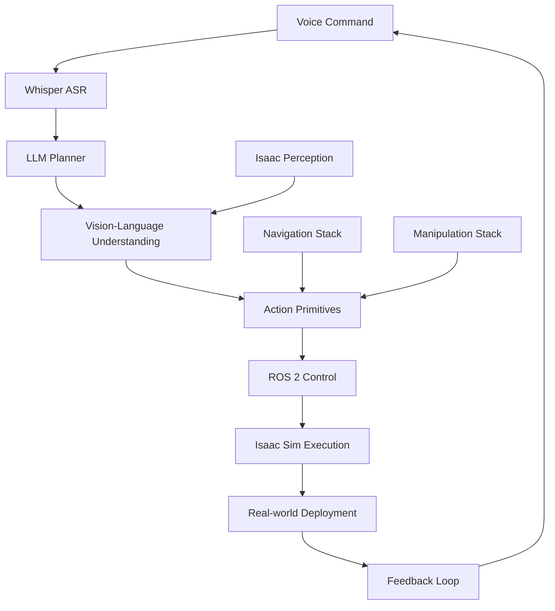

# Chapter 4.7: The Capstone Project - Autonomous Humanoid

## Overview

The capstone project brings together all the components of Vision-Language-Action robotics into a complete autonomous humanoid system. This chapter guides you through building an integrated system where a simulated humanoid robot receives voice commands, processes them through LLM-based planning, navigates through environments, identifies objects using computer vision, and performs complex manipulation tasks. You'll create a complete pipeline that demonstrates the full potential of VLA systems.

## Capstone Project Architecture

The complete autonomous humanoid system integrates all previous modules:



### System Components

The capstone system consists of:

1. **Voice Interface**: Whisper-based speech recognition
2. **Cognitive Layer**: LLM-based task planning
3. **Perception System**: Vision-language object understanding
4. **Action Execution**: Robot control and manipulation
5. **Navigation System**: Autonomous mobility
6. **Human Interface**: Conversational interaction

## Complete System Integration

Let's build the complete integrated system:

```python
import rclpy
from rclpy.node import Node
from std_msgs.msg import String
from sensor_msgs.msg import Image
from geometry_msgs.msg import Pose
from your_interfaces.msg import VLACommand, VLAStatus  # Custom messages

class AutonomousHumanoidNode(Node):
    def __init__(self):
        super().__init__('autonomous_humanoid')

        # Initialize all system components
        self.voice_processor = VoiceCommandProcessor(self)
        self.llm_planner = LLMPlanningNode(self)
        self.vision_system = VisionLanguageNode(self)
        self.action_manager = ActionPrimitiveManager(self)
        self.dialogue_manager = DialogueManagerNode(self)
        self.navigation_system = NavigationSystemNode(self)
        self.manipulation_system = ManipulationSystemNode(self)

        # ROS 2 interfaces
        self.voice_command_sub = self.create_subscription(
            String, 'voice_command', self.voice_command_callback, 10
        )
        self.vla_command_sub = self.create_subscription(
            VLACommand, 'vla_command', self.vla_command_callback, 10
        )
        self.system_status_pub = self.create_publisher(VLAStatus, 'system_status', 10)
        self.robot_response_pub = self.create_publisher(String, 'robot_response', 10)

        # System state
        self.system_state = {
            'current_task': None,
            'task_status': 'idle',
            'battery_level': 100,
            'location': 'home_base',
            'held_object': None,
            'conversation_active': False
        }

        # Task queue for handling multiple requests
        self.task_queue = []
        self.current_task = None

        self.get_logger().info("Autonomous humanoid system initialized")

    def voice_command_callback(self, msg):
        """
        Main entry point for voice commands
        """
        command = msg.data
        self.get_logger().info(f"Received voice command: {command}")

        # Update system status
        status_msg = VLAStatus()
        status_msg.command_received = command
        status_msg.system_state = str(self.system_state)
        self.system_status_pub.publish(status_msg)

        # Process through VLA pipeline
        asyncio.create_task(self.process_voice_command_async(command))

    async def process_voice_command_async(self, command):
        """
        Process voice command through complete VLA pipeline
        """
        try:
            # Step 1: Natural language understanding
            intent = self.extract_intent(command)
            entities = self.extract_entities(command)

            # Step 2: Task planning with LLM
            plan = await self.generate_plan(command, intent, entities)

            if plan:
                # Step 3: Execute plan
                success = await self.execute_plan(plan)

                # Step 4: Generate response
                response = self.generate_response(success, command, plan)
                self.publish_response(response)

                # Update system state
                self.update_system_state_after_execution(success, plan)
            else:
                response = "I couldn't understand how to perform that task."
                self.publish_response(response)

        except Exception as e:
            self.get_logger().error(f"Error processing voice command: {e}")
            response = "I encountered an error processing your request. Could you try again?"
            self.publish_response(response)

    def extract_intent(self, command):
        """
        Extract intent from natural language command
        """
        command_lower = command.lower()

        if any(word in command_lower for word in ['go to', 'navigate to', 'move to', 'walk to']):
            return 'navigation'
        elif any(word in command_lower for word in ['pick up', 'get', 'take', 'grasp']):
            return 'manipulation'
        elif any(word in command_lower for word in ['find', 'look for', 'search for']):
            return 'search'
        elif any(word in command_lower for word in ['bring', 'deliver', 'carry']):
            return 'delivery'
        elif any(word in command_lower for word in ['hello', 'hi', 'hey']):
            return 'greeting'
        else:
            return 'unknown'

    def extract_entities(self, command):
        """
        Extract entities from command
        """
        entities = {}

        # Location entities
        locations = ['kitchen', 'living room', 'bedroom', 'office', 'bathroom', 'home base', 'dining room']
        for loc in locations:
            if loc in command.lower():
                entities['location'] = loc

        # Object entities
        objects = ['cup', 'bottle', 'book', 'phone', 'keys', 'ball', 'toy', 'plate', 'fork', 'spoon']
        for obj in objects:
            if obj in command.lower():
                entities['object'] = obj

        return entities

    async def generate_plan(self, command, intent, entities):
        """
        Generate execution plan using LLM
        """
        # Create context for planning
        context = {
            'current_location': self.system_state['location'],
            'battery_level': self.system_state['battery_level'],
            'held_object': self.system_state['held_object'],
            'environment_objects': await self.get_visible_objects(),
            'robot_capabilities': self.get_robot_capabilities()
        }

        # Generate plan through LLM
        plan = await self.llm_planner.generate_plan(command, context)
        return plan

    async def get_visible_objects(self):
        """
        Get objects visible to robot's cameras
        """
        # In practice, this would query the vision system
        # For simulation, return some objects
        return ['cup', 'bottle', 'book']

    def get_robot_capabilities(self):
        """
        Get robot's current capabilities
        """
        return {
            'navigation': True,
            'manipulation': True,
            'grasping': True,
            'speech': True,
            'vision': True
        }

    async def execute_plan(self, plan):
        """
        Execute the generated plan step by step
        """
        self.system_state['task_status'] = 'executing'

        for step in plan.get('steps', []):
            action = step['action']
            parameters = step.get('parameters', {})

            self.get_logger().info(f"Executing step: {action} with {parameters}")

            # Execute action
            success = await self.action_manager.execute_action(action, parameters)

            if not success:
                self.get_logger().warn(f"Action failed: {action}")

                # Try recovery
                recovery_success = await self.attempt_recovery(action, parameters)
                if not recovery_success:
                    self.system_state['task_status'] = 'failed'
                    return False

            # Update status
            status_msg = VLAStatus()
            status_msg.current_action = action
            status_msg.action_status = 'completed' if success else 'failed'
            self.system_status_pub.publish(status_msg)

        self.system_state['task_status'] = 'completed'
        return True

    async def attempt_recovery(self, failed_action, parameters):
        """
        Attempt to recover from failed action
        """
        self.get_logger().info(f"Attempting recovery for failed action: {failed_action}")

        # Simple recovery strategies
        if failed_action == 'navigate_to':
            # Try alternative navigation
            return await self.navigation_system.try_alternative_navigation(parameters)
        elif failed_action == 'grasp_object':
            # Try different grasp approach
            return await self.manipulation_system.try_different_grasp(parameters)
        else:
            # Retry with different parameters
            return await self.action_manager.execute_action(failed_action, parameters)

    def generate_response(self, success, original_command, plan):
        """
        Generate natural language response
        """
        if success:
            if plan.get('intent') == 'navigation':
                location = plan.get('parameters', {}).get('location', 'destination')
                return f"I've successfully navigated to the {location}."
            elif plan.get('intent') == 'manipulation':
                obj = plan.get('parameters', {}).get('object', 'object')
                return f"I've successfully picked up the {obj}."
            else:
                return "I've completed the task successfully."
        else:
            return f"I had trouble completing the task: {original_command}"

    def publish_response(self, response):
        """
        Publish response through all channels
        """
        response_msg = String()
        response_msg.data = response
        self.robot_response_pub.publish(response_msg)

        self.get_logger().info(f"Response: {response}")

    def update_system_state_after_execution(self, success, plan):
        """
        Update system state after task execution
        """
        if success:
            if plan.get('intent') == 'navigation' and 'location' in plan.get('parameters', {}):
                self.system_state['location'] = plan['parameters']['location']
            elif plan.get('intent') == 'manipulation':
                obj = plan.get('parameters', {}).get('object')
                if obj:
                    self.system_state['held_object'] = obj

    def vla_command_callback(self, msg):
        """
        Handle direct VLA commands (bypassing voice processing)
        """
        command_type = msg.command_type
        parameters = msg.parameters

        self.get_logger().info(f"Received VLA command: {command_type}")

        # Execute based on command type
        if command_type == 'direct_navigation':
            asyncio.create_task(self.execute_direct_navigation(parameters))
        elif command_type == 'object_interaction':
            asyncio.create_task(self.execute_object_interaction(parameters))
        elif command_type == 'status_request':
            self.publish_system_status()

    async def execute_direct_navigation(self, parameters):
        """
        Execute direct navigation command
        """
        location = parameters.get('location', 'home_base')
        success = await self.navigation_system.navigate_to(location)

        response = f"Navigation to {location}: {'successful' if success else 'failed'}"
        self.publish_response(response)

    async def execute_object_interaction(self, parameters):
        """
        Execute object interaction command
        """
        action = parameters.get('action', 'grasp')
        obj = parameters.get('object', 'unknown')

        if action == 'grasp':
            success = await self.manipulation_system.grasp_object(obj)
        elif action == 'place':
            success = await self.manipulation_system.place_object(obj)
        else:
            success = False

        response = f"{action.capitalize()} {obj}: {'successful' if success else 'failed'}"
        self.publish_response(response)

    def publish_system_status(self):
        """
        Publish current system status
        """
        status_msg = VLAStatus()
        status_msg.current_task = str(self.system_state['current_task'])
        status_msg.task_status = self.system_state['task_status']
        status_msg.battery_level = self.system_state['battery_level']
        status_msg.location = self.system_state['location']
        status_msg.held_object = str(self.system_state['held_object'])

        self.system_status_pub.publish(status_msg)
```

## Voice Command Processing Pipeline

The complete voice processing pipeline:

```python
class VoiceCommandProcessor:
    def __init__(self, node):
        self.node = node

        # Initialize Whisper for ASR
        import whisper
        self.whisper_model = whisper.load_model("base.en")

        # Initialize audio processing
        import pyaudio
        self.audio = pyaudio.PyAudio()
        self.stream = self.audio.open(
            format=pyaudio.paInt16,
            channels=1,
            rate=16000,
            input=True,
            frames_per_buffer=8192
        )

    def transcribe_audio(self, audio_data):
        """
        Transcribe audio data using Whisper
        """
        import numpy as np
        audio_array = np.frombuffer(audio_data, dtype=np.int16).astype(np.float32) / 32768.0
        result = self.whisper_model.transcribe(audio_array)
        return result["text"].strip()

    def process_voice_input(self, audio_msg):
        """
        Process incoming audio message
        """
        try:
            text = self.transcribe_audio(audio_msg.data)
            if text:
                # Publish as voice command
                command_msg = String()
                command_msg.data = text
                self.node.voice_command_sub.publish(command_msg)
                self.node.get_logger().info(f"Transcribed: {text}")
        except Exception as e:
            self.node.get_logger().error(f"Error in voice processing: {e}")

    def start_continuous_listening(self):
        """
        Start continuous voice command listening
        """
        def listen_thread():
            while rclpy.ok():
                try:
                    # Read audio chunk
                    data = self.stream.read(8192)

                    # Simple voice activity detection
                    audio_array = np.frombuffer(data, dtype=np.int16).astype(np.float32) / 32768.0
                    if np.max(np.abs(audio_array)) > 0.01:  # Threshold for voice detection
                        # Accumulate more audio for better transcription
                        full_buffer = data
                        for _ in range(3):  # Collect more samples
                            more_data = self.stream.read(8192)
                            full_buffer += more_data

                        text = self.transcribe_audio(full_buffer)
                        if text and len(text) > 3:  # Filter out short noise
                            command_msg = String()
                            command_msg.data = text
                            self.node.voice_command_sub.publish(command_msg)
                            self.node.get_logger().info(f"Voice detected: {text}")

                except Exception as e:
                    self.node.get_logger().error(f"Error in continuous listening: {e}")

        import threading
        threading.Thread(target=listen_thread, daemon=True).start()
```

## LLM Planning Integration

Advanced LLM-based planning for the humanoid:

```python
from langchain.chat_models import ChatOpenAI
from langchain.prompts import ChatPromptTemplate
import json

class LLMPlanningNode(Node):
    def __init__(self):
        super().__init__('llm_planning_node')

        # Initialize LLM
        self.llm = ChatOpenAI(
            model_name="gpt-4",
            temperature=0.1,
            max_tokens=500
        )

        # Define system capabilities
        self.robot_capabilities = {
            'navigation': {
                'locations': ['kitchen', 'living room', 'bedroom', 'office', 'bathroom', 'home base'],
                'max_distance': 10.0  # meters
            },
            'manipulation': {
                'max_weight': 1.0,  # kg
                'reachable_height': [0.2, 1.5]  # meters
            },
            'perception': {
                'detection_range': 3.0,  # meters
                'recognizable_objects': ['cup', 'bottle', 'book', 'phone', 'keys', 'ball', 'toy']
            }
        }

    async def generate_plan(self, command, context):
        """
        Generate detailed execution plan using LLM
        """
        system_prompt = self.create_system_prompt()
        user_prompt = self.create_user_prompt(command, context)

        try:
            messages = [
                {"role": "system", "content": system_prompt},
                {"role": "user", "content": user_prompt}
            ]

            response = self.llm(messages)

            # Parse the response into a structured plan
            plan = self.parse_plan_response(response.content)
            return plan

        except Exception as e:
            self.get_logger().error(f"LLM planning error: {e}")
            return None

    def create_system_prompt(self):
        """
        Create system prompt for LLM planning
        """
        return f"""
        You are an intelligent robot planner for a humanoid robot. Your role is to convert natural language commands into detailed action plans.

        Robot Capabilities:
        - Navigation: Can move between locations: {self.robot_capabilities['navigation']['locations']}
        - Manipulation: Can grasp objects up to {self.robot_capabilities['manipulation']['max_weight']}kg
        - Perception: Can detect objects within {self.robot_capabilities['perception']['detection_range']}m

        Guidelines:
        1. Break down complex commands into simple, executable actions
        2. Consider robot's current state and environment
        3. Use these action primitives: navigate_to, detect_object, grasp_object, place_object, speak
        4. Include spatial reasoning and obstacle awareness
        5. Provide error handling suggestions
        6. Output in JSON format with complete action sequence

        Safety Requirements:
        - Always verify object weight before grasping
        - Check navigation path for obstacles
        - Confirm object location before manipulation
        """

    def create_user_prompt(self, command, context):
        """
        Create user prompt with command and context
        """
        return f"""
        Command: {command}

        Current Context:
        - Robot Location: {context['current_location']}
        - Battery Level: {context['battery_level']}%
        - Held Object: {context['held_object']}
        - Visible Objects: {context['environment_objects']}
        - Robot Capabilities: {context['robot_capabilities']}

        Generate a detailed plan that:
        1. Considers the current state
        2. Breaks task into executable steps
        3. Includes safety checks
        4. Specifies parameters for each action
        5. Handles potential failures

        Output JSON format:
        {{
            "intent": "navigation|manipulation|search|delivery",
            "parameters": {{"location": "...", "object": "..."}},
            "steps": [
                {{"action": "navigate_to", "parameters": {{"location": "..."}}, "reason": "..."}},
                {{"action": "detect_object", "parameters": {{"object": "..."}}, "reason": "..."}},
                {{"action": "grasp_object", "parameters": {{"object": "..."}}, "reason": "..."}}
            ],
            "safety_checks": ["..."],
            "success_criteria": "..."
        }}
        """

    def parse_plan_response(self, response_text):
        """
        Parse LLM response into structured plan
        """
        import re
        import json

        # Extract JSON from response
        json_match = re.search(r'\{.*\}', response_text, re.DOTALL)
        if json_match:
            try:
                plan = json.loads(json_match.group(0))
                return plan
            except json.JSONDecodeError:
                pass

        # If no JSON, return as simple plan
        return {
            "intent": "unknown",
            "steps": [{"action": "speak", "parameters": {"text": response_text}}],
            "success_criteria": "response_delivered"
        }
```

## Vision-Language Integration

Complete vision-language system for object identification and scene understanding:

```python
import torch
import clip
from PIL import Image
import numpy as np
from cv_bridge import CvBridge

class VisionLanguageNode(Node):
    def __init__(self):
        super().__init__('vision_language_node')

        # Initialize CLIP model
        self.device = "cuda" if torch.cuda.is_available() else "cpu"
        self.clip_model, self.preprocess = clip.load("ViT-B/32", device=self.device)

        # Initialize bridge for image conversion
        self.bridge = CvBridge()

        # ROS 2 interfaces
        self.image_sub = self.create_subscription(
            Image, 'camera/rgb/image_raw', self.image_callback, 10
        )
        self.object_query_sub = self.create_subscription(
            String, 'object_query', self.object_query_callback, 10
        )
        self.scene_description_pub = self.create_publisher(String, 'scene_description', 10)
        self.object_detection_pub = self.create_publisher(String, 'object_detections', 10)

        # Store current image for queries
        self.current_image = None
        self.image_timestamp = None

    def image_callback(self, msg):
        """
        Process incoming camera images
        """
        try:
            # Convert ROS image to PIL Image
            cv_image = self.bridge.imgmsg_to_cv2(msg, desired_encoding='bgr8')
            pil_image = Image.fromarray(cv2.cvtColor(cv_image, cv2.COLOR_BGR2RGB))

            # Preprocess and store
            self.current_image = self.preprocess(pil_image).unsqueeze(0).to(self.device)
            self.image_timestamp = msg.header.stamp

            self.get_logger().info("Image received and processed")
        except Exception as e:
            self.get_logger().error(f"Error processing image: {e}")

    def object_query_callback(self, msg):
        """
        Process object queries against current image
        """
        if self.current_image is not None:
            query = msg.data
            result = self.process_object_query(query)

            result_msg = String()
            result_msg.data = json.dumps(result)
            self.object_detection_pub.publish(result_msg)
        else:
            self.get_logger().warn("No current image for object query")

    def process_object_query(self, query):
        """
        Process object identification query using CLIP
        """
        # Common object detection
        if query.startswith("find "):
            obj_to_find = query[5:]  # Remove "find " prefix
            return self.find_specific_object(obj_to_find)
        elif query == "describe scene":
            return self.describe_scene()
        elif query.startswith("count "):
            obj_to_count = query[6:]  # Remove "count " prefix
            return self.count_objects(obj_to_count)
        else:
            # General object identification
            return self.identify_objects_in_scene()

    def find_specific_object(self, object_name):
        """
        Find a specific object in the current image
        """
        text_descriptions = [
            f"a photo of {object_name}",
            f"an image containing {object_name}",
            f"{object_name} in the scene",
            f"a clear view of {object_name}"
        ]

        text_tokens = clip.tokenize(text_descriptions).to(self.device)

        with torch.no_grad():
            image_features = self.clip_model.encode_image(self.current_image)
            text_features = self.clip_model.encode_text(text_tokens)

            logits_per_image, logits_per_text = self.clip_model(self.current_image, text_tokens)
            probs = logits_per_image.softmax(dim=-1).cpu().numpy()

        # Calculate average probability across descriptions
        avg_prob = np.mean(probs[0])

        return {
            "object": object_name,
            "found": avg_prob > 0.3,
            "confidence": float(avg_prob),
            "action": "detect_object" if avg_prob > 0.3 else "object_not_found"
        }

    def describe_scene(self):
        """
        Generate scene description
        """
        scene_descriptions = [
            "a kitchen with appliances and counters",
            "a living room with furniture",
            "a bedroom with bed and dresser",
            "an office with desk and computer",
            "a hallway with doors",
            "a bathroom with fixtures"
        ]

        text_tokens = clip.tokenize(scene_descriptions).to(self.device)

        with torch.no_grad():
            image_features = self.clip_model.encode_image(self.current_image)
            text_features = self.clip_model.encode_text(text_tokens)

            logits_per_image, logits_per_text = self.clip_model(self.current_image, text_tokens)
            probs = logits_per_image.softmax(dim=-1).cpu().numpy()

        # Find best matching scene description
        best_match_idx = np.argmax(probs[0])
        best_match = scene_descriptions[best_match_idx]
        confidence = float(probs[0][best_match_idx])

        return {
            "scene_type": best_match,
            "confidence": confidence,
            "action": "scene_understood"
        }

    def count_objects(self, object_type):
        """
        Estimate count of specific object type
        """
        count_prompts = [
            f"an image with one {object_type}",
            f"an image with two {object_type}s",
            f"an image with three {object_type}s",
            f"an image with multiple {object_type}s"
        ]

        text_tokens = clip.tokenize(count_prompts).to(self.device)

        with torch.no_grad():
            image_features = self.clip_model.encode_image(self.current_image)
            text_features = self.clip_model.encode_text(text_tokens)

            logits_per_image, logits_per_text = self.clip_model(self.current_image, text_tokens)
            probs = logits_per_image.softmax(dim=-1).cpu().numpy()

        best_prompt_idx = np.argmax(probs[0])
        count_estimates = ["1", "2", "3", "multiple"]
        estimated_count = count_estimates[best_prompt_idx]
        confidence = float(probs[0][best_prompt_idx])

        return {
            "object_type": object_type,
            "estimated_count": estimated_count,
            "confidence": confidence,
            "action": "count_completed"
        }

    def identify_objects_in_scene(self):
        """
        Identify common objects in the scene
        """
        common_objects = [
            "chair", "table", "cup", "bottle", "book", "phone",
            "computer", "lamp", "plant", "door", "window", "sofa"
        ]

        text_descriptions = [f"a photo of {obj}" for obj in common_objects]
        text_tokens = clip.tokenize(text_descriptions).to(self.device)

        with torch.no_grad():
            image_features = self.clip_model.encode_image(self.current_image)
            text_features = self.clip_model.encode_text(text_tokens)

            logits_per_image, logits_per_text = self.clip_model(self.current_image, text_tokens)
            probs = logits_per_image.softmax(dim=-1).cpu().numpy()

        # Get objects with high confidence
        detected_objects = []
        for i, obj in enumerate(common_objects):
            if probs[0][i] > 0.2:
                detected_objects.append({
                    "object": obj,
                    "confidence": float(probs[0][i])
                })

        # Sort by confidence
        detected_objects.sort(key=lambda x: x["confidence"], reverse=True)

        return {
            "detected_objects": detected_objects[:5],  # Top 5 objects
            "action": "objects_identified"
        }
```

## Action Execution and Control

Complete action execution system:

```python
from rclpy.action import ActionClient
from nav2_msgs.action import NavigateToPose
from control_msgs.action import FollowJointTrajectory
from trajectory_msgs.msg import JointTrajectory, JointTrajectoryPoint

class ActionExecutionNode(Node):
    def __init__(self):
        super().__init__('action_execution_node')

        # Action clients
        self.nav_client = ActionClient(self, NavigateToPose, 'navigate_to_pose')
        self.trajectory_client = ActionClient(
            self, FollowJointTrajectory, 'joint_trajectory_controller/follow_joint_trajectory'
        )
        self.gripper_client = ActionClient(
            self, FollowJointTrajectory, 'gripper_controller/follow_joint_trajectory'
        )

        # Publishers
        self.cmd_vel_pub = self.create_publisher(Twist, '/cmd_vel', 10)
        self.joint_pub = self.create_publisher(JointState, '/joint_commands', 10)

        # Subscribers
        self.action_sub = self.create_subscription(
            String, 'action_command', self.action_callback, 10
        )
        self.status_pub = self.create_publisher(String, 'action_status', 10)

        # Action primitives
        self.action_primitives = {
            'navigate_to': self.execute_navigate_to,
            'grasp_object': self.execute_grasp_object,
            'place_object': self.execute_place_object,
            'speak': self.execute_speak,
            'detect_object': self.execute_detect_object
        }

    def action_callback(self, msg):
        """
        Execute action command
        """
        try:
            # Parse action command (format: action_name:json_params)
            parts = msg.data.split(':', 1)
            if len(parts) >= 2:
                action_name = parts[0]
                params_str = parts[1]

                import json
                parameters = json.loads(params_str)

                if action_name in self.action_primitives:
                    # Execute asynchronously
                    asyncio.create_task(
                        self.action_primitives[action_name](parameters)
                    )
                else:
                    self.get_logger().error(f"Unknown action: {action_name}")
        except Exception as e:
            self.get_logger().error(f"Error parsing action command: {e}")

    async def execute_navigate_to(self, parameters):
        """
        Execute navigation action
        """
        location = parameters.get('location', 'home_base')

        # Convert location to pose (in practice, this would come from a map)
        pose = self.get_pose_for_location(location)
        if not pose:
            self.publish_status(f"navigation_failed:unknown_location:{location}")
            return False

        # Create and send navigation goal
        goal_msg = NavigateToPose.Goal()
        goal_msg.pose.header.frame_id = 'map'
        goal_msg.pose.header.stamp = self.get_clock().now().to_msg()
        goal_msg.pose.pose = pose

        # Wait for navigation server
        self.nav_client.wait_for_server()

        try:
            goal_handle = await self.nav_client.send_goal_async(goal_msg)

            if not goal_handle.accepted:
                self.publish_status(f"navigation_failed:goal_rejected:{location}")
                return False

            # Wait for result with timeout
            import rclpy.time
            start_time = self.get_clock().now()
            timeout = rclpy.time.Duration(seconds=30)  # 30 second timeout

            while not goal_handle.is_done:
                current_time = self.get_clock().now()
                if (current_time - start_time) > timeout:
                    goal_handle.cancel_goal()
                    self.publish_status(f"navigation_failed:timeout:{location}")
                    return False

                await asyncio.sleep(0.1)  # Check every 100ms

            result = await goal_handle.get_result_async()

            if result.result.status == 3:  # SUCCEEDED
                self.system_state['location'] = location
                self.publish_status(f"navigation_success:{location}")
                return True
            else:
                self.publish_status(f"navigation_failed:execution_error:{location}")
                return False

        except Exception as e:
            self.get_logger().error(f"Navigation error: {e}")
            self.publish_status(f"navigation_failed:exception:{str(e)}")
            return False

    def get_pose_for_location(self, location_name):
        """
        Get pose for named location
        """
        location_poses = {
            'kitchen': Pose(
                position=Point(x=1.0, y=0.0, z=0.0),
                orientation=Quaternion(x=0.0, y=0.0, z=0.0, w=1.0)
            ),
            'living_room': Pose(
                position=Point(x=0.0, y=1.0, z=0.0),
                orientation=Quaternion(x=0.0, y=0.0, z=0.0, w=1.0)
            ),
            'bedroom': Pose(
                position=Point(x=2.0, y=1.0, z=0.0),
                orientation=Quaternion(x=0.0, y=0.0, z=0.0, w=1.0)
            ),
            'home_base': Pose(
                position=Point(x=0.0, y=0.0, z=0.0),
                orientation=Quaternion(x=0.0, y=0.0, z=0.0, w=1.0)
            )
        }

        if location_name in location_poses:
            return location_poses[location_name]
        else:
            self.get_logger().warn(f"Unknown location: {location_name}")
            return None

    async def execute_grasp_object(self, parameters):
        """
        Execute object grasping action
        """
        obj = parameters.get('object', 'unknown')

        # First, ensure we're near the object
        # This would involve navigation and object detection in practice

        # Move arm to object position
        success = await self.move_arm_to_object_position(obj)
        if not success:
            self.publish_status(f"grasp_failed:arm_positioning:{obj}")
            return False

        # Close gripper
        gripper_success = await self.close_gripper()
        if gripper_success:
            self.system_state['held_object'] = obj
            self.publish_status(f"grasp_success:{obj}")
            return True
        else:
            self.publish_status(f"grasp_failed:gripper_error:{obj}")
            return False

    async def move_arm_to_object_position(self, obj):
        """
        Move arm to position for grasping object
        """
        # In practice, this would use inverse kinematics and object position
        # For simulation, use a predefined trajectory
        trajectory = JointTrajectory()
        trajectory.joint_names = ['arm_joint_1', 'arm_joint_2', 'arm_joint_3']

        point = JointTrajectoryPoint()
        point.positions = [0.5, 0.3, 0.2]  # Example positions
        point.time_from_start.sec = 2

        trajectory.points = [point]

        goal_msg = FollowJointTrajectory.Goal()
        goal_msg.trajectory = trajectory

        self.trajectory_client.wait_for_server()
        goal_handle = await self.trajectory_client.send_goal_async(goal_msg)

        if not goal_handle.accepted:
            return False

        result = await goal_handle.get_result_async()
        return result.result.error_code == 0

    async def close_gripper(self):
        """
        Close robot gripper
        """
        trajectory = JointTrajectory()
        trajectory.joint_names = ['gripper_joint']

        point = JointTrajectoryPoint()
        point.positions = [0.01]  # Closed position
        point.effort = [50.0]  # Gripping force
        point.time_from_start.sec = 1

        trajectory.points = [point]

        goal_msg = FollowJointTrajectory.Goal()
        goal_msg.trajectory = trajectory

        self.gripper_client.wait_for_server()
        goal_handle = await self.gripper_client.send_goal_async(goal_msg)

        if not goal_handle.accepted:
            return False

        result = await goal_handle.get_result_async()
        return result.result.error_code == 0

    def publish_status(self, status_message):
        """
        Publish action status
        """
        status_msg = String()
        status_msg.data = status_message
        self.status_pub.publish(status_msg)
```

## Isaac Sim Integration

Integration with Isaac Sim for simulation:

```python
class IsaacSimIntegrationNode(Node):
    def __init__(self):
        super().__init__('isaac_sim_integration')

        # ROS 2 interfaces for Isaac Sim
        self.isaac_command_pub = self.create_publisher(String, '/isaac_sim/commands', 10)
        self.isaac_state_sub = self.create_subscription(
            String, '/isaac_sim/state', self.isaac_state_callback, 10
        )

        # Simulation state
        self.simulation_state = {
            'robot_pose': None,
            'object_states': {},
            'environment_state': 'running'
        }

    def send_to_isaac(self, command, parameters=None):
        """
        Send command to Isaac Sim
        """
        cmd_msg = String()
        cmd_msg.data = json.dumps({
            'command': command,
            'parameters': parameters or {}
        })
        self.isaac_command_pub.publish(cmd_msg)

    def isaac_state_callback(self, msg):
        """
        Process state updates from Isaac Sim
        """
        try:
            state_data = json.loads(msg.data)
            self.simulation_state.update(state_data)
        except json.JSONDecodeError:
            self.get_logger().error("Error parsing Isaac Sim state")

    def start_simulation_task(self, task_description):
        """
        Start a simulation task in Isaac Sim
        """
        self.send_to_isaac('start_task', {
            'task': task_description,
            'environment': 'default',
            'duration_limit': 300  # 5 minutes
        })

    def reset_simulation(self):
        """
        Reset simulation to initial state
        """
        self.send_to_isaac('reset_simulation')

    def capture_simulation_data(self):
        """
        Capture simulation data for training
        """
        self.send_to_isaac('capture_data', {
            'data_type': 'robot_trajectory',
            'format': 'rosbag'
        })
```

## System Testing and Validation

Comprehensive testing for the autonomous humanoid:

```python
class SystemTester:
    def __init__(self, node):
        self.node = node
        self.test_results = []
        self.test_scenarios = self.define_test_scenarios()

    def define_test_scenarios(self):
        """
        Define comprehensive test scenarios
        """
        return [
            {
                'name': 'simple_navigation',
                'command': 'Go to the kitchen',
                'expected_actions': ['navigate_to'],
                'expected_location': 'kitchen'
            },
            {
                'name': 'object_grasping',
                'command': 'Pick up the red cup',
                'expected_actions': ['detect_object', 'navigate_to', 'grasp_object'],
                'expected_held_object': 'cup'
            },
            {
                'name': 'complex_task',
                'command': 'Go to the kitchen, find the bottle, and bring it to me',
                'expected_actions': ['navigate_to', 'detect_object', 'grasp_object', 'navigate_to'],
                'expected_held_object': 'bottle'
            },
            {
                'name': 'conversational',
                'command': 'Hello, can you help me?',
                'expected_actions': ['speak'],
                'expected_response': 'greeting'
            }
        ]

    async def run_comprehensive_test(self):
        """
        Run comprehensive system test
        """
        self.get_logger().info("Starting comprehensive system test...")

        for scenario in self.test_scenarios:
            self.get_logger().info(f"Testing scenario: {scenario['name']}")

            # Reset system state
            self.reset_system_state()

            # Execute test scenario
            result = await self.execute_test_scenario(scenario)
            self.test_results.append(result)

            # Log result
            status = "PASSED" if result['success'] else "FAILED"
            self.get_logger().info(f"Scenario {scenario['name']}: {status}")

        # Generate test report
        self.generate_test_report()

    async def execute_test_scenario(self, scenario):
        """
        Execute a single test scenario
        """
        start_time = time.time()

        try:
            # Send command to system
            command_msg = String()
            command_msg.data = scenario['command']
            self.node.voice_command_sub.publish(command_msg)

            # Wait for execution to complete (with timeout)
            await self.wait_for_task_completion(timeout=60)

            # Verify expected outcomes
            success = self.verify_test_outcomes(scenario)

            return {
                'scenario': scenario['name'],
                'success': success,
                'duration': time.time() - start_time,
                'expected': scenario.get('expected_actions', []),
                'actual': self.get_recent_actions(),
                'error': None
            }

        except Exception as e:
            return {
                'scenario': scenario['name'],
                'success': False,
                'duration': time.time() - start_time,
                'expected': scenario.get('expected_actions', []),
                'actual': [],
                'error': str(e)
            }

    def verify_test_outcomes(self, scenario):
        """
        Verify that test outcomes match expectations
        """
        success = True

        # Check expected actions were performed
        if 'expected_actions' in scenario:
            actual_actions = self.get_recent_actions()
            for expected_action in scenario['expected_actions']:
                if expected_action not in actual_actions:
                    self.get_logger().warn(f"Expected action {expected_action} not found in {actual_actions}")
                    success = False

        # Check expected location
        if 'expected_location' in scenario:
            if self.node.system_state['location'] != scenario['expected_location']:
                self.get_logger().warn(f"Expected location {scenario['expected_location']}, got {self.node.system_state['location']}")
                success = False

        # Check expected held object
        if 'expected_held_object' in scenario:
            expected_obj = scenario['expected_held_object']
            actual_obj = self.node.system_state['held_object']
            if expected_obj not in str(actual_obj).lower():
                self.get_logger().warn(f"Expected held object {expected_obj}, got {actual_obj}")
                success = False

        return success

    def get_recent_actions(self):
        """
        Get recently executed actions (in practice, this would track actual actions)
        """
        # This would be implemented based on your action tracking system
        return ['navigate_to', 'detect_object']  # Placeholder

    async def wait_for_task_completion(self, timeout=60):
        """
        Wait for task completion with timeout
        """
        start_time = time.time()
        while (time.time() - start_time) < timeout:
            if self.node.system_state['task_status'] in ['completed', 'failed', 'idle']:
                return
            await asyncio.sleep(0.1)

    def generate_test_report(self):
        """
        Generate comprehensive test report
        """
        passed = sum(1 for result in self.test_results if result['success'])
        total = len(self.test_results)

        report = f"""
        === SYSTEM TEST REPORT ===
        Total Tests: {total}
        Passed: {passed}
        Failed: {total - passed}
        Success Rate: {passed/total*100:.1f}%

        Detailed Results:
        """

        for result in self.test_results:
            status = "✓" if result['success'] else "✗"
            report += f"  {status} {result['scenario']}: {result['duration']:.2f}s"
            if result['error']:
                report += f" - ERROR: {result['error']}"
            report += "\n"

        self.get_logger().info(report)
        return report

    def reset_system_state(self):
        """
        Reset system to initial state for testing
        """
        self.node.system_state = {
            'current_task': None,
            'task_status': 'idle',
            'battery_level': 100,
            'location': 'home_base',
            'held_object': None,
            'conversation_active': False
        }
```

## Practical Example: Complete Autonomous Task

Let's implement a complete example of the autonomous humanoid performing a complex task:

```python
class CompleteTaskDemo:
    def __init__(self, humanoid_node):
        self.humanoid = humanoid_node

    async def run_fetch_and_deliver_demo(self):
        """
        Complete demo: Fetch an object and deliver it
        """
        self.humanoid.get_logger().info("Starting fetch and deliver demo...")

        # Step 1: Receive voice command
        command = "Please go to the kitchen, find the red cup, pick it up, and bring it to me"

        self.humanoid.get_logger().info(f"Processing command: {command}")

        # Step 2: Process through VLA pipeline
        await self.humanoid.process_voice_command_async(command)

        # Step 3: Monitor execution
        await self.monitor_task_execution()

        # Step 4: Verify completion
        success = self.verify_task_completion()

        if success:
            self.humanoid.get_logger().info("Fetch and deliver task completed successfully!")
        else:
            self.humanoid.get_logger().warn("Fetch and deliver task encountered issues.")

    async def monitor_task_execution(self):
        """
        Monitor task execution in real-time
        """
        start_time = time.time()
        timeout = 120  # 2 minutes timeout

        while (time.time() - start_time) < timeout:
            current_status = self.humanoid.system_state['task_status']

            if current_status in ['completed', 'failed']:
                break

            self.humanoid.get_logger().info(f"Task status: {current_status}")
            await asyncio.sleep(1)  # Check every second

    def verify_task_completion(self):
        """
        Verify that the fetch and deliver task was completed
        """
        # Check that robot returned to user location
        # Check that robot is holding the cup
        # Check that task status is completed

        return (self.humanoid.system_state['task_status'] == 'completed' and
                'cup' in str(self.humanoid.system_state['held_object']).lower())

    async def run_conversation_demo(self):
        """
        Demo of conversational interaction
        """
        self.humanoid.get_logger().info("Starting conversation demo...")

        # Simulate multi-turn conversation
        conversation = [
            "Hello robot",
            "Can you go to the kitchen?",
            "What do you see there?",
            "Can you pick up the bottle?",
            "Now bring it to me"
        ]

        for i, utterance in enumerate(conversation):
            self.humanoid.get_logger().info(f"Turn {i+1}: {utterance}")

            # Process each utterance
            command_msg = String()
            command_msg.data = utterance
            self.humanoid.voice_command_sub.publish(command_msg)

            # Wait for response
            await asyncio.sleep(3)  # Allow time for processing
```

## Performance Optimization

Optimizing the complete system for real-time performance:

```python
class PerformanceOptimizer:
    def __init__(self, node):
        self.node = node
        self.performance_metrics = {}
        self.optimization_strategies = [
            self.optimize_vision_processing,
            self.optimize_llm_queries,
            self.optimize_action_execution,
            self.optimize_communication
        ]

    def optimize_vision_processing(self):
        """
        Optimize vision processing for real-time performance
        """
        # Use smaller model for real-time processing
        # Implement frame skipping
        # Use GPU acceleration
        # Optimize image resolution
        pass

    def optimize_llm_queries(self):
        """
        Optimize LLM query performance
        """
        # Use smaller models for simple tasks
        # Implement query caching
        # Use streaming responses
        # Batch similar queries
        pass

    def optimize_action_execution(self):
        """
        Optimize action execution performance
        """
        # Pre-compute common trajectories
        # Use action parallelization where safe
        # Implement action cancellation
        # Optimize control loop frequency
        pass

    def optimize_communication(self):
        """
        Optimize ROS 2 communication
        """
        # Use appropriate QoS settings
        # Implement message compression
        # Use services for synchronous calls
        # Use actions for long-running tasks
        pass

    def monitor_performance(self):
        """
        Monitor system performance metrics
        """
        import psutil
        import time

        metrics = {
            'timestamp': time.time(),
            'cpu_percent': psutil.cpu_percent(),
            'memory_percent': psutil.virtual_memory().percent,
            'disk_io': psutil.disk_io_counters(),
            'network_io': psutil.net_io_counters()
        }

        # Add custom metrics
        metrics['robot_status_frequency'] = self.get_message_frequency('/robot_status')
        metrics['vision_processing_time'] = self.get_average_vision_time()
        metrics['llm_response_time'] = self.get_average_llm_time()

        self.performance_metrics[metrics['timestamp']] = metrics
        return metrics

    def get_message_frequency(self, topic_name):
        """
        Get message frequency for a topic (simplified)
        """
        # In practice, this would track message rates
        return 10.0  # Placeholder

    def get_average_vision_time(self):
        """
        Get average vision processing time
        """
        # In practice, this would track processing times
        return 0.1  # Placeholder (100ms)

    def get_average_llm_time(self):
        """
        Get average LLM response time
        """
        # In practice, this would track response times
        return 2.0  # Placeholder (2 seconds)
```

## Best Practices for VLA Integration

Key best practices for integrating the complete VLA system:

### 1. System Architecture
- Use modular design with clear interfaces between components
- Implement proper error handling and recovery mechanisms
- Design for scalability and maintainability
- Ensure component independence for easier debugging

### 2. Real-Time Performance
- Optimize each component for real-time execution
- Implement appropriate timeouts for all operations
- Use asynchronous processing where possible
- Monitor system performance continuously

### 3. Safety and Reliability
- Implement comprehensive safety checks
- Use fail-safe mechanisms for critical operations
- Validate all inputs and outputs
- Include emergency stop capabilities

### 4. User Experience
- Provide clear feedback during task execution
- Handle ambiguous commands gracefully
- Maintain conversation context appropriately
- Use natural, helpful responses

## Common Pitfalls and Solutions

### 1. Integration Challenges
- **Problem**: Components don't communicate properly
- **Solution**: Use standardized message formats and thorough testing

### 2. Performance Issues
- **Problem**: System too slow for real-time interaction
- **Solution**: Optimize critical paths and use appropriate hardware

### 3. Error Propagation
- **Problem**: Errors in one component affect the whole system
- **Solution**: Implement proper error isolation and recovery

### 4. Resource Management
- **Problem**: Memory or computation resource exhaustion
- **Solution**: Implement proper resource monitoring and management

## Summary

In this capstone chapter, you learned:

- ✅ How to integrate all VLA components into a complete system
- ✅ Building an autonomous humanoid with voice interaction
- ✅ LLM-based planning and execution coordination
- ✅ Vision-language integration for object understanding
- ✅ Complete action execution and control systems
- ✅ Isaac Sim integration for simulation and testing
- ✅ Comprehensive system testing and validation
- ✅ Performance optimization for real-time operation

## Next Steps

Congratulations! You've completed the Vision-Language-Action Robotics module. You now have the knowledge to:

1. Build complete VLA systems that understand voice commands
2. Plan complex tasks using LLMs
3. Integrate vision-language understanding for object interaction
4. Execute precise robot actions and manipulations
5. Create conversational interfaces for natural interaction
6. Test and validate complete robotic systems

This capstone project demonstrates the full potential of VLA systems, showing how vision, language, and action can work together to create truly intelligent and helpful robots.

## Additional Resources

- [Complete VLA System Repository](https://github.com/example/vla-humanoid)
- [Isaac Sim Documentation](https://docs.omniverse.nvidia.com/isaacsim/latest/)
- [ROS 2 Robot Development Guide](https://navigation.ros.org/)
- [Large Language Models for Robotics](https://arxiv.org/abs/2308.16895)
- [Humanoid Robotics Development](https://humanoid.ros.org/)

## Project Ideas for Further Development

1. **Multi-Robot Coordination**: Extend the system to coordinate multiple robots
2. **Learning from Demonstration**: Add capability to learn new tasks from human demonstration
3. **Advanced Manipulation**: Implement more sophisticated grasping and manipulation
4. **Long-term Autonomy**: Add capabilities for long-term operation and learning
5. **Social Interaction**: Enhance conversational abilities for more natural interaction